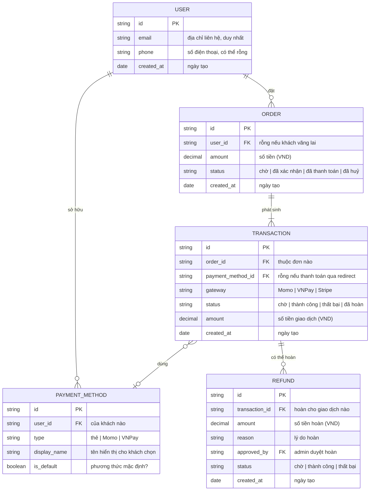

# payment — Entity Relationship Diagram

> Scope: feature payment

## Diagram

## Entity Reference

| Entity | Purpose | Key attributes |
|--------|---------|----------------|
| USER | Tài khoản khách hàng (khách vãng lai không có bản ghi) | email (duy nhất), phone, ngày tạo |
| ORDER | Đơn hàng phát sinh từ checkout | số tiền, trạng thái đơn |
| TRANSACTION | Mỗi lần thử thanh toán cho 1 đơn | cổng thanh toán, trạng thái, số tiền |
| PAYMENT_METHOD | Phương thức đã lưu để khách chọn lại lần sau | loại, tên hiển thị, mặc định |
| REFUND | Mỗi lần admin duyệt hoàn tiền | số tiền hoàn, lý do, admin duyệt |

## Notes & Assumptions

- **Khách vãng lai không có bản ghi USER** — `ORDER.user_id` để rỗng, chỉ khách đăng nhập mới gắn được vào tài khoản.
- **Trạng thái ORDER đi 1 chiều:** chờ sang đã xác nhận sang đã thanh toán, hoặc rẽ sang đã huỷ. Không quay ngược. (Chi tiết chuyển trạng thái xem `srs/payment-states.md`.)
- **TRANSACTION.payment_method_id để rỗng** khi khách thanh toán qua redirect (Momo/VNPay chuyển sang trang cổng) — chỉ luồng thẻ Stripe mới ghi phương thức đã lưu.
- **REFUND.approved_by** trỏ tới tài khoản admin duyệt — quy tắc nghiệp vụ chỉ admin mới được tạo lệnh hoàn (BR-payment-004).
- **Admin dùng chung bảng USER** với khách hàng, phân biệt bằng vai trò — không tách entity ADMIN riêng (Mermaid không có cú pháp kế thừa; xem gotcha inheritance).
- **Hoàn tiền v1 chỉ hoàn toàn phần** — hoàn một phần để Phase 1.1.
