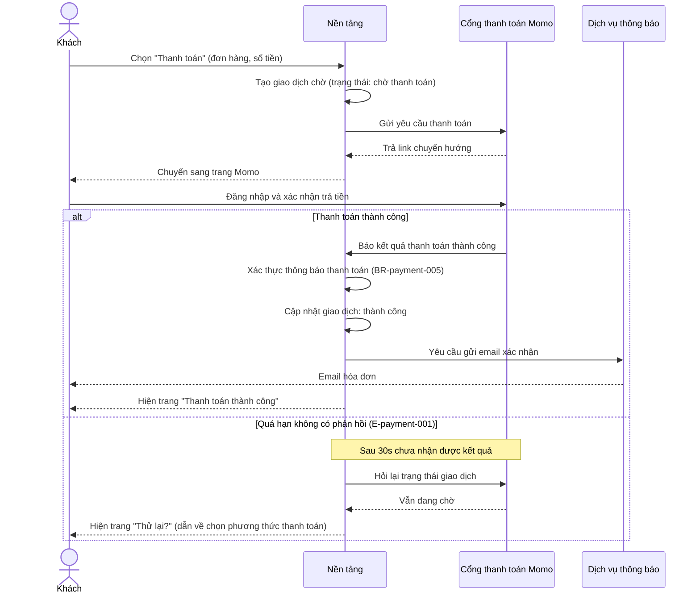

<!--
REFERENCE cho /sequence (không phải doc thật). Điểm cần bắt chước:
- File gộp: slim frontmatter (type/feature/updated) + heading trần "# {Feature} — Flows", KHÔNG câu intro/blockquote meta trong thân doc.
- Mỗi flow = 1 section "## Flow:" được APPEND (không phải file standalone).
- Message business-language: dev hiểu luồng nhưng KHÔNG bịa endpoint/SQL/thuật toán khi chưa có nguồn.
-->

# Payment — Flows

## Flow: Guest Checkout via Momo
**Trigger**: Khách guest (không đăng nhập) bấm "Thanh toán" ở màn giỏ hàng.
**Related UC**: [[../usecases/uc-guest-checkout.md]]
**Related FR**: FR-payment-001, FR-payment-003, FR-payment-006

## Notes

- **Chống xử lý trùng** — mỗi thông báo thanh toán chỉ được ghi nhận 1 lần; nhận trùng thì giữ nguyên trạng thái đã có, không cộng tiền 2 lần (BR-payment-005). *Cách hiện thực (khóa chống trùng, xác thực chữ ký) là việc thiết kế kỹ thuật — chỉ ghi vào NFR/technical design khi đã có nguồn phê duyệt, KHÔNG vẽ thành message.*
- **Chờ kết quả** — nếu khách quay lại app trước khi có kết quả từ cổng (mạng yếu), app chủ động hỏi lại trạng thái vài lần trước khi báo "thử lại".
- **Email không chặn thanh toán** — gửi email là bước phụ; nếu dịch vụ thông báo lỗi, thanh toán vẫn tính thành công với khách, email gửi lại sau.

**Reference:**
- FR-payment-001, FR-payment-003, FR-payment-006 (spec Mục 2).
- E-payment-001 (spec Mục 5 — Error Matrix).
- BR-payment-005 (spec Mục 4 — quy tắc chống xử lý trùng).
