---
name: user-flow
description: Dùng khi cần phân tích nghiệp vụ ra user flow tổng (mermaid) phủ happy/error/edge case, chia sẵn feature thành các flow trước khi vẽ wireframe. Kích hoạt bằng /user-flow <feature>. Output là nguồn chia flow chung cho /wireframe-ascii và /wireframe-html.
---

# /user-flow — Nghiệp vụ → User Flow (nguồn chia flow chung)

> **KHĂ”NG dĂ¹ng `context: fork`.** Skill PHẢI chạy ở main conversation vì cĂ³ HITL thật: clarify loop (Phase C, hỏi user chờ trả lời), duyệt text (Phase E, max 3 vĂ²ng), vĂ  HARD STOP (chốt/sá»­a/hủy). Fork = khĂ´ng cĂ³ kĂªnh user trả lời prompt → mọi gate bị auto-skip → skill tá»± Ä‘oĂ¡n nghiệp vụ hoặc tá»± Write khĂ´ng hỏi (cĂ¹ng root cause bug CR-20260612-001). PhĂ¢n tĂ­ch nặng Ä‘Ă£ delegate cho `flow-reviewer` qua Task tool nĂªn khĂ´ng cần fork toĂ n skill.

## Goal

Đi từ **nghiệp vụ trừu tượng** (chỉ tĂªn tĂ­nh năng hoặc 1 Ä‘oạn mĂ´ tả) tá»›i **user flow tổng Ä‘Ă£ duyệt**: sÆ¡ đồ mermaid thể hiện tÆ°Æ¡ng tĂ¡c giữa cĂ¡c mĂ n hình, phủ đủ **happy / error / edge case**, vĂ  chia sẵn feature thĂ nh cĂ¡c **flow** (flow-slug + danh sĂ¡ch screens/use case má»—i flow).

Output `docs/{feature}/srs/{feature}-userflow.md` lĂ  **nguồn chia flow DUY NHẤT** — `/wireframe-ascii` vĂ  `/wireframe-html` đều đọc file nĂ y để biết flow nĂ o gồm những mĂ n nĂ o, rồi má»—i skill tá»± vẽ wireframe Ä‘á»™c lập (KHĂ”NG đọc lẫn nhau). `/user-flow` PHẢI chạy trÆ°á»›c cả hai — chÆ°a biết flow dá»± kiến thì chÆ°a vẽ được wireframe Ä‘Ăºng scope.

> **User flow ≠ activity diagram.** User flow lĂ  view **UX** (tÆ°Æ¡ng tĂ¡c giữa cĂ¡c MĂ€N HĂŒNH, phục vụ chia flow để vẽ wireframe) — dĂ¹ng mermaid `flowchart` gọn. Activity/quy trình nghiệp vụ Ä‘a vai trĂ² (ai lĂ m bÆ°á»›c nĂ o) lĂ  việc của `/activity` (Mermaid), `/activity-swimlane` (PlantUML swimlane) hoặc `/bpmn`, sống ở `srs/{feature}-flows.md`. Đừng nhồi lane/actor nghiệp vụ vĂ o userflow.

## Constraints

- **HARD STOP sau khi flow được duyệt.** Skill nĂ y CHỈ dừng ở user flow — KHĂ”NG vẽ wireframe (Ä‘Ă³ lĂ  việc của `/wireframe-ascii` hoặc `/wireframe-html`, gọi riĂªng hoặc qua `/srs`).
- **Hỏi khi khĂ´ng rõ — KHĂ”NG Ä‘oĂ¡n.** Mọi Ä‘iểm mÆ¡ hồ (luồng, Ä‘iều kiện, giĂ¡ trị cụ thể, case lá»—i) phải hỏi user ngay trong chat (numbered list, 1 vĂ²ng/lần, chờ trả lời) trÆ°á»›c khi Ä‘Æ°a vĂ o flow. Áp dụng `resolve-oqs` tinh thần: thĂ  ghi Open Question cĂ²n hÆ¡n bịa.
- **Upstream priority**: brainstorm > URD > PRD/SRS > tự suy luận. Soft gate — thiếu vẫn proceed bằng suy luận + clarify.
- **Skip L3 cho mermaid** — flow tổng lĂ  mermaid `flowchart`, KHĂ”NG render được trong chat (khĂ¡c ASCII cÅ©). Write file thẳng sau khi user duyệt ná»™i dung bằng mĂ´ tả text (xem Phase E).
- **flow-reviewer gate (Phase E.5)** — sau khi user OK ná»™i dung flow (mĂ´ tả text, chÆ°a phải file), BẮT BUỘC spawn agent `flow-reviewer` (persona "UX_Reviewer") review flow + case coverage + grouping trÆ°á»›c khi Ä‘Æ°a user confirm cuối. Skill nhận findings → xá»­ lĂ½ lại → má»›i sang HARD STOP.
- **L1 plan preview** trÆ°á»›c khi Write file.
- **L2 diff** khi file Ä‘Ă£ tồn tại (chạy lại tá»± Ä‘á»™ng vĂ o update mode).
- **Vietnamese-first** labels + prose. User nĂ³i "viết bằng tiếng Anh" để switch.
- **BA conventions** (must follow) — Owner resolution, no-re-ask rule, IT-BA framing (KHĂ”NG hỏi DB/API/framework), Vietnamese typography ("Mục N" khĂ´ng dĂ¹ng §), L1 prose preview. Per @../../rules/ba-conventions.md.
- **Mermaid syntax safety** — theo @../../rules/diagram-selection.md Mục "Mermaid syntax safety". Quan trọng nhất: **QUOTE PHĂ’NG THỦ** — bọc `"..."` mọi node label + edge label chứa kĂ½ tá»± đặc biệt (`≥ ≤ + / ? & ( ) :`), vd `d1{"...email/password"}`, `A -->|"fail ≥3 lần"| B` (nguồn lá»—i "Invalid mermaid syntax" #1, vĂ  `mmdc` verify LẠI tha nĂªn phải phĂ²ng khi viết). KhĂ´ng HTML entity `&amp;` trong label, khĂ´ng `"..."` lồng, `<br/>` cho newline.
- **Render-verify mermaid BẮT BUỘC sau Write** (Phase F.5) — chạy `mermaid-verify.mjs`, fail thì tá»± sá»­a ≤2 lần. KHĂ”NG bĂ¡o "xong" khi mermaid chÆ°a compile OK.

## Inputs

```
/user-flow <feature-slug>                 # vd: /user-flow forgot-password
/user-flow "mĂ´ tả tĂ­nh năng tá»± do"        # vd: /user-flow "người dĂ¹ng quĂªn mật khẩu, gá»­i OTP qua email, đặt lại"
```

- Arg lĂ  **feature slug** (kebab-case) HOẶC **mĂ´ tả tĂ­nh năng** (free text). Skill tá»± nhận diện: nếu arg khá»›p folder `docs/{arg}/` tồn tại → coi lĂ  feature slug; nếu lĂ  cĂ¢u mĂ´ tả → derive slug + confirm ở L1. MĂ´ tả khĂ´ng suy ra slug rõ → skill hỏi lại tĂªn feature slug mong muốn trong cĂ¢u trả lời.
- Chạy lại trĂªn feature Ä‘Ă£ cĂ³ `userflow.md` → tá»± vĂ o update mode, L2 diff.
- Viết bằng tiếng Anh → nĂ³i "viết bằng tiếng Anh".

## Context (dynamic)

Today: !`date +%Y-%m-%d`
Features cĂ³ sẵn: !`ls -d docs/*/ 2>/dev/null | xargs -I{} basename {} | grep -v "^_" | head -20`
Features cĂ³ upstream (brainstorm/urd/prd — nguồn suy flow): !`for d in docs/*/; do f=$(basename "$d"); { [ -f "${d}$(basename "$d")-prd.md" ] || [ -f "${d}$(basename "$d")-urd.md" ] || ls "$d"brainstorms/*.md >/dev/null 2>&1; } && echo "$f"; done 2>/dev/null | grep -v "^_" | head -20`
Features Ä‘Ă£ cĂ³ userflow.md: !`for d in docs/*/srs/*-userflow.md; do [ -f "$d" ] && dirname "$d" | xargs dirname | xargs basename; done 2>/dev/null | head -20`

## Output

```
docs/{feature}/srs/{feature}-userflow.md
```

Slim frontmatter (`type: srs-userflow`, `feature`, `updated` + state fields). Sá»± kiện ghi vĂ o `docs/_shared/activity.log` qua hook (set env note trÆ°á»›c Write — khĂ´ng phụ thuá»™c spec.md).

## Runtime flow (skill chạy thế nĂ o)

```
/user-flow <arg>
        │
        â–¼
[Phase A] Parse arg → feature slug (existing folder?) hoặc derive từ mĂ´ tả
        │
        â–¼
[Phase A.5] Check docs/{feature}/srs/{feature}-userflow.md Ä‘Ă£ cĂ³ stage: flow-approved chÆ°a
            CĂ³ + flow_hash cĂ²n khá»›p Mục 1 hiện tại → bĂ¡o "flow Ä‘Ă£ duyệt, dĂ¹ng lại
            luĂ´n" + dừng (khĂ´ng hỏi lại). Lệch → cảnh bĂ¡o, hỏi user xĂ¡c nhận lại.
            ChÆ°a cĂ³ → tiếp Phase B.
        │
        â–¼
[Phase B] Đọc upstream: brainstorm > URD > PRD/SRS (Glob docs/{feature}/**).
        │
        â–¼
[Phase C] PhĂ¢n tĂ­ch nghiệp vụ → Ä‘iểm mÆ¡ hồ → HỎI user (numbered, chờ trả lời).
        │
        â–¼
[Phase D] Sinh: (1) danh sĂ¡ch mĂ n hình dá»± kiến, (2) chia flow (flow-slug +
          screens/UC mỗi flow), (3) user flow mermaid tổng (happy+error+edge).
        │
        â–¼
[Phase E] Duyệt ná»™i dung flow bằng mĂ´ tả text trong chat (max 3 vĂ²ng, KHĂ”NG
          phải L3 mermaid render — chỉ lĂ  preview cĂ³ cấu trĂºc).
        │
        â–¼
[Phase E.5] Spawn flow-reviewer → review flow + cases + flow grouping → findings.
            Skill xá»­ lĂ½ lại → bĂ¡o user Ä‘Ă£ sá»­a gì. Tối Ä‘a 2 vĂ²ng nếu cĂ²n BLOCKING.
        │
        â–¼
  ╔═══════════════════ HARD STOP ═══════════════════╗
  â•‘ In flow (Ä‘Ă£ qua review) + danh sĂ¡ch mĂ n + flow mapâ•‘
  â•‘ + tĂ³m tắt findings Ä‘Ă£ xá»­ lĂ½. Hỏi:                 â•‘
  ║ "Confirm để em ghi user flow? (chốt / sửa / hủy)" ║
  â•‘ Đợi user. KHĂ”NG tá»± Ä‘i tiếp.                       â•‘
  ╚══════════════════════════════════════════════════╝
        │ user "chốt"
        â–¼
[Phase F] L1 plan preview → Write userflow.md, set stage: flow-approved.
        │
        â–¼
[Phase F.5] Render-verify mermaid (mermaid-verify.mjs) → fail thì tá»± sá»­a ≤2 lần.
        │
        â–¼
[Phase G] Final report + recommend next (/wireframe-ascii, /wireframe-html, /srs).
```

## Approach (chi tiết từng phase)

### Phase A — Parse & resolve feature

1. Lấy arg sau `/user-flow`.
2. `Glob docs/*/` — nếu arg (slugify) khớp 1 folder tồn tại → `feature = arg`.
3. Nếu arg lĂ  mĂ´ tả tá»± do → derive feature slug (kebab-case, ASCII, ≤50 kĂ½ tá»±, theo `naming-conventions.md`). Confirm slug ở L1 cuối. User khĂ´ng đồng Ă½ slug tá»± suy → nĂ³i slug mong muốn trong cĂ¢u trả lời, skill dĂ¹ng luĂ´n.

### Phase A.5 — Check state Ä‘Ă£ duyệt (trĂ¡nh phĂ¢n tĂ­ch lại từ đầu)

> State artifact chống mất context khi turn bị ngắt (compact, session má»›i, quay lại sau nhiều ngĂ y). KHĂ”NG dá»±a vĂ o trĂ­ nhá»› há»™i thoại.

1. `Read docs/{feature}/srs/{feature}-userflow.md` nếu tồn tại. KhĂ´ng tồn tại → tiếp Phase B bình thường.
2. CĂ³ tồn tại + frontmatter cĂ³ `stage: flow-approved`:
   - TĂ­nh lại hash ná»™i dung Mục 1 "User Flow (tổng)" hiện tại, so vá»›i `flow_hash` Ä‘Ă£ lÆ°u.
   - **Khá»›p** → in "Flow Ä‘Ă£ duyệt từ {flow_approved_at}, dĂ¹ng lại luĂ´n" rồi **dừng ở Ä‘Ă¢y** (khĂ´ng chạy lại Phase B-E.5-HARD STOP), trừ khi user nĂ³i rõ muốn rĂ  lại (vd "chạy lại /user-flow", "rĂ  lại flow") — coi nhÆ° Ä‘Ă£ xong, bĂ¡o user chạy `/wireframe-ascii` hoặc `/wireframe-html` tiếp.
   - **Lệch** (ai Ä‘Ă³ sá»­a Mục 1 sau khi duyệt — thủ cĂ´ng hoặc qua `/cr`) → CẢNH BÁO: "Flow Ä‘Ă£ đổi từ lĂºc duyệt ({flow_approved_at})." Hỏi user: dĂ¹ng flow hiện tại lĂ m chuẩn má»›i (tá»± cập nhật `flow_hash`) hay rĂ  lại từ Phase C.
3. CĂ³ tồn tại nhÆ°ng KHĂ”NG cĂ³ `stage: flow-approved` (HARD STOP chÆ°a qua ở lần chạy trÆ°á»›c) → tiếp Phase B bình thường.
4. User nĂ³i muốn rĂ  lại/chạy lại từ đầu (dĂ¹ Ä‘Ă£ khá»›p hash) → tiếp Phase B (rĂ  lại cĂ³ chủ Ä‘Ă­ch), bỏ qua nhĂ¡nh "khá»›p → dừng".

### Phase B — Đọc upstream nghiệp vụ

Đọc theo thứ tá»± Æ°u tiĂªn (dừng khi đủ ngữ cảnh, nhÆ°ng nĂªn đọc thĂªm nếu cĂ³):
- **KG chọn nguồn trÆ°á»›c (rẻ hÆ¡n scan):** chạy `node .agents/skills/kg/engine/kg-query.mjs facts {feature}` vĂ  `node .agents/skills/kg/engine/kg-query.mjs neighbors <doc-path>` khi cĂ³ doc mốc để lấy danh sĂ¡ch candidate/coverage, rồi VẪN Read đầy đủ prose file Ä‘Ă£ chọn. TuĂ¢n `.agents/rules/kg-usage.md` (3 nghÄ©a vụ: `--all` khi bị cap · đọc mục "Phải Read tay" · `KG-ERROR` → scan trá»±c tiếp nhÆ° cÅ©).

| Nguồn | Path | Trích gì |
|-------|------|----------|
| Brainstorm (Æ°u tiĂªn 1) | `docs/{feature}/brainstorms/*.md` | Core flows, scenario matrix, state transitions, decision points, error cases, giĂ¡ trị cụ thể |
| URD (Æ°u tiĂªn 2) | `docs/{feature}/{feature}-urd.md` | Personas, user needs, user journeys, success criteria |
| PRD/SRS (nếu cĂ³) | `docs/{feature}/{feature}-prd.md`, `docs/{feature}/srs/{feature}-spec.md` | Capabilities, FR, screens Ä‘Ă£ định nghÄ©a |

- CĂ³ upstream → trĂ­ch nghiệp vụ, KHĂ”NG hỏi lại cĂ¡i Ä‘Ă£ cĂ³ (no-re-ask).
- Thiếu hết → **suy luận mode**: skill tá»± dá»±ng giả định nghiệp vụ từ tĂªn/mĂ´ tả tĂ­nh năng, rồi Phase C hỏi xĂ¡c nhận giả định.

### Phase C — PhĂ¢n tĂ­ch nghiệp vụ & clarify (KHĂ”NG Ä‘oĂ¡n)

1. Skill tĂ³m tắt **hiểu biết hiện tại** về tĂ­nh năng (2-4 dĂ²ng): mục tiĂªu, actor, luồng chĂ­nh, nhĂ¡nh nghi ngờ.
2. Liệt kĂª **Ä‘iểm chÆ°a rõ** thĂ nh numbered list. Hỏi tối Ä‘a 5-7 cĂ¢u/vĂ²ng, **1 vĂ²ng má»™t**, chờ trả lời. CĂ¢u hỏi bằng **ngĂ´n ngữ nghiệp vụ** (IT-BA framing).
3. Loop tá»›i khi đủ rõ HOẶC user nĂ³i "đủ rồi" → phần chÆ°a trả lời ghi vĂ o Open Questions, KHĂ”NG bịa ná»™i dung.

### Phase D — Sinh màn hình + chia flow + user flow mermaid

0. **Primary device** (hỏi 1 cĂ¢u ở Phase C nếu chÆ°a rõ): feature nĂ y chủ yếu chạy trĂªn **mobile (375px)**, **tablet (768px)** hay **desktop (1024px+)**? ÄĂ¢y lĂ  nguồn DUY NHẤT cho `/wireframe-html` + `/prototype-html` render Ä‘Ăºng bề rá»™ng khung. KhĂ´ng rõ → default `mobile` (mobile-first). Ghi vĂ o frontmatter `primary_device`.
1. **Danh sĂ¡ch mĂ n hình dá»± kiến**: má»—i mĂ n 1 dĂ²ng (slug + mục Ä‘Ă­ch 1 cĂ¢u). Bao gồm mĂ n trạng thĂ¡i (success, error page, empty, loading nếu cần).
2. **Chia flow**: skill Tá»° nhĂ³m cĂ¡c mĂ n cĂ¹ng má»™t mục tiĂªu nghiệp vụ thĂ nh 1 flow (vd `forgot-password-flow` = mĂ n nhập email → OTP → đặt mật khẩu má»›i → thĂ nh cĂ´ng). Má»—i flow cĂ³ 1 `flow-slug`. User duyệt cĂ¡ch chia nĂ y ở HARD STOP — Ä‘Ă¢y lĂ  quyết định quan trọng vì `/wireframe-ascii` + `/wireframe-html` sẽ tạo 1 file/flow theo Ä‘Ăºng cĂ¡ch chia nĂ y.
3. **User flow mermaid tổng**: `flowchart TD` (hoặc `TB`) thể hiện tÆ°Æ¡ng tĂ¡c giữa mĂ n hình, phủ **đủ 3 loại case**:
   - **Happy case** — luồng thành công chính.
   - **Error case** — sai input, lỗi hệ thống, sai OTP, hết hạn, vv.
   - **Edge case** — biĂªn: account khĂ´ng tồn tại, Ä‘Ă£ dĂ¹ng OTP, double-submit, quay lại giữa chừng, vv.
   DĂ¹ng style class riĂªng cho từng loại case (xem Mục "Mermaid user flow convention").
   **QUOTE PHĂ’NG THỦ khi compose (bắt buá»™c — trĂ¡nh "Invalid mermaid syntax"):** bọc `"..."` MỌI node label vĂ  MỌI edge label chứa kĂ½ tá»± đặc biệt (`≥ ≤ + / ? & ( ) :`). Vd `d1{"Kiểm tra<br/>email/password"}` vĂ  `A -->|"fail ≥3 lần"| B`. Mặc định quote hết cho chắc — quote thừa vĂ´ hại. ÄĂ¢y lĂ  nguồn lá»—i phổ biến nhất mĂ  `mmdc` (Phase F.5) lại **tha**, nĂªn phải phĂ²ng ngừa lĂºc viết, khĂ´ng dá»±a verify để phĂ¡t hiện. Chi tiết: `diagram-selection.md` Mục "Mermaid syntax safety".
4. **Bảng chuyển mĂ n (Mục 3.5)**: rĂºt từ mermaid Mục 1 thĂ nh bảng `Từ mĂ n [#] → Đến mĂ n [#] | Trigger | Điều kiện`, phủ cả nhĂ¡nh happy/error/edge. ÄĂ¢y lĂ  nguồn DUY NHẤT cho `/wireframe-html` + `/prototype-html` nối Ä‘iều hÆ°á»›ng (edge NAVIGATES_TO) — đừng để 3 nÆ¡i tá»± suy lại. Má»—i cạnh trong flowchart = 1 dĂ²ng bảng.

### Phase E — Duyệt ná»™i dung flow (khĂ´ng phải L3 mermaid render)

> Mermaid KHĂ”NG render trong chat — khĂ¡c ASCII trÆ°á»›c Ä‘Ă¢y. Thay vì L3 render-vĂ -sá»­a, skill in **preview cĂ³ cấu trĂºc bằng text** (khĂ´ng phải code mermaid thĂ´) để user duyệt ná»™i dung, rồi má»›i ghi mermaid thật vĂ o file.

```
[/user-flow] Preview user flow — PhiĂªn bản 1:

Primary device: {mobile 375 / tablet 768 / desktop 1024}

Luồng chính (happy): {A} → {B} → {C} → Thành công
NhĂ¡nh error: {Ä‘iểm rẽ} → {error case 1}, {error case 2}
NhĂ¡nh edge: {Ä‘iểm rẽ} → {edge case 1}, {edge case 2}

Danh sĂ¡ch mĂ n hình ({N}):
  1. {slug} — {mục Ä‘Ă­ch}
  ...

Chia flow ({M} flow):
  - {flow-slug-1}: gồm {màn a, b, c}
  - {flow-slug-2}: gồm {màn d, e}

Đồng Ă½ / Sá»­a: <mĂ´ tả thay đổi> / Hủy:
```

- Max 3 vĂ²ng. User "Sá»­a: thĂªm case OTP hết hạn" → regen v2. VĂ²ng 3 Ă©p chốt.
- Mermaid thật (cĂº phĂ¡p đầy đủ) được compose SAU khi ná»™i dung Ä‘Ă£ chốt ở bÆ°á»›c nĂ y — trĂ¡nh user phải đọc/sá»­a cĂº phĂ¡p mermaid thĂ´.

### Phase E.5 — flow-reviewer review (BẮT BUỘC, trước khi confirm)

Sau khi user "Đồng Ă½" preview ở Phase E, skill **spawn agent `flow-reviewer`** (persona "UX_Reviewer") để review chi tiết trÆ°á»›c khi Ä‘Æ°a user chốt.

1. **Spawn agent** qua Task tool, `subagent_type: flow-reviewer`. Truyền vào prompt:
   - Preview flow (luồng chĂ­nh + nhĂ¡nh error/edge — dạng text nhÆ° Phase E).
   - Danh sĂ¡ch mĂ n hình (slug + mục Ä‘Ă­ch).
   - Bảng chia flow (flow nĂ o gồm mĂ n nĂ o, phủ case nĂ o).
   - TĂ³m tắt nghiệp vụ + Open Questions hiện cĂ³.
   - Path upstream để agent tự đọc: `docs/{feature}/brainstorms/`, `docs/{feature}/{feature}-urd.md`.
2. **Nhận findings** (format `review-format.md`: verdict + BLOCKING/WARNING/SUGGESTION + section "Missing screens/branches").
3. **Skill xá»­ lĂ½ lại flow:**
   - Mọi **BLOCKING** + **Missing screens/branches** → bổ sung vĂ o flow + danh sĂ¡ch mĂ n + flow map (skill tá»± xá»­ lĂ½, KHĂ”NG hỏi user từng cĂ¡i — trừ khi cần giĂ¡ trị nghiệp vụ chÆ°a biết thì ghi Open Question).
   - **WARNING** → Ă¡p dụng nếu rõ rĂ ng; nếu cần quyết định nghiệp vụ → ghi Open Question.
   - **SUGGESTION** → cĂ¢n nhắc, khĂ´ng bắt buá»™c.
4. **BĂ¡o user** ngắn gọn Ä‘Ă£ sá»­a gì:
   ```
   đŸ” UX_Reviewer Ä‘Ă¡nh giĂ¡ flow (verdict: {revise}):
     ÄĂ£ bổ sung theo review:
       - {nhĂ¡nh/mĂ n vừa thĂªm}
       - {case vừa phủ}
     Ghi nhận Open Question: {nếu cĂ³}
   ```
5. **Loop**: nếu sau khi sá»­a vẫn cĂ²n BLOCKING bản chất, spawn lại review lần 2. **Tối Ä‘a 2 vĂ²ng** — vĂ²ng 2 vẫn block → ghi rõ Ä‘iểm tồn đọng vĂ o Open Question + để user quyết ở HARD STOP.

> LÆ°u Ă½ phĂ¢n vai: `UX_Reviewer` lĂ m flow **tốt hÆ¡n về UX/nghiệp vụ**; **quyền chốt vẫn lĂ  user** ở HARD STOP.

### HARD STOP (sau Phase E.5)

```
✅ User flow + {N} mĂ n hình + {M} flow (Ä‘Ă£ qua UX_Reviewer).
   Findings Ä‘Ă£ xá»­ lĂ½: {tĂ³m tắt 1-2 dĂ²ng}.

Em sẽ ghi user flow vĂ o docs/{feature}/srs/{feature}-userflow.md.
Confirm? (chốt / sửa / hủy)
```

- `chốt` / `ok` / `Y` → sang Phase F.
- `sửa: ...` → quay lại Phase D/E.
- `hủy` → dừng, KHÔNG write gì.

**KHĂ”NG được tá»± Ä‘i tiếp khi chÆ°a cĂ³ "chốt".**

### Phase F — L1 plan preview + Write

Theo `ba-conventions.md` Mục 5 (prose, khĂ´ng bảng tag dĂ y):

```
Em sẽ tạo file `docs/{feature}/srs/{feature}-userflow.md`:

**Primary device:** {mobile 375 / tablet 768 / desktop 1024} (dĂ¹ng cho wireframe/prototype render Ä‘Ăºng khung).

**User flow tổng:** {N} màn hình, chia {M} flow, phủ happy/error/edge.

**Chia flow:**
- {flow-slug-1}: {mĂ n a, b, c}
- {flow-slug-2}: {mĂ n d, e}

**CĂ¢u hỏi mở:** {K} cĂ¢u chÆ°a chốt sẽ ghi vĂ o file.

Apply? (Y / sá»­a)
```

User Y → Write `docs/{feature}/srs/{feature}-userflow.md` (xem Mục "Template userflow.md"). **Bắt buá»™c set state ngay lĂºc Write**: `primary_device: {mobile|tablet|desktop Ä‘Ă£ chốt}`, `stage: flow-approved`, `flow_approved_at: {date}`, `flow_hash: {sha256 8 kĂ½ tá»± đầu của ná»™i dung Mục 1 vừa ghi}`.

Set env `CLAUDE_CHANGELOG_NOTE` trÆ°á»›c Write — hook ghi activity.log (khĂ´ng phụ thuá»™c spec.md tồn tại hay chÆ°a).

### Phase F.5 — Render-verify mermaid (BẮT BUỘC, chạy ngay sau Write)

Flow tổng lĂ  mermaid `flowchart` — KHĂ”NG render trong chat (lĂ½ do skip L3), nĂªn Ä‘Ă¢y lĂ  cĂ¡ch DUY NHẤT bắt lá»—i cĂº phĂ¡p TRƯỚC khi bĂ¡o "xong", thay vì để user tá»± phĂ¡t hiện khi mở IDE/GitHub/Obsidian.

```bash
node .agents/scripts/mermaid-verify.mjs --file docs/{feature}/srs/{feature}-userflow.md
```

- **Pass** (compile OK) → **kiểm thĂªm bằng mắt trÆ°á»›c khi bĂ¡o xong:** `mmdc` lenient hÆ¡n GitHub/Obsidian nĂªn compile OK vẫn cĂ³ thể crash renderer thật. RĂ  block Mục 1: MỌI node label + edge label chứa kĂ½ tá»± đặc biệt (`≥ ≤ + / ? & ( ) :`) Ä‘Ă£ bọc `"..."` chÆ°a? ChÆ°a → quote ngay (Ä‘Ă¢y Ä‘Ăºng lĂ  lá»—i "Invalid mermaid syntax" hay gặp nhất, mmdc khĂ´ng bắt). Xong → sang Phase G, report cĂ³ dĂ²ng "mermaid compile OK".
- **Fail** → đọc lá»—i dĂ²ng/cá»™t script trả về, sá»­a **chỉ block mermaid Mục 1** (KHĂ”NG đụng Mục 2/3/4), verify lại. **Tá»± sá»­a tối Ä‘a 2 lần.** Lá»—i hay gặp (theo `diagram-selection.md` Mục "Mermaid syntax safety"):
  - **KĂ½ tá»± đặc biệt trần (`≥ + / ?`) trong node label `{...}`/`[...]` hoặc edge label `|...|`** → bọc cả label trong `"..."`. Vd `d1{"...email/password"}`, `A -->|"fail ≥3 lần"| B`. (NguyĂªn nhĂ¢n #1.)
  - HTML entity trong label (`&amp;` `&lt;`) → thay bằng chữ thường ("vĂ ", "nhỏ hÆ¡n") hoặc bỏ.
  - Quote `"..."` Lá»’NG trong 1 label Ä‘Ă£ cĂ³ `"..."` → bỏ lá»›p trong, dĂ¹ng `<b>...</b>` nếu cần nhấn.
  - KĂ½ tá»± `()[]{}` lĂ  ná»™i dung trong label → bọc `"..."` hoặc escape `#40;#41;#91;#93;#123;#125;`.
  - `\n` → dĂ¹ng `<br/>`.
- **Vẫn fail sau 2 lần tá»± sá»­a** → bĂ¡o user rõ lá»—i + Ä‘oạn mermaid, gợi Ă½ paste mermaid.live để debug tay. **KHĂ”NG Ă¢m thầm để file lá»—i mĂ  bĂ¡o "xong".**

> Nếu Mục 1 Ä‘Ă£ đổi do sá»­a cĂº phĂ¡p ở bÆ°á»›c nĂ y → **tĂ­nh lại `flow_hash`** cho khá»›p ná»™i dung Mục 1 cuối cĂ¹ng (trĂ¡nh Phase A.5 lần sau bĂ¡o "flow Ä‘Ă£ đổi" oan).

### Phase G — Final report

```
✅ User flow hoĂ n tất: docs/{feature}/srs/{feature}-userflow.md
   {N} mĂ n hình, {M} flow, cĂ¢u hỏi mở cĂ²n lại: {K}
   Mermaid: compile OK · Primary device: {mobile|tablet|desktop}

Recommended next:
  - /wireframe-ascii {feature}   — wireframe ASCII lo-fi (duyệt cấu trĂºc nhanh)
  - /wireframe-html {feature}    — wireframe HTML lo-fi B&W (khung device {primary_device})
  - /prototype-html {feature}    — prototype hi-fi clickable (design tokens + JS)
  - /srs {feature}                — kỹ thuật hoĂ¡ thĂ nh SRS đầy đủ
```

## Mermaid user flow convention (cho userflow.md Mục 1)

`flowchart TD`, Ä‘Ă¡nh số `[n]` má»—i mĂ n hình (trong label, vì Mermaid node id khĂ´ng nhận số đứng đầu — dĂ¹ng id dạng `n1`, `n2`...). Style class cho 3 loại case:



- Node label Ä‘Ă¡nh số `[n]` cho mĂ n hình thật; node quyết định (diamond `{...}`) vĂ  node thĂ´ng bĂ¡o khĂ´ng Ä‘Ă¡nh số.
- `-->` cho luồng chĂ­nh, `-.->` cho quay lại/retry.
- Style class `happy`/`error`/`edge` tĂ´ mĂ u theo loại case — Ă¡p cho node kết quả (khĂ´ng nhất thiết Ă¡p cho node quyết định).
- Nếu flow quĂ¡ rá»™ng → tĂ¡ch thĂ nh nhiều `flowchart` block theo flow-slug, má»—i block 1 heading `### Flow: {flow-slug}`.
- TuĂ¢n `diagram-selection.md` Mục "Mermaid syntax safety" — KHĂ”NG dĂ¹ng `"..."` lồng trong `[...]`, dĂ¹ng `<br/>` cho newline.

## Template `userflow.md`

```yaml
---
type: srs-userflow
feature: {feature}
updated: {date}
primary_device: mobile          # mobile (375) | tablet (768) | desktop (1024) — nguồn bề rộng khung cho /wireframe-html + /prototype-html
stage: flow-approved
flow_approved_at: {date}
flow_hash: "{sha256 8 kĂ½ tá»± đầu của ná»™i dung Mục 1 tại lĂºc user gõ 'chốt' ở HARD STOP}"
---

# {Feature} — User Flow

> Nguồn chia flow DUY NHẤT cho feature nĂ y. `/wireframe-ascii` vĂ  `/wireframe-html` đọc file nĂ y để biết flow nĂ o gồm những mĂ n nĂ o — KHĂ”NG tá»± chia flow riĂªng.

## 1. User Flow (tổng)

> Phủ happy / error / edge cases. `[n]` = số mĂ n hình đối chiếu Mục 2.

```mermaid
{mermaid flowchart — theo convention}
```

## 2. Danh sĂ¡ch mĂ n hình

> Cá»™t `Slug` = định danh mĂ¡y-đọc DUY NHẤT của mĂ n (khá»›p `## Screen: {slug}` bĂªn wireframe + node KG). `[#]` chỉ để đối chiếu Mục 1/3.5.

| [#] | Slug | MĂ n hình | Mục Ä‘Ă­ch | Thuá»™c flow |
|-----|------|----------|----------|------------|
| 1 | forgot-email | Nhập email | Người dĂ¹ng nhập email để nhận OTP | forgot-password-flow |
| 2 | otp-input | Nhập OTP | XĂ¡c thá»±c mĂ£ gá»­i qua email | forgot-password-flow |
| ... | | | | |

## 3. Danh sĂ¡ch flow

| Flow-slug | TĂªn flow | MĂ n hình gồm | Cases phủ |
|-----------|----------|--------------|-----------|
| forgot-password-flow | QuĂªn mật khẩu | forgot-email → otp-input → reset-form → reset-done | happy, error (sai OTP), edge (hết hạn, email khĂ´ng tồn tại) |

## 3.5. Chuyển mĂ n (transitions)

> Nguồn DUY NHẤT cho chuyển mĂ n mĂ n→mĂ n (edge NAVIGATES_TO). `/wireframe-html` + `/prototype-html` đọc bảng nĂ y để nối nĂºt/Ä‘iều hÆ°á»›ng — KHĂ”NG tá»± suy lại từ prose/mermaid (trĂ¡nh 3 nÆ¡i maintain lệch nhau). 1 dĂ²ng = 1 chuyển; đủ phủ happy + error + edge của Mục 1.

| Từ mĂ n [#] | Đến mĂ n [#] | Trigger | Điều kiện |
|-----------|------------|---------|-----------|
| Nhập email [1] | Nhập OTP [2] | Submit email | email tồn tại |
| Nhập email [1] | (giữ nguyĂªn) [1] | Submit email | email khĂ´ng tồn tại → bĂ¡o lá»—i |
| Nhập OTP [2] | Đặt mật khẩu [3] | Submit OTP | OTP Ä‘Ăºng, cĂ²n hạn |

## 4. Open Questions

- [ ] OQ-1: {cĂ¢u hỏi nghiệp vụ chÆ°a chốt}

(Trống nếu nghiệp vụ Ä‘Ă£ rõ hết.)
```

> **KHĂ”NG cĂ³ section Changelog trong file.** Lịch sá»­ thay đổi sống ở `docs/_shared/activity.log` tập trung (hook `auto-changelog.sh` lĂ  writer duy nhất) — set env `CLAUDE_CHANGELOG_NOTE` trÆ°á»›c Write.

## Gotchas

- **KhĂ´ng vẽ wireframe ở Ä‘Ă¢y.** `/user-flow` dừng lại ở flow — vẽ ASCII/HTML lĂ  việc của `/wireframe-ascii` / `/wireframe-html`.
- **flow-reviewer chạy TRƯỚC HARD STOP.** Đừng Ä‘Æ°a user confirm trÆ°á»›c khi review xong.
- **Review ≠ tá»± Ă½ đổi nghiệp vụ.** Findings cần giĂ¡ trị nghiệp vụ chÆ°a biết → ghi Open Question, KHĂ”NG bịa số.
- **Đừng Ä‘oĂ¡n nghiệp vụ.** MÆ¡ hồ → hỏi ngay, chờ trả lời. KhĂ´ng trả lời → Open Question.
- **Chia flow theo mục tiĂªu nghiệp vụ**, khĂ´ng theo mĂ n rời — quyết định nĂ y ảnh hưởng trá»±c tiếp `/wireframe-ascii` + `/wireframe-html` sau nĂ y.
- **Mermaid, khĂ´ng phải ASCII** — khĂ¡c skill tiền nhiệm `/wireframe-n-userflow`. KHĂ”NG render trong chat; Phase E dĂ¹ng preview text, khĂ´ng phải mermaid thĂ´.
- **Verify mermaid sau Write (Phase F.5) — KHĂ”NG bỏ qua.** Mermaid khĂ´ng render trong chat nĂªn lá»—i cĂº phĂ¡p chỉ lá»™ khi user mở IDE/GitHub. Chạy `mermaid-verify.mjs`, tá»± sá»­a ≤2 lần. Lá»—i hay gặp: `&amp;`/HTML entity trong label, quote lồng `[...]`. Nếu sá»­a Mục 1 → tĂ­nh lại `flow_hash`.
- **`flow_hash` lĂ  cÆ¡ chế chống hỏi lại** — Phase A.5 dĂ¹ng nĂ³ để biết flow Ä‘Ă£ duyệt chÆ°a, trĂ¡nh chạy lại toĂ n bá»™ phĂ¢n tĂ­ch má»—i lần `/wireframe-ascii` hay `/srs` cần đọc userflow.
- **User muốn rĂ  lại chủ Ä‘á»™ng** (dĂ¹ flow Ä‘Ă£ duyệt vĂ  hash khá»›p) → nĂ³i rõ trong cĂ¢u lệnh ("chạy lại", "rĂ  lại từ đầu"), skill luĂ´n chạy lại Phase B, L2 diff khi Write.
- **Folder chÆ°a tồn tại** → tạo `docs/{feature}/srs/`. Feature folder `docs/{feature}/` chÆ°a cĂ³ → vẫn tạo (skill cĂ³ thể chạy trÆ°á»›c cả brainstorm).

## References

- @../../rules/approval-gate.md
- @../../rules/kg-usage.md
- @../../rules/naming-conventions.md
- @../../rules/feature-bootstrap.md
- @../../rules/ba-conventions.md
- @../../rules/resolve-oqs.md (chỉ Ă¡p dụng TINH THẦN "thĂ  ghi Open Question cĂ²n hÆ¡n bịa" — user-flow lĂ  Ä‘iểm-vĂ o sá»›m, KHĂ”NG chạy Phase resolve-OQ đầy đủ; resolve OQ lĂ  việc của `/urd` `/srs` sau)
- @../../rules/diagram-selection.md
- @../../rules/review-format.md (findings format UX_Reviewer dĂ¹ng)
- @../../scripts/mermaid-verify.mjs (render-verify sau Write — Phase F.5)
- @../../agents/flow-reviewer.md (UX_Reviewer — review flow ở Phase E.5)
- @../wireframe-ascii/SKILL.md (đọc userflow.md để chia flow)
- @../wireframe-html/SKILL.md (đọc userflow.md để chia flow)

