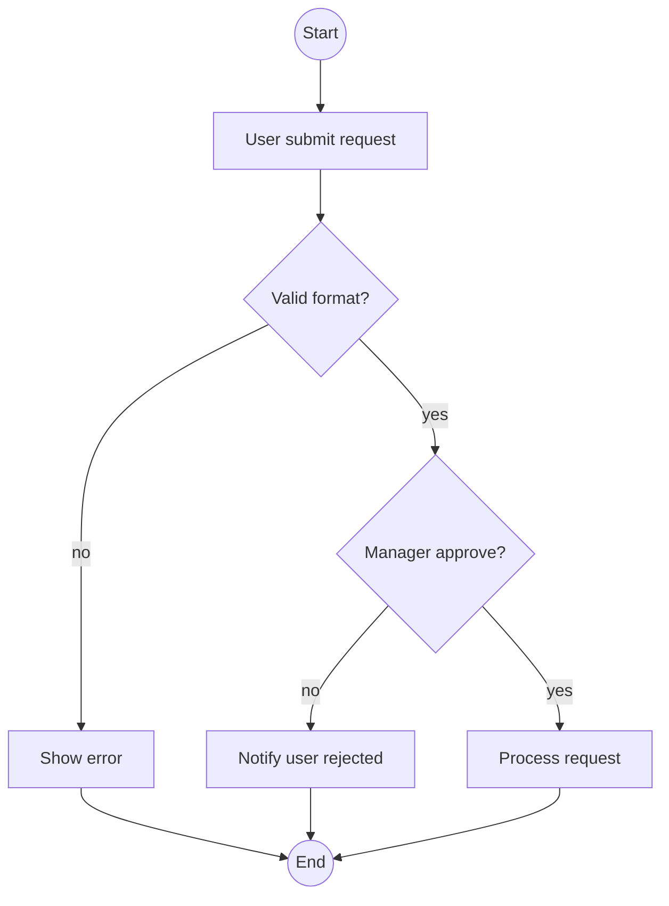
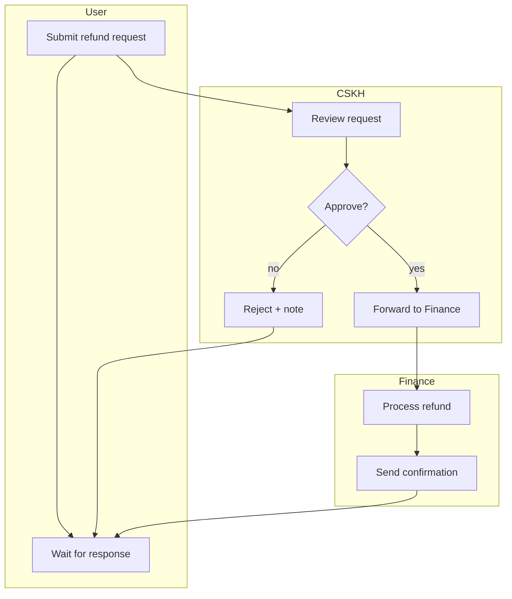

# /activity — Activity / Flowchart Diagram

## Goal

Produce mermaid `flowchart` cho 1 business process — show decisions, parallels, sub-processes, loops. Phù hợp khi sequence quá tuyến tính hoặc khi process là business workflow (cùng level abstraction với UC). **Output duy nhất**: append section vào `docs/{feature}/srs/{feature}-flows.md` (cùng file sequence, section riêng).

> **Định vị (per `diagram-selection.md`):** `/activity` (Mermaid) là lựa chọn cho **flow gọn 1-2 vai trò** cần **nhúng inline auto-render** GitHub/Obsidian. Quy trình **đa vai trò nhiều tương tác chéo lane** (refund, duyệt nhiều cấp) → mặc định dùng **`/activity-swimlane`** (PlantUML swimlane thật — Mermaid subgraph xô lệch khi nhiều cross-edge). Nếu phát hiện ≥3 lane với nhiều cross-lane edge, đề xuất user chuyển `/activity-swimlane` ở L1 trước khi vẽ.

## Constraints

- **1 output cố định** — `docs/{feature}/srs/{feature}-flows.md` append mode. KHÔNG flag `--uc`, `--standalone`, `--system-flow`, `--lanes`.
- **L1 approval** trước Write — prose BA-friendly.
- **KHÔNG L3 iterate** — mermaid không render trong chat. User review từ rendered file, muốn sửa thì gọi lại skill và nói cần đổi gì.
- **Auto-detect lanes/roles** từ description: scan role keywords (admin, user, system, approver, manager, CSKH). Nếu ≥2 lane → dùng `subgraph` để chia lane. **Nhưng nếu ≥3 lane + nhiều tương tác chéo lane → subgraph Mermaid xô lệch, đề xuất `/activity-swimlane` (PlantUML) ở L1** — user vẫn có quyền chọn ở lại Mermaid nếu cần nhúng inline.
- **Direction tự chọn theo độ phức tạp** — mặc định TB (top-bottom); process nhiều lane/rộng thì tự chuyển LR. User muốn ngang thì nói "vẽ theo chiều ngang" trong câu lệnh hoặc câu trả lời.
- **`--feature` optional** — auto-detect từ ngữ cảnh/feature đang làm dở; mơ hồ mới hỏi bằng picker. **Feature chưa tồn tại + arg là mô tả quy trình → tự derive slug + tạo feature** (điểm-vào, xem `feature-bootstrap.md` nhóm A). KHÔNG bắt qua `/brainstorm` trước.
- **Vietnamese-first** trong labels (mermaid hỗ trợ Unicode); syntax keywords English.
- **Per @../../rules/diagram-selection.md** — check process có ≥3 decisions hoặc có parallel; nếu đơn giản tuyến tính → suggest `/sequence`.
- **flows.md không tồn tại** → tạo mới với frontmatter + heading trần `# {Feature} — Flows` (KHÔNG câu intro/blockquote meta), rồi section `## Flow:` đầu.

## Inputs

```
/activity "<description>" --feature <slug>       # append section vào flows.md
/activity "<description>"                          # feature auto-detect từ ngữ cảnh, mơ hồ mới hỏi
/activity "<mô tả quy trình của feature mới>"       # feature chưa có → derive slug + phỏng vấn + tạo feature (nhóm A)
```

Muốn ngang thay vì mặc định top-bottom → nói "vẽ theo chiều ngang". Đã có section cho process đó → gọi lại skill với mô tả thay đổi, skill tự vào update mode (match slug) + L2 diff.

## Context (dynamic)

Today: !`date +%Y-%m-%d`
Features có sẵn: !`ls -d docs/*/ 2>/dev/null | xargs -I{} basename {} | head -20`
Features có flows.md: !`for d in docs/*/srs/*-flows.md; do [ -f "$d" ] && echo "$d"; done | head -10`

## Approach

1. **Resolve feature + process slug** — process slug auto-derive từ description (verb-object kebab-case, max 40 chars).
   - **Feature chưa tồn tại (điểm-vào, per `feature-bootstrap.md` nhóm A):** nếu arg là 1 mô tả quy trình thô mà chưa có `docs/{feature}/` nào khớp (vd `/activity "user nộp đơn, quản lý duyệt, tài chính chi tiền"`) → `/activity` ĐƯỢC PHÉP tự khởi tạo: derive feature slug từ mô tả (kebab-case, ASCII, ≤50 ký tự), confirm slug ở L1 (user override được), tạo `docs/{feature}/srs/` khi Write. KHÔNG bắt user chạy `/brainstorm` trước.
   - **Nguồn nghiệp vụ:** feature đã có UC/SRS/flows → đọc để lấy steps/decisions/lanes, không hỏi lại cái đã có (no-re-ask). **Feature mới (hoặc cũ thiếu nguồn)** → **phỏng vấn ĐÚNG PHẠM VI activity cần** (per `feature-bootstrap.md` nhóm A bước 3), hỏi gom 1 batch business-language (KHÔNG hỏi DB/SDK): **các bước tuần tự** · **điểm quyết định** (câu hỏi + các nhánh yes/no) · **lanes** nếu đa vai (ai làm bước nào) · **loop** (retry/quay lại) nếu có. KHÔNG bịa — thiếu ý nào hỏi ý đó. Làm rõ đủ để vẽ đúng, không lan man toàn diện như `/brainstorm`.
   - **Mô tả mơ hồ dù feature đã có nguồn** (vd process description quá ngắn, không rõ điểm quyết định/vai trò, hoặc UC/SRS đọc được cũng thiếu chi tiết) → **PHẢI hỏi clarifying trước khi generate**, KHÔNG tự suy đoán và generate luôn. Câu hỏi tối thiểu: "Có điểm quyết định (yes/no) nào cần thể hiện?", "Quy trình có mấy vai trò tham gia?". Đây không phải bootstrap phỏng vấn (feature đã có) — chỉ là 1-2 câu hỏi ngắn bù chỗ thiếu.
2. **Validate target** `docs/{feature}/srs/{feature}-flows.md`:
   - Tồn tại + trùng slug → tự vào update mode (L2 diff cho section đó).
   - Tồn tại, slug mới → append `## Flow: {title}` section.
   - Thiếu → tạo mới: slim frontmatter (`type: srs-flows`, `feature`, `updated`) + heading trần `# {Feature title} — Flows`, rồi append thẳng section `## Flow:` đầu tiên. KHÔNG chèn câu intro/blockquote mô tả "file này chứa gì / nguồn ở đâu / quy tắc viết" (meta-text — vi phạm `ba-conventions.md` Mục 0). Doc chỉ chứa nội dung nghiệp vụ thật.
3. **Auto-detect lanes/roles** từ description prose (scan role keywords). Nếu mơ hồ, ask clarifying (xem bước 1).
3.5. **Xác nhận lanes trước khi generate (BẮT BUỘC nếu ≥1 lane detect được)** — heuristic scan từ khoá chỉ là đề xuất ban đầu, KHÔNG tự chốt luôn. In ra: "Phát hiện {N} vai trò tham gia: {list}. Đủ chưa, hay còn vai trò nào khác?" — chờ user xác nhận/bổ sung trước khi sang bước 4. Mục đích: actor bị ẩn/ngụ ý trong câu văn (không gọi tên rõ) dễ bị heuristic bỏ sót, dẫn tới thiếu cả 1 lane mà không ai phát hiện. Nếu 0 lane detect được (process 1 vai trò) → bỏ qua bước này, không cần hỏi.
4. **Identify decisions + parallels** từ description ("nếu... thì...", "trong khi đó...", "đồng thời", "song song", "if/else").
4.5. **Trích fact-list (checklist coverage)** — TRƯỚC khi generate, liệt kê ngắn gọn (giữ trong context, không cần file riêng):
   - **Lanes/roles** đã xác nhận ở bước 3.5.
   - **Decision points**: mỗi điểm quyết định + các nhánh (yes/no hoặc multi-way).
   - **Loose ends check**: mọi node phải có ít nhất 1 đường ra dẫn tới 1 end node — không có nhánh cụt (theo đúng yêu cầu "no loose ends" phổ biến trong prompt BA chuẩn).
   Fact-list dùng làm checklist đối chiếu ở bước 9.6.
5. **Generate mermaid flowchart:**
   - `flowchart TB` (default); process nhiều lane/nhánh song song → tự chuyển `LR` cho gọn. User nói "vẽ theo chiều ngang" → dùng `LR`.
   - Node shapes: `[]` rectangle (process), `{}` diamond (decision), `(())` circle (start/end), `[/...\]` parallelogram (input/output).
   - Subgraph cho lanes nếu có ≥2 role.
   - Edge labels cho decision branches: `-->|yes|`, `-->|no|`.
6. **L1 plan preview** — prose BA-friendly: "Em sẽ append flowchart cho process {name} vào docs/{feature}/srs/{feature}-flows.md với N decisions + M lanes. Apply? (Y / sửa)".
7. **Write** — Read flows.md, append section sau last `## Flow:`. Mỗi section format:
   ```markdown
   ## Flow: {Title} (Activity)
   **Trigger**: {1-line}
   **Related UC**: [[../usecases/uc-{slug}.md]] (nếu detect được, else "TBD")
   **Related FR**: FR-{feature}-NNN, ...
   **Related E**: E-{feature}-NNN, ... (error path trong flow, else "—")

   \`\`\`mermaid
   flowchart TB
     ...
   \`\`\`
   ```
   > **ID full-form bắt buộc** trong 3 dòng Related — luôn `FR-{feature}-NNN` / `E-{feature}-NNN`, KHÔNG short-form `FR-001` (nguồn edge cho KG; short-form gây feature-ma + mất trace).
8. **Gọi lại với slug trùng** (update mode tự động) → L2 diff cho section đó.
9. **Activity log** — set env `CLAUDE_SKILL_NAME=/activity` + `CLAUDE_CHANGELOG_NOTE` (note: `added {process-title} activity diagram`) TRƯỚC khi Write — hook append vào `docs/_shared/activity.log` (không phụ thuộc spec.md tồn tại hay chưa, không còn routing/fallback). Update flows.md `updated: {date}`.
9.5. **Render-verify (BẮT BUỘC, chạy ngay sau Write)** — `node .claude/scripts/mermaid-verify.mjs --file docs/{feature}/srs/{feature}-flows.md`. Mermaid không render trong chat (đây là lý do skip L3), nên đây là cách duy nhất bắt lỗi cú pháp TRƯỚC khi báo "xong" thay vì để user tự phát hiện khi mở IDE.
   - **Pass** → tiếp bước 10, report có dòng "compile OK".
   - **Fail** (thường do quote lồng trong `[...]`/`{}` — xem Mermaid syntax safety ở `diagram-selection.md`) → đọc lỗi dòng/cột script trả về, sửa lại section vừa append (KHÔNG đụng section khác), verify lại. Tối đa 2 lần tự sửa.
   - **Vẫn fail sau 2 lần** → báo user rõ lỗi cụ thể + đoạn mermaid, gợi ý paste mermaid.live để debug tay. KHÔNG âm thầm để file lỗi mà báo "xong" bình thường.
9.6. **Coverage-verify (BẮT BUỘC, chạy ngay sau 9.5 pass)** — đối chiếu diagram vừa ghi với fact-list ở bước 4.5:
   - **Decision coverage**: mỗi decision point trong fact-list có xuất hiện thành 1 diamond với đủ nhánh (yes/no) trong diagram không.
   - **Lane coverage**: mỗi lane đã xác nhận ở 3.5 có xuất hiện thành 1 `subgraph` không.
   - **No loose ends**: mọi node có ít nhất 1 outgoing edge dẫn tới 1 end node (`((End))` hoặc tương đương) — không có nhánh cụt giữa chừng.
   Đây là compile-check KHÁC bước 9.5 — 9.5 chỉ bắt lỗi cú pháp, 9.6 bắt lỗi **thiếu nội dung nghiệp vụ hoặc dead-end**.
   - **Đủ** → tiếp bước 10, report thêm dòng "Coverage: {N}/{N} decisions, {M}/{M} lanes, no loose ends".
   - **Thiếu** (vd 1 lane bị bỏ sót, hoặc 1 nhánh "no" không dẫn tới đâu) → tự bổ sung vào section vừa ghi, verify lại 9.5 rồi 9.6. Tối đa 2 lần tự sửa.
   - **Vẫn thiếu sau 2 lần** → báo user rõ decision/lane/nhánh nào chưa thể hiện được, hỏi có muốn bỏ qua hay bổ sung mô tả. KHÔNG âm thầm báo "xong" khi coverage chưa đủ.
9.7. **Diagram_Reviewer gate (CHỈ khi vượt ngưỡng phức tạp)** — spawn agent qua Task tool, `subagent_type: diagram-reviewer`, truyền: section mermaid vừa ghi + fact-list bước 4.5, khi vượt bất kỳ ngưỡng nào (đo theo **tổng độ phức tạp**): **≥3 lane** HOẶC **≥5 decision point** HOẶC **nesting decision ≥2 tầng** HOẶC có **loop/retry quay lại**. Dưới mọi ngưỡng trên, bước 9.6 tự-đối-chiếu (không agent) đã đủ — SKIP 9.7, đi thẳng bước 10.
   - **Task tool không khả dụng** (runtime không cấp) → KHÔNG ngầm coi là đã review; report ghi rõ `reviewer skipped (Task unavailable)` để user biết diagram phức tạp chưa qua gate.
   - Nhận findings (format `review-format.md` + section "Coverage checklist"). Có BLOCKING → tự bổ sung lane/nhánh thiếu vào section, verify lại 9.5+9.6, rồi tiếp bước 10.
   - Loop tối đa 2 vòng — vòng 2 vẫn BLOCKING → báo user rõ findings còn tồn đọng, để user quyết định trước khi báo report.
   - Verdict `approve`/chỉ WARNING/SUGGESTION → tiếp bước 10 luôn.
10. **Output report:**
    ```
    ✅ Activity diagram appended: docs/{feature}/srs/{feature}-flows.md → ## Flow: {title} (Activity)
       Decisions: {N} | Lanes: {M} | Direction: {TB|LR} | Mermaid compile: OK | Coverage: {N}/{N} decisions, {M}/{M} lanes, no loose ends{reviewed_note}

    Mở file trong IDE/Obsidian/GitHub preview để xem rendered diagram.
    Cần sửa? Gọi lại /activity "<change>" --feature {feature}, em tự vào update mode.
    ```
    `{reviewed_note}` = ` | Reviewed by Diagram_Reviewer` nếu bước 9.7 đã chạy, else rỗng.

## Mermaid syntax reference

**Simple flowchart:**


**Multi-lane (swimlane via subgraph):**


## Gotchas

- **Đừng over-engineer** — process 3-4 step tuyến tính: dùng sequence hoặc numbered steps.
- **Subgraph naming** — lane name có space dùng `subgraph "Customer Support"`.
- **Loop** — `A --> B --> A` OK, nhưng ≥2 loop khác nhau dễ render rối; split thành 2 diagram.
- **Decision có >3 branches** — Mermaid không có native multi-way; dùng nhiều diamond nối tiếp.
- **Mermaid syntax fail** — bước 9.5 bắt lỗi qua `mermaid-verify.mjs` NGAY sau Write, tự sửa tối đa 2 lần. KHÔNG còn "vẫn write, warn" im lặng — chỉ báo user paste mermaid.live nếu 2 lần tự sửa vẫn fail.
- **Coverage thiếu ≠ lỗi cú pháp** — bước 9.5 (compile) và 9.6 (coverage + no-loose-ends) là 2 việc khác nhau. Diagram compile OK vẫn có thể thiếu 1 lane hoặc có 1 nhánh cụt (dead-end) — đừng nhầm "compile OK" là "xong".
- **Đừng tự chốt lane từ heuristic** — bước 3.5 bắt buộc hỏi user xác nhận danh sách vai trò detect được trước khi generate, vì scan từ khoá dễ bỏ sót actor bị ẩn/ngụ ý trong câu văn.
- **Sub-process** — Mermaid không native; dùng node label "[Sub: refund-eligibility-check]" + comment.
- **UC embed** — nếu user yêu cầu "vẽ activity vào UC X" → cho phép (activity là cùng level business với UC), nhưng vẫn KHÔNG phải responsibility của skill này. Suggest viết tay trong UC Mục e nếu thật sự cần inline. Default vẫn flows.md.

## References

- @../../rules/ba-conventions.md
- @../../rules/approval-gate.md
- @../../rules/naming-conventions.md
- @../../rules/changelog.md
- @../../rules/diagram-selection.md
- @../../rules/feature-bootstrap.md
- @../../../_templates/diagram-activity.md
- @../../scripts/mermaid-verify.mjs (render-verify sau Write — bước 9.5)
- @../../agents/diagram-reviewer.md (Diagram_Reviewer — review coverage khi vượt ngưỡng phức tạp, bước 9.7)
