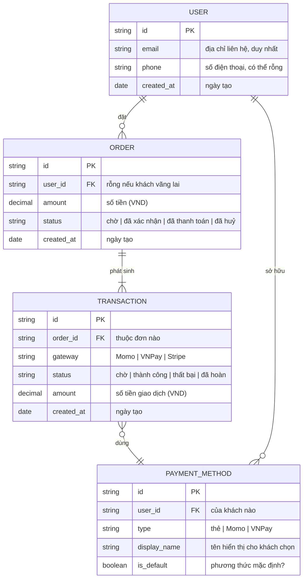

# /erd — Mermaid Entity-Relationship Diagram

## Goal

Tạo Mermaid `erDiagram` cho data model per-feature. **Output duy nhất**: `docs/{feature}/srs/{feature}-erd.md`. Project-wide ERD đã bỏ (singleton exception cũ) — nếu cross-feature data view cần, user tự gom manually.

## Constraints

- **1 output cố định** — `docs/{feature}/srs/{feature}-erd.md`. KHÔNG flag `--scope project`.
- **KHÔNG L3 iterate** — mermaid không render trong chat. Đi thẳng L1 plan → Write. User review rendered ERD từ file (IDE/Obsidian/GitHub) → muốn sửa thì gọi lại skill và nói cần đổi gì.
- **L1 approval** trước Write.
- **`--feature` optional** — auto-detect từ ngữ cảnh/feature đang làm dở; mơ hồ mới hỏi bằng picker. **Feature chưa tồn tại + arg là mô tả data model → tự derive slug + tạo feature** (điểm-vào, xem `feature-bootstrap.md` nhóm A). KHÔNG bắt qua `/brainstorm` trước.
- **File đã tồn tại** → tự động chuyển sang update mode (L2 diff), không refuse.
- **Auto-detect entities** từ SRS Mục 6 nếu có.
- **Vietnamese-first** trong description; mermaid keywords English.
- **Inheritance limitation** — Mermaid `erDiagram` không full support inheritance; note hạn chế, gợi ý workaround FK.

## Inputs

```
/erd --feature <slug>       # tạo mới, hoặc tự vào update mode nếu erd.md đã tồn tại
/erd                        # feature auto-detect từ ngữ cảnh, mơ hồ mới hỏi
/erd "<mô tả data model của feature mới>"   # feature chưa có → derive slug + phỏng vấn + tạo feature (nhóm A)
```

Muốn dùng entity descriptions từ nguồn khác thay vì trả lời trực tiếp → tag `@file` hoặc dán nội dung trong câu chat.

## Context (dynamic)

Today: !`date +%Y-%m-%d`
Features có SRS: !`for d in docs/*/srs/*-spec.md; do [ -f "$d" ] && dirname "$d" | xargs dirname | xargs basename; done | head -20`
Features có ERD: !`for d in docs/*/srs/*-erd.md; do [ -f "$d" ] && grep -l "erDiagram" "$d" 2>/dev/null && dirname "$d" | xargs dirname | xargs basename; done | head -10`

## Approach

1. **Resolve feature.** `--feature` explicit nếu có; else auto-detect (single in-progress) hoặc prompt picker.
   - **Feature chưa tồn tại (điểm-vào, per `feature-bootstrap.md` nhóm A):** nếu arg là 1 mô tả data model thô mà chưa có `docs/{feature}/` nào khớp (vd `/erd "khách hàng, đơn hàng, giao dịch thanh toán"`) → `/erd` ĐƯỢC PHÉP tự khởi tạo: derive feature slug từ mô tả (kebab-case, ASCII, ≤50 ký tự), confirm slug ở L1 (user override được), tạo `docs/{feature}/srs/` khi Write. KHÔNG bắt user chạy `/brainstorm` trước.
2. **Validate existing.** `erd.md` đã tồn tại → tự chuyển sang update mode (L2 diff), báo user biết đang update.
3. **Auto-detect upstream entities** — scan `docs/{feature}/srs/{feature}-spec.md` Mục 6 Data Entities bullet list. Có → dùng, không hỏi lại cái đã có (no-re-ask).
4. **Phỏng vấn ĐÚNG PHẠM VI erd cần** (khi chưa có nguồn — feature mới hoặc cũ thiếu spec.md, per `feature-bootstrap.md` nhóm A bước 3). Hỏi gom 1 batch business-language, **KHÔNG hỏi kiểu DB** (varchar/int...) — chỉ nghĩa nghiệp vụ của attribute:
   1. Liệt kê **entities** chính (1 dòng/entity: name + 1-sentence purpose).
   2. **Attribute nghiệp vụ** của từng entity (tên + nghĩa, vd "email — địa chỉ liên hệ", "status — trạng thái đơn"; PK/FK marker nếu rõ). **KHÔNG hỏi kiểu dữ liệu DB** ("varchar hay text?" là câu của dev) — skill TỰ gán type kỹ thuật gọn (`string`/`int`/`decimal`/`date`/`boolean`) khi vẽ, vì ERD vốn là artifact kỹ thuật (xem Gotchas). User chỉ mô tả nghĩa nghiệp vụ.
   3. **Quan hệ** giữa entities (cardinality 1:1 / 1:N / N:N + label mô tả bản chất quan hệ).
   4. Inheritance/specialization (nếu có) — Mermaid limitation flag.
4.5. **Mô tả mơ hồ dù có nguồn** (vd `spec.md` Mục 6 chỉ liệt kê tên entity mà không rõ attribute/quan hệ, hoặc mô tả user gõ quá ngắn) → **PHẢI hỏi clarifying trước khi generate**, KHÔNG tự bịa attribute/cardinality. Câu hỏi tối thiểu: "Entity {X} có những attribute nghiệp vụ nào?", "Quan hệ giữa {X} và {Y} là 1:1, 1:N hay N:N?".
5. **Generate Mermaid `erDiagram`:**
   - UPPERCASE entity names (convention).
   - Attributes inside `{}` block: `type name [PK|FK]`.
   - Relationships: `||--o{` (one-to-many), `||--||` (one-to-one), `}o--o{` (many-to-many).
   - Self-reference: `ENTITY ||--o{ ENTITY : "label"`.
6. **L1 approval** plan table — show path + tóm tắt entity/relationship count. **KHÔNG L3 iterate trong chat** — mermaid không render được trong chat, review từ rendered file hiệu quả hơn.
7. **Write** từ `_templates/diagram-erd.md` (slim frontmatter `type: srs-erd`/`feature`/`updated`). Fill `mermaid_code`, `entity_descriptions`, `notes`.
8. **Update mode (file đã tồn tại)** → L2 diff. Update `updated: {date}`.
9. **Activity log** — set env `CLAUDE_SKILL_NAME=/erd` + `CLAUDE_CHANGELOG_NOTE` (note: `{N} entities, {M} relationships — {note}`) TRƯỚC khi Write — hook append vào `docs/_shared/activity.log` (không phụ thuộc spec.md tồn tại hay chưa, không còn routing/fallback). Update erd.md `updated: {date}`.
9.5. **Render-verify + TỰ XEM ẢNH (BẮT BUỘC, chạy ngay sau Write)** — `node .claude/scripts/mermaid-verify.mjs --file docs/{feature}/srs/{feature}-erd.md --png <scratchpad>/erd-review`. Cờ `--png` vừa compile-check vừa xuất ảnh PNG mỗi block để skill **tự Read xem hình**. Mermaid không render trong chat (đây là lý do skip L3), nên đây là cách duy nhất bắt lỗi TRƯỚC khi báo "xong".
   - **Compile fail** (thường do attribute thiếu token type — xem gotcha "2-token" — hoặc relationship label thiếu quote) → đọc lỗi dòng/cột script trả về, sửa lại block vừa ghi, verify lại. Tối đa 2 lần tự sửa.
   - **Compile pass** → **Read ảnh PNG** (`<scratchpad>/erd-review/block-0.png`) và TỰ SOI nghiệp vụ (compile-check KHÔNG bắt được lỗi nội dung):
     - [ ] Đủ entity? Không thiếu entity nào có trong nguồn/mô tả.
     - [ ] Cardinality đúng chiều? `USER ||--o{ ORDER` = 1 user có nhiều order — đừng vẽ ngược.
     - [ ] Cột type không lặp dại (vd `id id`)? Type kỹ thuật gọn, name có nghĩa.
     - [ ] Nhãn quan hệ đọc được, không bị wrap dài che hình.
     - Lỗi bất kỳ → sửa .md, re-render + re-xem. Tối đa 2 vòng.
   - **Vẫn fail sau 2 lần** → báo user rõ lỗi cụ thể + đoạn mermaid, gợi ý paste mermaid.live để debug tay. KHÔNG âm thầm để file lỗi/xấu mà báo "xong" bình thường.
10. **Output report:**
   ```
   ✅ ERD đã ghi: docs/{feature}/srs/{feature}-erd.md
      Entities: {N} | Relationships: {M} | Mermaid compile: OK

   Mở file trong IDE/Obsidian/GitHub preview để xem rendered diagram.
   Cần sửa? Gọi lại /erd --feature {feature}, em tự vào update mode.
   ```

## Mermaid syntax reference



> **Type** = kỹ thuật gọn (`string`/`int`/`decimal`/`date`/`datetime`/`boolean`). **Comment `"..."`** = nghĩa nghiệp vụ tiếng Việt + liệt kê enum. KHÔNG `uuid`/`jsonb`/`varchar(255)`, KHÔNG index/token PCI (việc dev ở `/srs`).

## Gotchas

- **ERD vốn là artifact kỹ thuật — type/PK/FK là bản chất, KHÔNG phải lệch vai.** Rule no-dev của vault (`ba-conventions.md` Mục 3) nhắm vào việc *phỏng vấn* user bằng ngôn ngữ DB ("varchar hay text?") và thứ over-detail (index, migration, denormalization, token PCI, `jsonb`/`uuid`/`varchar(255)`) — KHÔNG cấm type kỹ thuật gọn trên chính ERD. **Type dùng:** `string` / `int` / `decimal` / `date` / `datetime` / `boolean`. Comment (`"..."`) mới là chỗ ghi nghĩa nghiệp vụ tiếng Việt + enum values. **KHÔNG dùng** `uuid`/`jsonb`/`varchar(255)`, KHÔNG mục "Indexes cần plan", KHÔNG note PCI/encryption — đó là việc dev/DBA ở `/srs`, không phải ERD nghiệp vụ.
- **Mermaid `erDiagram` BẮT BUỘC mỗi attribute có đúng 2 token `type name` (+comment optional).** Chỉ ghi `name` (bỏ type) → parse fail `Expecting 'ATTRIBUTE_WORD', got 'ATTRIBUTE_KEY'`. Nên PK phải là `string id PK`, không phải `id PK`. Đừng thử bỏ cột type để "cho nghiệp vụ" — Mermaid không cho. Type gọn (`string`/`decimal`/`date`) là đủ.
- **Cột type đừng lặp dại** — `string id` OK, nhưng `id id` (đặt cả type lẫn name = `id`) đọc rất ngớ ngẩn. Bước 9.5 tự-xem-ảnh bắt lỗi này.
- **Mermaid relationship cardinality syntax tricky** — nhớ thứ tự: `LEFT ||--o{ RIGHT` đọc là "1 LEFT có nhiều RIGHT". Đừng nhầm direction.
- **Self-reference cần label** — `EMPLOYEE ||--o{ EMPLOYEE : "manages"` để render OK.
- **Inheritance không native** — vd "Admin extends User", Mermaid không có syntax. Workaround: tạo entity ADMIN với FK `user_id` trỏ USER + note "ISA relationship via FK". Document trong Mục Notes.
- **Self-referential many-to-many** (vd "friends" giữa Users) — dùng junction entity: `USER ||--o{ FRIENDSHIP }o--|| USER`. Mermaid không vẽ trực tiếp được m:n loop.
- **Long entity names** — render xấu nếu >15 chars. Abbreviate: `PAYMENT_METHOD` → `PMT_METHOD` (note full name trong Mục Entity Reference).
- **PK/FK markers optional** nhưng nên có cho audit/migration planning.
- **Composite PK** — Mermaid không render rõ. Note: `(user_id, role_id) PK` trong attribute description.
- **Soft-deleted column convention** — `deleted_at timestamp "nullable, soft-delete"`.
- **Update mode** với new entities → preserve existing layout, add new entities sau cuối block.
- **Mermaid syntax fail** — bước 9.5 bắt lỗi qua `mermaid-verify.mjs` NGAY sau Write, tự sửa tối đa 2 lần. KHÔNG write rồi bỏ mặc — chỉ báo user paste mermaid.live nếu 2 lần tự sửa vẫn fail.

## References

- @../../rules/ba-conventions.md
- @../../rules/approval-gate.md
- @../../rules/naming-conventions.md
- @../../rules/changelog.md
- @../../rules/diagram-selection.md
- @../../rules/feature-bootstrap.md
- @../../../_templates/diagram-erd.md
- @./references/example-erd.md
- @../../scripts/mermaid-verify.mjs (render-verify sau Write — bước 9.5)
