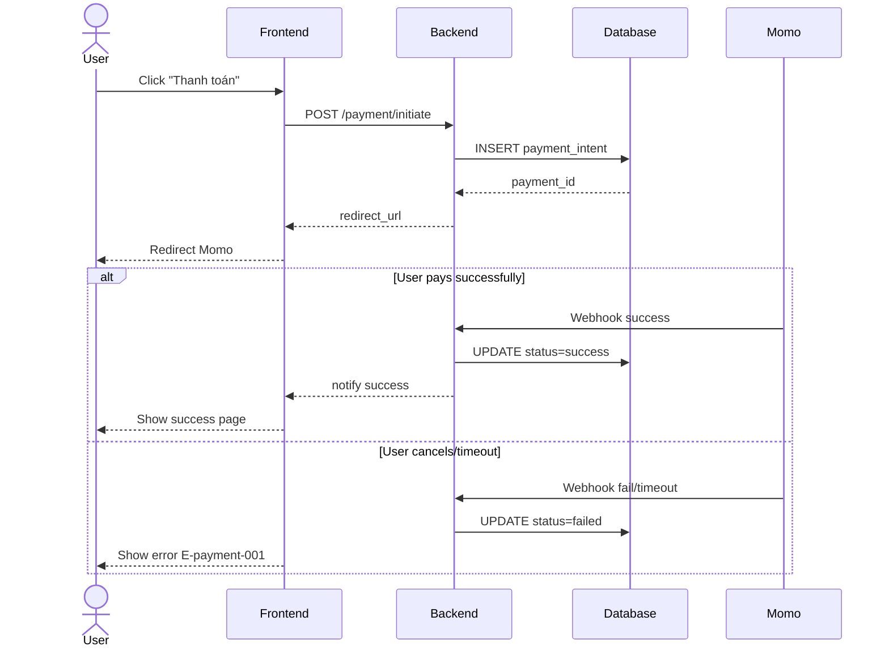

# /sequence — Mermaid Sequence Diagram Generator

## Goal

Tạo Mermaid `sequenceDiagram` block cho 1 flow trong 1 feature. **Output duy nhất**: append section vào `docs/{feature}/srs/{feature}-flows.md`. UC files KHÔNG nhận diagram (UC là business black-box).

## Constraints

- **1 output cố định** — `docs/{feature}/srs/{feature}-flows.md` append mode. KHÔNG flag `--uc`, `--standalone`, `--system-flow`. Quá nhiều flow → user split manually.
- **KHÔNG L3 iterate** — mermaid không render được trong chat. Đi thẳng L1 plan → Write. User review rendered diagram từ file (IDE/Obsidian/GitHub) → muốn sửa thì gọi lại skill và nói cần đổi gì (skill tự vào update mode + L2 diff).
- **L1 approval** trước Write.
- **`--feature` optional** — auto-detect nếu chỉ 1 feature in-progress; mơ hồ mới hỏi. **Feature chưa tồn tại + arg là mô tả flow → tự derive slug + tạo feature** (điểm-vào, xem `feature-bootstrap.md` nhóm A). KHÔNG bắt qua `/brainstorm` trước.
- **Auto-detect actors** từ description prose.
- **Mermaid syntax strict** — matched `participant`/`actor`, balanced `alt`/`end`.
- **Vietnamese-first** trong description/notes; mermaid syntax keywords giữ English.
- **flows.md không tồn tại** → tạo mới với frontmatter + heading trần `# {Feature} — Flows` (KHÔNG câu intro/blockquote meta), rồi section `## Flow:` đầu.

## Inputs

```
/sequence "<description>" --feature <slug>       # append section vào flows.md
/sequence "<description>"                         # feature auto-detect từ ngữ cảnh, mơ hồ mới hỏi
/sequence "<mô tả flow của feature mới>"          # feature chưa có → derive slug + phỏng vấn + tạo feature (nhóm A)
```

Muốn dùng nguồn khác thay vì gõ mô tả trực tiếp → tag `@file` hoặc dán nội dung trong câu chat. Đã có section cho flow đó → gọi lại skill với mô tả thay đổi, skill tự vào update mode (match theo slug) + L2 diff.

## Context (dynamic)

Today: !`date +%Y-%m-%d`
Features có flows.md: !`for d in docs/*/srs/*-flows.md; do [ -f "$d" ] && echo "$d"; done | head -10`
In-progress features: !`for d in docs/*/srs/*-spec.md; do grep -l "status: draft\|status: in-review" "$d" 2>/dev/null; done | head -5`

## Approach

1. **Parse args.** Description bắt buộc (inline string, tag `@file`, hoặc dán nội dung trong câu chat).
2. **Resolve feature.** `--feature` explicit nếu có; else auto-detect (single in-progress) hoặc prompt.
   - **Feature chưa tồn tại (điểm-vào, per `feature-bootstrap.md` nhóm A):** nếu arg là 1 mô tả flow thô mà chưa có `docs/{feature}/` nào khớp (vd `/sequence "khách đặt hàng, hệ thống gọi cổng thanh toán rồi gửi email xác nhận"`) → `/sequence` ĐƯỢC PHÉP tự khởi tạo: derive feature slug từ mô tả (kebab-case, ASCII, ≤50 ký tự), confirm slug ở L1 (user override được), tạo `docs/{feature}/srs/` khi Write. KHÔNG bắt user chạy `/brainstorm` trước.
   - **Nguồn nghiệp vụ:** feature đã có UC/SRS/flows → đọc để lấy actors/steps, không hỏi lại cái đã có (no-re-ask). **Feature mới (hoặc cũ thiếu nguồn)** → **phỏng vấn ĐÚNG PHẠM VI sequence cần** (per `feature-bootstrap.md` nhóm A bước 3), hỏi gom 1 batch business-language (KHÔNG hỏi DB/SDK): **actors** nào tham gia · **thứ tự message** giữa họ (ai gọi ai, response gì) · **nhánh error** (alt/opt — success path vs error/timeout/cancel). KHÔNG bịa — thiếu ý nào hỏi ý đó. Làm rõ đủ để vẽ đúng, không lan man toàn diện như `/brainstorm`.
   - **Mô tả mơ hồ dù feature đã có nguồn** (vd description quá ngắn, không nói rõ actors/nhánh error, hoặc UC/SRS đọc được cũng thiếu chi tiết) → **PHẢI hỏi clarifying trước khi generate**, KHÔNG tự suy đoán và generate luôn. Câu hỏi tối thiểu: "Actors nào tham gia?", "Có nhánh lỗi/timeout/hủy nào cần thể hiện?". Đây không phải bootstrap phỏng vấn (feature đã có) — chỉ là 1-2 câu hỏi ngắn bù chỗ thiếu, không lặp lại no-re-ask.
2.5. **Trích fact-list (checklist coverage)** — TRƯỚC khi generate, liệt kê ngắn gọn (không cần file riêng, giữ trong context):
   - **Actors**: mọi actor sẽ xuất hiện làm participant/actor trong diagram.
   - **Main flow steps**: các bước theo thứ tự (tương ứng message chính).
   - **Alternative/Error Flows**, đánh ID con kiểu `A1`, `A1.1`, `A1.2` (theo mẫu prompt BA chuẩn) — mỗi nhánh error/alt/timeout/cancel 1 ID riêng, KHÔNG gộp chung "có nhánh error" mơ hồ. Nếu mô tả/UC chỉ nói chung chung "có xử lý lỗi" mà không rõ lỗi gì → hỏi lại (xem bước 2 trên), đừng tự bịa case cụ thể.
   Fact-list này dùng làm checklist đối chiếu ở bước 9.6.
3. **Derive flow slug** từ description (verb-object kebab-case, max 40 chars).
4. **Validate target** `docs/{feature}/srs/{feature}-flows.md`:
   - Tồn tại + trùng slug → tự vào update mode (L2 diff cho section đó).
   - Tồn tại, slug mới → **KHÔNG append mù**. Slug tái-derive từ mô tả thay đổi có thể lệch slug section cũ (vd lần đầu `guest-checkout-momo`, lần sau mô tả "sửa luồng thanh toán khách" → `guest-payment`) — append sẽ tạo section trùng nội dung thay vì sửa. Xử lý: liệt kê các section `## Flow:` **gần khớp** (cùng actor/chủ đề) cho user chọn "sửa section nào" HOẶC "tạo flow mới"; user chọn sửa → vào update mode section đó (L2 diff), chọn mới → append. Chỉ append thẳng khi mô tả rõ là flow hoàn toàn khác (không section nào gần khớp).
   - Thiếu → tạo mới: slim frontmatter (`type: srs-flows`, `feature`, `updated`) + heading trần `# {Feature title} — Flows`, rồi append thẳng section `## Flow:` đầu tiên. KHÔNG chèn câu intro/blockquote mô tả "file này chứa gì / nguồn ở đâu / quy tắc viết" (meta-text — vi phạm `ba-conventions.md` Mục 0). Doc chỉ chứa nội dung nghiệp vụ thật.
5. **Auto-detect actors** từ description: scan capitalized nouns + common roles (User, FE/Client, BE/Backend, DB, third-party như Stripe/Momo). Tên người → generalize "User".
6. **Generate Mermaid `sequenceDiagram`:**
   - `actor User` cho human, `participant X as Y` cho system.
   - Mỗi step → 1 message arrow: `->>` = request/gọi (nét liền), `-->>` = kết quả/response (nét đứt) — đây là **quy ước team**, KHÔNG phải nghĩa "async". Async thật (fire-and-forget) mới dùng `-)` / `--)` (mũi tên hở), chỉ dùng khi nghiệp vụ thực sự bất đồng bộ VÀ verifier hỗ trợ.
   - Error/conditional branches → `alt ... else ... end` (2+ nhánh loại trừ nhau) hoặc `opt ... end` (1 đoạn có-thể-xảy-ra, không else).
   - **Fragment khác — chỉ khi nghiệp vụ thật sự cần**: `par ... and ... end` khi các hành động **thực sự chạy song song độc lập** (vd gửi email + ghi audit cùng lúc); `loop ... end` khi lặp/polling/retry (nhưng lặp >2-3 vòng có logic phức tạp → cân nhắc tách activity riêng); `break ... end` khi thoát sớm do exception. KHÔNG dùng nếu chỉ là bước tuần tự thường.
   - **`autonumber`** (đầu diagram): optional, CHỈ bật khi doc đi kèm narrate lại theo số bước ("bước 3 gửi OTP") — để số message khớp text. Không bật mặc định.
   - **Activation bar** (`activate`/`deactivate` hoặc `->>+`/`-->>-`): KHÔNG dùng mặc định — ngụ ý execution timing kỹ thuật, làm rối diagram nghiệp vụ. Chỉ dùng khi "đang xử lý" của 1 bên có ý nghĩa nghiệp vụ cần nhấn.
   - **`Note over`/`Note right of`**: cho business rule / SLA / giả định / tham chiếu FR-BR-E (vd "Sau 30s chưa có kết quả"). KHÔNG chứa secret hay implementation detail (khóa, thuật toán, endpoint).
   - **KHÔNG dùng `ref`** — Mermaid sequence không có fragment `ref` chuẩn đáng dựa; muốn liên kết flow khác thì ghi ở metadata "Related flows" (Markdown), không vẽ trong diagram.
   - Concise; complex flows >15 step, HOẶC >8 participant, HOẶC nesting >2 tầng → warn, suggest split thành 2-3 flow.
7. **L1 plan preview** — show path + action (append/update) + actors + steps count + related UC (nếu detect được).
8. **Write** — Read flows.md, append section sau last `## Flow:`. Mỗi section format:
   ```markdown
   ## Flow: {Title}
   **Trigger**: {1-line}
   **Related UC**: [[../usecases/uc-{slug}.md]] (nếu detect được, else "TBD")
   **Related FR**: FR-{feature}-NNN, ...
   **Related E**: E-{feature}-NNN, ... (error path trong flow, else "—")

   \`\`\`mermaid
   sequenceDiagram
     ...
   \`\`\`
   ```
   > **ID full-form bắt buộc** trong 3 dòng Related — luôn `FR-{feature}-NNN` / `E-{feature}-NNN`, KHÔNG short-form `FR-001` (nguồn edge cho KG; short-form gây feature-ma + mất trace).
9. **Activity log** — set env `CLAUDE_SKILL_NAME=/sequence` + `CLAUDE_CHANGELOG_NOTE` (note: `added {flow-title} sequence`) TRƯỚC khi Write — hook append vào `docs/_shared/activity.log` (không phụ thuộc spec.md tồn tại hay chưa, không còn routing/fallback). Update flows.md `updated: {date}`.
9.5. **Render-verify (BẮT BUỘC, chạy ngay sau Write)** — `node .claude/scripts/mermaid-verify.mjs --file docs/{feature}/srs/{feature}-flows.md`. Mermaid không render trong chat (đây là lý do skip L3), nên đây là cách duy nhất bắt lỗi cú pháp TRƯỚC khi báo "xong" thay vì để user tự phát hiện khi mở IDE.
   - **Pass** → tiếp bước 10, report có dòng "compile OK".
   - **Fail** (thường do quote lồng trong `[...]`/`{...}` — xem Mermaid syntax safety ở `diagram-selection.md`) → đọc lỗi dòng/cột script trả về, sửa lại section vừa append (KHÔNG đụng section khác), verify lại. Tối đa 2 lần tự sửa.
   - **Vẫn fail sau 2 lần** → báo user rõ lỗi cụ thể + đoạn mermaid, gợi ý paste mermaid.live để debug tay. KHÔNG âm thầm để file lỗi mà báo "xong" bình thường.
   - **PNG self-check (optional, cho diagram lớn)** — với diagram vượt ngưỡng phức tạp (>15 step hoặc >8 participant), chạy thêm `--png <scratchpad>/seq-review` để xuất ảnh, rồi Read ảnh tự soi lỗi bố cục mà compile không bắt (label bị cắt, message chồng, participant lệch cột). Compile OK ≠ đọc được. Diagram gọn thì skip cho nhẹ.
9.6. **Coverage-verify (BẮT BUỘC, chạy ngay sau 9.5 pass)** — đối chiếu diagram vừa ghi với **cả 3 phần** của fact-list ở bước 2.5. Đây là compile-check KHÁC bước 9.5 — 9.5 chỉ bắt lỗi cú pháp, 9.6 bắt lỗi **thiếu/sai nội dung nghiệp vụ** (diagram hợp lệ cú pháp nhưng bỏ sót actor/bước/nhánh so với fact-list). Kiểm 3 chiều:
   1. **Actor** — mỗi actor trong fact-list có xuất hiện làm `participant`/`actor` không.
   2. **Main flow steps** — mỗi bước chính trong fact-list có ≥1 message tương ứng trong diagram không (KHÔNG chỉ đếm actor có mặt — actor xuất hiện nhưng thiếu bước nghiệp vụ vẫn là lỗi). Bước không thể hiện được bằng message → phải nằm ở `Note` hoặc metadata, không được bốc hơi.
   3. **Alternative/Error Flow** — mỗi nhánh (A1, A1.1...) có 1 block `alt`/`opt` không, VÀ **điều kiện/label nhánh khớp mô tả** (vd A1.2 "timeout" thì label nhánh phải nói tới quá hạn/timeout, không phải label mơ hồ "lỗi khác"). Nhánh có mặt nhưng điều kiện lệch fact-list vẫn tính thiếu.
   - **Đủ** → tiếp bước 10, report dòng "Coverage: {N}/{N} actors, {S}/{S} main-steps, {M}/{M} alt-flows".
   - **Thiếu** (vd fact-list có A1.2 "timeout" nhưng diagram không có nhánh timeout; hoặc bước "gửi email xác nhận" trong fact-list không có message nào) → tự bổ sung phần còn thiếu vào section vừa ghi, verify lại 9.5 rồi 9.6. Tối đa 2 lần tự sửa.
   - **Vẫn thiếu sau 2 lần** → báo user rõ actor/bước/nhánh nào chưa thể hiện được, hỏi có muốn bỏ qua (case ngoài phạm vi) hay bổ sung thêm mô tả. KHÔNG âm thầm báo "xong" khi coverage chưa đủ.
9.7. **Diagram_Reviewer gate (CHỈ khi vượt ngưỡng phức tạp)** — nếu fact-list ở bước 2.5 có **≥3 Alternative/Error Flow**, HOẶC diagram có **≥4 participant**, HOẶC **nesting alt/opt ≥2 tầng**, HOẶC có **callback/timeout/webhook**, spawn agent qua Task tool, `subagent_type: diagram-reviewer`, truyền: section mermaid vừa ghi + fact-list bước 2.5. Đo theo **tổng độ phức tạp** — số actor đơn thuần không đủ (flow 3-actor thẳng thì đơn giản, flow 2-actor 18-message 3-nhánh-lồng lại phức tạp). Dưới mọi ngưỡng trên, bước 9.6 tự-đối-chiếu (không agent) đã đủ — SKIP 9.7, đi thẳng bước 10 để tránh overhead cho case đơn giản.
   - **Task tool không khả dụng** (runtime không cấp) → KHÔNG ngầm coi là đã review; report ghi rõ `reviewer skipped (Task unavailable)` để user biết diagram phức tạp chưa qua gate.
   - Nhận findings (format `review-format.md` + section "Coverage checklist"). Có BLOCKING → tự bổ sung actor/nhánh thiếu vào section, verify lại 9.5+9.6, rồi tiếp bước 10.
   - Loop tối đa 2 vòng (giống pattern `flow-reviewer` của `/user-flow`) — vòng 2 vẫn BLOCKING → báo user rõ findings còn tồn đọng, để user quyết định trước khi báo report.
   - Verdict `approve`/chỉ WARNING/SUGGESTION → tiếp bước 10 luôn, không cần sửa.
10. **Output report:**
    ```
    ✅ Sequence diagram appended: docs/{feature}/srs/{feature}-flows.md → ## Flow: {title}
       Actors: {list} | Steps: {N} | Mermaid compile: OK | Coverage: {N}/{N} actors, {S}/{S} main-steps, {M}/{M} alt-flows{reviewed_note}

    Mở file trong IDE/Obsidian/GitHub preview để xem rendered diagram.
    Cần sửa? Gọi lại /sequence "<mô tả thay đổi>" --feature {feature}, em tự vào update mode.
    ```
    `{reviewed_note}` = ` | Reviewed by Diagram_Reviewer` nếu bước 9.7 đã chạy, else rỗng.

## Mermaid syntax reference (Claude composes, KHÔNG paste cứng)



## Gotchas

- **flows.md header convention** — first run: frontmatter + heading trần `# {Feature} — Flows` (KHÔNG intro/blockquote meta), rồi section `## Flow:` đầu. Sub-sequent: append sau last `## Flow:`.
- **Description vague** — `/sequence "checkout"` → ask clarifying: trigger? actors? success vs error path?
- **Diagram quá lớn** — warn "diagram sẽ dense, split thành 2-3 flow?" khi >15 step, HOẶC >8 participant, HOẶC nesting alt/opt >2 tầng (đây là dấu hiệu đang nhồi quá nhiều vào 1 diagram).
- **Fragment nâng cao** — `par`/`loop`/`break`/`autonumber`/activation chỉ dùng khi nghiệp vụ thật sự cần (xem bước 6). Mặc định KHÔNG activation bar (ngụ ý timing kỹ thuật), KHÔNG `ref` (Mermaid không có ref chuẩn — liên kết flow qua metadata "Related flows").
- **Tên người thật** → generalize "User".
- **Error branch convention** — `alt` cho 2-way, `opt` cho optional. Nest tối đa 2 level.
- **`participant X as Y`** vs `actor X`: actor cho human, participant cho system.
- **Arrow không phải nghĩa "async"** — `->>` (nét liền) = request/gọi, `-->>` (nét đứt) = response, đây là **quy ước team** để đọc dễ, KHÔNG mang nghĩa UML "đồng bộ/bất đồng bộ". Mermaid có mũi tên async riêng `-)`/`--)` (mũi tên hở) — chỉ dùng khi nghiệp vụ thực sự fire-and-forget. Đừng chú thích `->>` là "async".
- **Mermaid syntax fail** — bước 9.5 bắt lỗi qua `mermaid-verify.mjs` NGAY sau Write, tự sửa tối đa 2 lần. KHÔNG còn "vẫn write, warn" im lặng — chỉ báo user paste mermaid.live nếu 2 lần tự sửa vẫn fail.
- **Coverage thiếu ≠ lỗi cú pháp** — bước 9.5 (compile) và 9.6 (coverage) là 2 việc khác nhau. Diagram có thể compile OK (9.5 pass) nhưng vẫn thiếu 1 nhánh error so với fact-list (9.6 fail) — đừng nhầm "compile OK" là "xong".
- **UC embed** — nếu user yêu cầu "vẽ sequence vào UC X", refuse + giải thích "sequence thuộc flows.md, UC chỉ chứa prose". Suggest activity diagram nếu cần inline UC.

## References

- @../../rules/ba-conventions.md
- @../../rules/approval-gate.md
- @../../rules/naming-conventions.md
- @../../rules/changelog.md
- @../../rules/diagram-selection.md
- @../../rules/feature-bootstrap.md
- @../../../_templates/diagram-sequence.md
- @./references/example-sequence.md
- @../../scripts/mermaid-verify.mjs (render-verify sau Write — bước 9.5)
- @../../agents/diagram-reviewer.md (Diagram_Reviewer — review coverage khi vượt ngưỡng phức tạp, bước 9.7)
