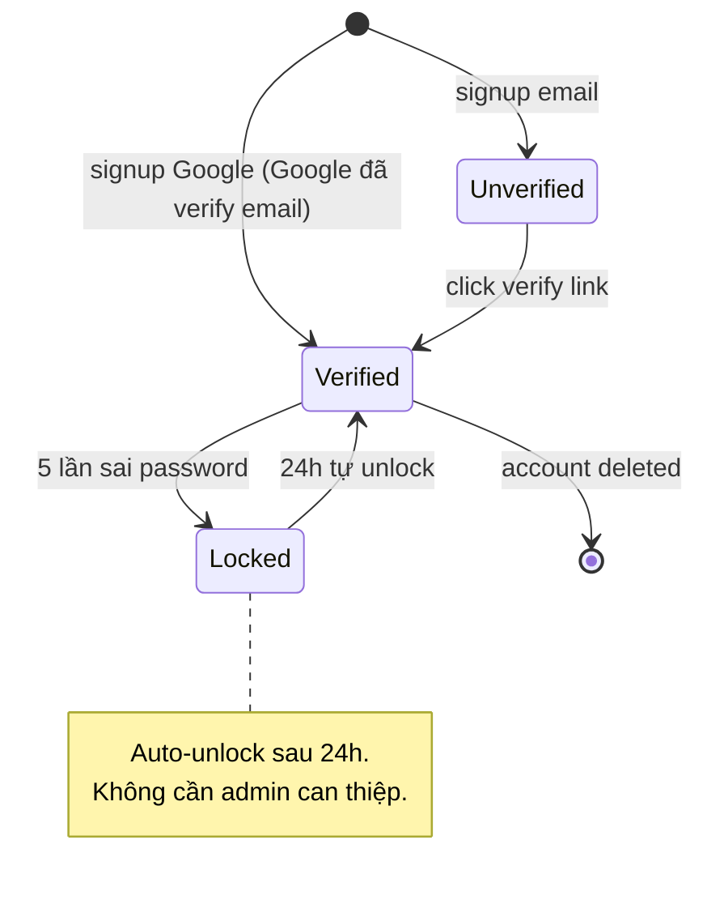

# /state — Per-entity State Diagram

## Goal

Produce mermaid `stateDiagram-v2` cho 1 entity của feature, capture: states + transitions + triggers + invalid transitions. **Output duy nhất**: append section vào `docs/{feature}/srs/{feature}-states.md` (1 file gộp mọi entity, mỗi entity 1 `## State: <Entity>` section).

## Constraints

- **1 output cố định** — `docs/{feature}/srs/{feature}-states.md` append mode. KHÔNG flag `--uc`, `--append`, `--system-flow`.
- **`--feature` optional** — auto-detect từ ngữ cảnh/feature đang làm dở; mơ hồ mới hỏi bằng picker. **Feature chưa tồn tại + arg cho biết entity/feature mới → tự derive slug + tạo feature** (điểm-vào, xem `feature-bootstrap.md` nhóm A). KHÔNG bắt qua `/brainstorm` trước.
- **L1 approval** trước Write — show entity + state count + transition count.
- **KHÔNG L3 iterate** — mermaid không render trong chat. User review từ rendered file, muốn sửa thì gọi lại skill và nói cần đổi gì.
- **Auto-detect states** từ:
  - `docs/{feature}/brainstorms/*.md` Mục 6.3 State Transitions table.
  - `docs/{feature}/srs/{feature}-spec.md` Mục 4 Business Rules nếu mention state transition.
  - Nếu không có → clarifying questions. User muốn dùng nguồn khác → tag `@file` hoặc dán nội dung trong câu chat.
- **Invalid transitions explicit** — table riêng trong section liệt kê transitions KHÔNG được phép.
- **Vietnamese-first** trong description/notes, auto-detect từ seed. Muốn tiếng Anh thì nói "viết bằng tiếng Anh". Mermaid syntax keywords giữ English.
- **Per @../../rules/diagram-selection.md** — entity ≥3 states trước proceed; <3 → warn "bảng đủ, có cần diagram?".
- **states.md không tồn tại** → tạo mới với header skeleton.

## Inputs

```
/state <entity> --feature <slug>       # append section vào states.md
/state <entity>                        # feature auto-detect từ ngữ cảnh, mơ hồ mới hỏi
/state <entity> "<feature mới>"        # feature chưa có → derive slug + phỏng vấn + tạo feature (nhóm A)
```

Muốn đổi hành vi mặc định, nói bằng lời:
- Dùng nguồn khác thay vì brainstorm/spec mặc định → tag `@file` hoặc dán nội dung.
- Viết bằng tiếng Anh → nói "viết bằng tiếng Anh".
- Đã có section cho entity đó → gọi lại skill, skill tự vào update mode (L2 diff).

## Context (dynamic)

Today: !`date +%Y-%m-%d`
Features có sẵn: !`ls -d docs/*/ 2>/dev/null | xargs -I{} basename {} | head -20`
Features có states.md: !`for d in docs/*/srs/*-states.md; do [ -f "$d" ] && echo "$d"; done | head -10`

## Approach

1. **Resolve feature + entity** — feature từ arg/picker; entity UpperCamelCase từ arg.
   - **Feature chưa tồn tại (điểm-vào, per `feature-bootstrap.md` nhóm A):** nếu chưa có `docs/{feature}/` nào khớp và arg cho thấy đây là entity/feature mới (vd `/state Order "quản lý đơn hàng"`) → `/state` ĐƯỢC PHÉP tự khởi tạo: derive feature slug từ mô tả (kebab-case, ASCII, ≤50 ký tự; slug rõ không suy được thì hỏi), confirm slug ở L1 (user override được), tạo `docs/{feature}/srs/` khi Write. KHÔNG bắt user chạy `/brainstorm` trước.
2. **Auto-detect existing state info:**
   - Read `docs/{feature}/brainstorms/*.md` Mục 6.3 — pull rows liên quan entity.
   - Read `docs/{feature}/srs/{feature}-spec.md` Mục 4 — pull BR liên quan state.
   - Có nguồn → dùng, không hỏi lại cái đã có (no-re-ask).
   - **Không có nguồn (feature mới hoặc cũ thiếu brainstorm/spec)** → **phỏng vấn ĐÚNG PHẠM VI state cần** (per `feature-bootstrap.md` nhóm A bước 3), hỏi gom 1 batch business-language (KHÔNG hỏi DB/SDK): **entity nào** (nếu chưa rõ) · **các trạng thái** entity đi qua · **trigger** mỗi transition (sự kiện/hành động nào chuyển trạng thái) · **transition cấm** (từ trạng thái nào KHÔNG được quay về đâu). KHÔNG bịa — thiếu ý nào hỏi ý đó. Làm rõ đủ để vẽ đúng, không lan man toàn diện như `/brainstorm`.
   - **Mô tả mơ hồ dù có nguồn** (vd brainstorm/spec chỉ nhắc chung chung "có nhiều trạng thái" mà không liệt kê rõ) → **PHẢI hỏi clarifying trước khi generate**, KHÔNG tự suy đoán trạng thái/trigger. Câu hỏi tối thiểu: "Entity có những trạng thái nào?", "Trigger chuyển trạng thái là gì?".
2.5. **Trích fact-list (checklist coverage)** — TRƯỚC khi generate, liệt kê ngắn gọn (giữ trong context):
   - **States**: mọi trạng thái entity sẽ đi qua.
   - **Transitions**: mỗi transition + trigger tương ứng.
   - **Invalid transitions**: mọi transition bị cấm đã nêu (sẽ vào bảng riêng, không vẽ trong diagram).
   Fact-list dùng làm checklist đối chiếu ở bước 9.6.
3. **Validate states count** — <3 states, warn "bảng có thể đủ; tiếp tục diagram?" Y/n.
4. **Validate target** `docs/{feature}/srs/{feature}-states.md`:
   - Tồn tại + trùng entity → tự vào update mode (L2 diff cho section đó).
   - Tồn tại, entity mới → append `## State: {Entity}` section.
   - Thiếu → tạo mới với slim frontmatter (`type: srs-states`, `feature`, `updated`) + intro skeleton.
5. **Generate mermaid stateDiagram-v2:**
   - `[*] --> initial_state` cho entry.
   - `state --> next_state : trigger / condition`.
   - `final_state --> [*]` cho terminal nếu có.
   - Composite states (nested) chỉ khi cần — KHÔNG over-engineer.
6. **L1 plan preview** — prose BA-friendly: "Em sẽ append state diagram cho entity {entity} vào docs/{feature}/srs/{feature}-states.md với N states + M transitions + K invalid. Apply? (Y / sửa)".
7. **Write** — Read states.md, append section. Mỗi section format:
   ```markdown
   ## State: {Entity}
   **Related entity**: {Entity} (CamelCase khớp ERD `srs/{feature}-erd.md` — nguồn edge state→entity)
   **Related UC**: [[../usecases/uc-{slug}.md]], ...
   **Related BR**: BR-{feature}-NNN, ...

   \`\`\`mermaid
   stateDiagram-v2
     ...
   \`\`\`

   ### Invalid transitions
   | From | To | Why not |
   |---|---|---|
   | paid | pending | Đã thanh toán không quay lại pending |
   ```
   > **ID full-form bắt buộc** trong dòng Related — luôn `BR-{feature}-NNN`, KHÔNG short-form `BR-001` (nguồn edge cho KG; short-form gây feature-ma + mất trace). **Related entity** viết CamelCase khớp ERD.
8. **Gọi lại với entity trùng** (update mode tự động) → L2 diff cho section đó.
9. **Activity log** — set env `CLAUDE_SKILL_NAME=/state` + `CLAUDE_CHANGELOG_NOTE` (note: `added/updated {Entity} state diagram`) TRƯỚC khi Write — hook append vào `docs/_shared/activity.log` (không phụ thuộc spec.md tồn tại hay chưa, không còn routing/fallback). Update states.md `updated: {date}`.
9.5. **Render-verify + TỰ XEM ẢNH (BẮT BUỘC, chạy ngay sau Write)** — `node .claude/scripts/mermaid-verify.mjs --file docs/{feature}/srs/{feature}-states.md --png <scratchpad>/state-review`. Cờ `--png` vừa compile-check vừa xuất ảnh PNG mỗi block để skill **tự Read xem hình**. Mermaid không render trong chat (đây là lý do skip L3), nên đây là cách duy nhất bắt lỗi TRƯỚC khi báo "xong" thay vì để user tự phát hiện khi mở IDE.
   - **Compile fail** → đọc lỗi dòng/cột script trả về, sửa lại section vừa append (KHÔNG đụng entity khác), verify lại. Tối đa 2 lần tự sửa.
   - **Compile pass** → **Read ảnh PNG** (`<scratchpad>/state-review/block-{n}.png` — block của entity vừa ghi) và TỰ SOI nghiệp vụ (compile-check + coverage text KHÔNG bắt được lỗi hình):
     - [ ] State mồ côi? Mọi state có đường vào (và đường ra, trừ terminal) — không state nào lơ lửng không nối.
     - [ ] Entry/terminal đúng? Có `[*] -->` vào initial state; terminal (nếu có) `--> [*]`.
     - [ ] Transition đúng chiều? `Verified --> Locked` khác `Locked --> Verified` — đừng vẽ ngược.
     - [ ] Nhãn trigger đọc được, không che nhau / không wrap dài mất chữ.
     - Lỗi bất kỳ → sửa section vừa ghi, re-render + re-xem. Tối đa 2 vòng.
   - **Vẫn fail sau 2 lần** → báo user rõ lỗi cụ thể + đoạn mermaid, gợi ý paste mermaid.live để debug tay. KHÔNG âm thầm để file lỗi/xấu mà báo "xong" bình thường.
9.6. **Coverage-verify (BẮT BUỘC, chạy ngay sau 9.5 pass)** — đối chiếu diagram vừa ghi với fact-list ở bước 2.5: mỗi state có xuất hiện thành 1 node không; mỗi transition có xuất hiện với đúng trigger không. Đây là compile-check KHÁC bước 9.5 — 9.5 chỉ bắt lỗi cú pháp, 9.6 bắt lỗi **thiếu state/transition so với fact-list**.
   - **Đủ** → tiếp bước 10, report thêm dòng "Coverage: {N}/{N} states, {M}/{M} transitions".
   - **Thiếu** (vd 1 state không xuất hiện, hoặc 1 transition thiếu trigger) → tự bổ sung vào section vừa ghi, verify lại 9.5 rồi 9.6. Tối đa 2 lần tự sửa.
   - **Vẫn thiếu sau 2 lần** → báo user rõ state/transition nào chưa thể hiện được. KHÔNG âm thầm báo "xong" khi coverage chưa đủ.
10. **Output report:**
    ```
    ✅ State diagram appended: docs/{feature}/srs/{feature}-states.md → ## State: {Entity}
       States: {N} | Transitions: {M} | Invalid: {K} | Mermaid compile: OK | Đã tự soi ảnh | Coverage: {N}/{N} states, {M}/{M} transitions

    Mở file trong IDE/Obsidian/GitHub preview để xem rendered diagram.
    Cần sửa? Gọi lại /state {entity} --feature {feature}, em tự vào update mode.
    ```

## Mermaid syntax reference



## Gotchas

- **Composite states** — Mermaid hỗ trợ nested nhưng >2 level render rối. Giữ flat khi có thể.
- **Entity name** — UpperCamelCase (Account, Order, VerifyLink).
- **Multiple entry points** — dùng nhiều `[*] -->` lines.
- **Self-loop** — `State1 --> State1 : retry` OK, nhưng nhiều retry cùng state nên gom note.
- **Invalid transitions** — KHÔNG vẽ trong diagram (bẩn); table riêng.
- **Update mode** — preserve user edits trong notes section; chỉ regenerate mermaid + tables.
- **UC embed** — nếu user yêu cầu "vẽ state vào UC X", refuse + giải thích "state thuộc states.md vì entity thường shared cross UC".
- **Mermaid syntax fail** — bước 9.5 bắt lỗi qua `mermaid-verify.mjs` NGAY sau Write, tự sửa tối đa 2 lần. KHÔNG write rồi bỏ mặc — chỉ báo user paste mermaid.live nếu 2 lần tự sửa vẫn fail.
- **Coverage thiếu ≠ lỗi cú pháp** — bước 9.5 (compile) và 9.6 (coverage) là 2 việc khác nhau. Diagram compile OK vẫn có thể thiếu 1 state so với fact-list — đừng nhầm "compile OK" là "xong".

## References

- @../../rules/ba-conventions.md
- @../../rules/approval-gate.md
- @../../rules/naming-conventions.md
- @../../rules/changelog.md
- @../../rules/diagram-selection.md
- @../../rules/feature-bootstrap.md
- @../../../_templates/diagram-state.md
- @../../scripts/mermaid-verify.mjs (render-verify sau Write — bước 9.5)
