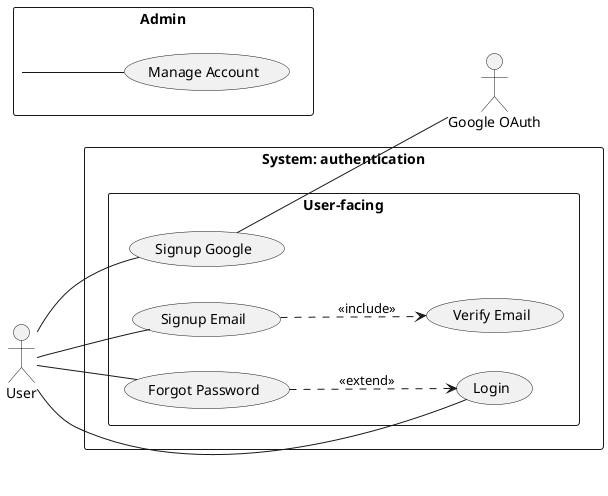

# /usecase-diagram — Use Case Diagram (PlantUML native)

## Goal

Produce visual use case diagram cho 1 feature: actors (bên ngoài system) + use cases (bên trong system boundary, gom nhóm theo package khi nhiều) + relationships (`include`, `extend`, `generalization`). Phục vụ kickoff stakeholder và system scope overview — KHÔNG phải detail flow (đó là `/usecase` text doc).

Output trong `docs/{feature}/usecases/`:
1. `{feature}-usecase-diagram.puml` — **source** PlantUML do AI viết (text, version git được). Sửa khi gọi lại skill (tự vào update mode).
2. `{feature}-usecase-diagram.svg` — render sẵn (mở bằng browser/IDE/Obsidian).

> **KHÔNG còn file `.md` wrapper riêng** (bỏ 2026-07-13). Ảnh `.svg` + bảng Actors/Use Cases/Relationships được nhúng/ghi thẳng vào **`{feature}-usecase-index.md`** (nơi đã giữ metadata UC) — tránh 2 file wrapper trùng dữ liệu + drift. `/preview` và Obsidian đọc `{feature}-usecase-index.md` là thấy ảnh.

## Tại sao PlantUML thay vì Mermaid workaround?

Mermaid **không có cú pháp use-case-diagram gốc** — bản trước dùng `flowchart` giả lập (`([Actor])` + `(Use Case)` + subgraph), chỉ approximation, không group được use case thành package rõ ràng, không phân biệt được `include`/`extend`/`generalization` bằng ký hiệu chuẩn. PlantUML có `actor`/`usecase`/`package` **native** — đúng UML thật, group use case theo domain con dễ dàng, giảm crossing lines khi nhiều use case.

> **Trade-off đã xác nhận:** không có Java runtime trên máy này để chạy PlantUML local — skill render qua **server công khai `plantuml.com`** (giống cách bpmn-js viewer dùng CDN). Nghĩa là nội dung diagram (tên actor/use case) được gửi qua internet mỗi lần render. Nếu nội dung nhạy cảm, cân nhắc cài Java + `plantuml.jar` local thay thế (xem Gotchas).
>
> **PlantUML cũng không native-render trên GitHub/Obsidian** (cần plugin/server, giống D2) — đây là lý do skill xuất `.svg` rồi nhúng `` vào `{feature}-usecase-index.md`, KHÔNG nhúng code `` ```plantuml `` fence trực tiếp (sẽ hiển thị raw text, không render).

## Constraints

- **L1 approval** trước Write — show path + actor count + use case count + package grouping (nếu áp dụng).
- **KHÔNG L3 iterate** — PlantUML không render trong chat. User review từ `.svg`, muốn sửa thì gọi lại skill và nói cần đổi gì.
- **`--feature` optional** — auto-detect từ ngữ cảnh/feature đang làm dở; mơ hồ mới hỏi bằng picker.
- **Feature chưa tồn tại HOẶC thiếu cả `usecases/{feature}-usecase-index.md` lẫn `srs/{feature}-spec.md` → REFUSE + route `/usecase` hoặc `/srs`** (per `feature-bootstrap.md` nhóm B) — không có actor/UC nguồn thật thì diagram tự bịa sẽ sai. **Có ≥1 trong 2 nguồn (kể cả chưa approved) → proceed.**
- **Render qua `render.sh`** (dùng chung script trong `.claude/skills/usecase-diagram/`) — KHÔNG tự gọi curl/encode trực tiếp trong skill logic, script lo hết.
- **Compile phải PASS** (HTTP 200 + SVG hợp lệ, không phải trang lỗi) trước khi báo xong.
- **System boundary BẮT BUỘC** — mọi use case nằm trong 1 rectangle `rectangle "System: {feature}" { ... }` (hoặc package tên feature); actor ở ngoài. Diagram thiếu boundary = thiếu scope.
- **Package theo domain/subsystem THẬT, KHÔNG theo ngưỡng số** — chỉ chia package khi có domain con thật (vd "User-facing" / "Admin" / "Integration"). KHÔNG dùng ngưỡng cơ học ">7-8 UC" (đếm số không phải lý do chia nhóm). Ít domain → 1 boundary duy nhất là đủ.
- **Relationship phải có evidence + rationale** — KHÔNG tự suy include/extend/generalization. Chỉ vẽ khi UC text chứng minh (mandatory-shared / conditional-addition / specialization thật) + ghi được rationale. Mặc định chỉ vẽ actor `--` UC + boundary. `include` ≠ "tách bước dùng chung cho đẹp"; `extend` ≠ "mọi error/optional branch". Sai hướng mũi tên là lỗi hay gặp — xem syntax reference.
- **Auto-detect** actors + use cases từ:
  - `docs/{feature}/usecases/uc-*.md` — pull title + primary actor.
  - `docs/{feature}/{feature}-urd.md` Mục 2 User Types.
  - `docs/{feature}/srs/{feature}-spec.md` actor mentions.
- **Vietnamese-first** labels, auto-detect từ ngữ cảnh feature. Muốn tiếng Anh thì nói "viết bằng tiếng Anh". PlantUML syntax giữ English.
- **Per @../../rules/diagram-selection.md** — nếu feature chỉ 1 actor + 1 use case → warn "overkill, có thể skip".
- **Ảnh + bảng nhúng vào `{feature}-usecase-index.md`** (section `## Diagram / Actors / Relationships`), KHÔNG tạo file `.md` wrapper riêng.

## Inputs

```
/usecase-diagram --feature <slug>    # auto-detect actors + use cases; tự vào update mode nếu diagram.puml đã có
/usecase-diagram                     # feature auto-detect từ ngữ cảnh, mơ hồ mới hỏi
```

Actor list auto-detect; user confirm/sửa trong L1 prompt thay vì flag. Muốn tiếng Anh thì nói "viết bằng tiếng Anh".

## Context (dynamic)

Today: !`date +%Y-%m-%d`
Features có sẵn: !`ls -d docs/*/ 2>/dev/null | xargs -I{} basename {} | head -20`

## Approach

1. **Resolve feature** — `--feature` explicit nếu có; else auto-detect (single in-progress) hoặc picker. Phân biệt 2 case (per `feature-bootstrap.md` nhóm B):
   - **Feature KHÔNG tồn tại HOẶC thiếu cả `usecases/{feature}-usecase-index.md` lẫn `srs/{feature}-spec.md`** (không có nguồn actor/UC nào) → **REFUSE tường minh + route**: "Chưa thể chạy `/usecase-diagram` cho `{feature}` — thiếu use case + SRS nguồn (cần actor + use case để vẽ). Feature hiện có: {list}. Chạy `/usecase {feature}` (hoặc `/srs {feature}`) trước, rồi quay lại." KHÔNG tự tạo feature.
   - **Có ≥1 nguồn** (`{feature}-usecase-index.md` hoặc `srs/{feature}-spec.md`, kể cả chưa approved) → proceed.
2. **Validate existing** — `docs/{feature}/usecases/{feature}-usecase-diagram.puml` đã tồn tại → tự chuyển sang update mode (L2 diff), báo user biết đang update.
3. **Auto-detect actors + use cases:**
   - Đọc `docs/{feature}/usecases/{feature}-usecase-index.md` table `## Use cases` — pull slug + actor + title (UC files zero-frontmatter, metadata sống ở file index).
   - Scan `docs/{feature}/{feature}-urd.md` Mục 2 — extract user types làm actor.
   - Scan `docs/{feature}/srs/{feature}-spec.md` — find actor mentions trong FR/flows.
   - Dedupe + present list cho user confirm (Y / sửa / thêm).
4. **Classify actors:**
   - Primary (trigger use case chính) — vd User, Customer.
   - Secondary (hỗ trợ / nhận output) — vd Admin, Manager.
   - System (external service) — vd Google OAuth, Stripe, Email Service.
5. **Identify relationships** (chỉ primary — xem Constraints):
   - `include`: use case A luôn gọi B (vd "Checkout" includes "Validate Cart").
   - `extend`: use case B mở rộng A trong điều kiện cụ thể (vd "Apply Discount" extends "Checkout").
   - `generalization`: use case A là dạng cụ thể của B (hiếm — chỉ specialization thật).
   - **Chỉ suy relationship khi có evidence + rationale** (per Constraints). Không giải thích được → KHÔNG vẽ, chỉ actor `--` UC.
6. **System boundary + package** — mọi UC trong 1 boundary tên feature; chia package chỉ khi có **domain/subsystem thật** (KHÔNG theo ngưỡng số UC). Present nhóm đề xuất cho user confirm ở L1.
7. **Viết source `.puml`** (công thức bên dưới) — actor `--` UC (không hướng), include base→included, extend extending→base. AI mô tả cấu trúc, PlantUML lo layout.
8. **L1 plan preview** — prose BA-friendly: "Em sẽ vẽ use case diagram cho {feature} với N actors + M use cases (system boundary + {K} package nếu có domain) + J relationships có rationale. Apply? (Y / sửa)".
9. **Write** `docs/{feature}/usecases/{feature}-usecase-diagram.puml` → chạy `render.sh` → sinh `{feature}-usecase-diagram.svg`.
   - Compile fail (script exit != 0) → đọc lỗi, sửa source, render lại. Tối đa 2 lần tự sửa trước khi báo user.
10. **Ghi ảnh + bảng vào `{feature}-usecase-index.md`** (KHÔNG tạo file `.md` wrapper riêng) — section `## Diagram` nhúng `` + section `## Actors` (Actor/Loại/Mô tả/**Nguồn**) + `## Relationships` (Type/From/To/**Rationale**). Tạo `{feature}-usecase-index.md` từ `_templates/usecase-index.md` nếu chưa có. L2 diff nếu đã có.
11. **Update mode (`.puml` đã tồn tại)** → L2 diff cho `.puml`, re-render `.svg`, update các section trong `{feature}-usecase-index.md`. Update `updated: {date}`.
12. **Activity log** — set env note (`{N} actors, {M} use cases, {K} packages — {note}`) trước Write — hook append activity.log.
13. **Output report:**
    ```
    ✅ Use case diagram đã ghi: docs/{feature}/usecases/{feature}-usecase-diagram.svg (+ .puml source)
       Actors: {N} | Use cases: {M} | Packages: {K} | Relationships: {J}
       Ảnh + bảng nhúng trong: usecases/{feature}-usecase-index.md (§ Diagram / Actors / Relationships)

    Mở .svg bằng browser/IDE/Obsidian, hoặc xem trong {feature}-usecase-index.md.
    Cần sửa? Gọi lại /usecase-diagram --feature {feature}, em tự vào update mode.

    Detail từng use case: chạy /usecase {feature} để generate text docs (fully-dressed).
    ```

## PlantUML syntax reference (native use case diagram)



> **Hướng mũi tên (CRITICAL — hay sai):**
> - **`include`**: mũi tên đi từ **base → included** (`Base ..> Included : <<include>>`). Ví dụ `UC1 (Signup) ..> UC4 (Verify Email) : <<include>>` = "Signup luôn cần Verify". Dùng khi hành vi con **luôn bắt buộc** để base hoàn thành.
> - **`extend`**: mũi tên đi từ **extending → base** (`Extending ..> Base : <<extend>>`). Ví dụ `UC5 (Reset qua Forgot) ..> UC3 (Login) : <<extend>>` chỉ đúng NẾU reset là hành vi có điều kiện chèn vào Login — thường Forgot Password là **UC độc lập** khởi từ login screen, KHÔNG phải extend. Base phải vẫn đủ nghĩa khi extension không xảy ra.
> - **Association actor↔UC dùng `--` (không hướng)** — participation, KHÔNG phải control flow. Tránh `-->` (gợi actor "gọi" UC sai nghĩa UML).
> - **KHÔNG tự suy include/extend/generalization** khi không có evidence từ UC text. Mặc định chỉ vẽ actor `--` UC + system boundary. Chỉ thêm relationship khi UC text chứng minh: mandatory-shared (include) / conditional-addition tại extension point (extend) / specialization thật (generalization). Không giải thích được rationale → KHÔNG vẽ.

**Conventions:**
- `left to right direction` — thường rõ hơn cho use case (actors trái, use cases giữa/phải).
- `actor "Tên có space" as Alias` — dùng alias khi tên có khoảng trắng/ký tự đặc biệt.
- `usecase "Tên" as UCn` — luôn đặt alias ngắn để relationship dễ viết.
- `rectangle "System: {feature}" { ... }` — **system boundary bắt buộc**, mọi UC nằm trong; actor ở ngoài.
- `package "Tên nhóm" { ... }` — group use case theo **domain/subsystem thật** (KHÔNG theo ngưỡng số UC). KHÔNG lồng package sâu (1 tầng package trong boundary là đủ).
- Association actor↔use-case: `Actor -- UCn` (đường **không hướng** — participation, KHÔNG `-->`).
- `include`: `Base ..> Included : <<include>>` (base → included, hành vi luôn cần).
- `extend`: `Extending ..> Base : <<extend>>` (extending → base, hành vi có điều kiện; base vẫn đủ nếu không xảy ra).
- `generalization`: `Specific --|> General` (mũi tên rỗng, "Specific là dạng cụ thể của General"). Hiếm dùng — chỉ khi có specialization thật.
- External system actor (Google, Stripe): khai `actor "Tên" as Alias`, đặt NGOÀI mọi package (giống actor người dùng).

## Gotchas

- **Feature/nguồn hoàn toàn không tồn tại** — refuse + route `/usecase {feature}` (hoặc `/srs {feature}`); KHÔNG tự tạo feature, KHÔNG bịa actor/use case. Đây KHÁC "có index/spec nhưng chưa approved" (case đó proceed bình thường).
- **Render qua server công khai (plantuml.com)** — nội dung diagram gửi qua internet mỗi lần render. Cần offline/không muốn gửi data ra ngoài → cài Java (`brew install openjdk`) + tải `plantuml.jar` (plantuml.com/download), rồi tự đổi `render.sh` sang gọi `java -jar plantuml.jar` local thay vì HTTP. Skill hiện tại KHÔNG tự làm việc này — chỉ báo gotcha cho user tự quyết.
- **Quá nhiều use cases (>10)** vẫn rối dù đã group package — cân nhắc split thành 2 diagram riêng theo nhóm lớn (vd "User-facing" 1 file, "Admin" 1 file).
- **Package lồng nhau** — PlantUML hỗ trợ nhưng render rối; giữ 1 tầng package duy nhất.
- **External system as actor** — khai actor riêng, đặt ngoài mọi package, dùng alias khi tên có space (vd "Google OAuth").
- **Diagram ≠ detail flow, ≠ semantic validation.** Diagram chỉ show visual scope + relationship; detail steps ở `/usecase` text doc. Render PASS KHÔNG có nghĩa đúng nghiệp vụ — tự soi goal level (UC cùng level, ưu tiên sea), actor coverage, relationship đúng hướng + có rationale, tên UC khớp catalog `{feature}-usecase-index.md`.
- **Diagram thừa khi** feature chỉ 1 actor + vài goal rõ ràng, hoặc audience đang cần executable flow/AC hơn scope map → warn "có thể skip".
- **Nguồn thật là `.puml`** — ảnh + bảng nhúng trong `{feature}-usecase-index.md`. Sửa nội dung → sửa `.puml` rồi gọi lại skill (section trong index bị regen). KHÔNG sửa tay section `## Diagram/Actors/Relationships` (bị ghi đè).
- **Compile fail (HTTP non-200 hoặc SVG <200 bytes)** — `render.sh` tự phát hiện, trả exit code khác 0. Đọc lỗi cụ thể, sửa `.puml` (thường do quote/alias thiếu), render lại. Tối đa 2 lần tự sửa trước khi báo user.
- **`/preview` đọc `{feature}-usecase-index.md`** — section `## Diagram` đã nhúng `` (HTML chuẩn) nên preview.html hiển thị ảnh bình thường. KHÔNG còn file `diagram.md` riêng.

## References

- @../../rules/ba-conventions.md
- @../../rules/approval-gate.md
- @../../rules/naming-conventions.md
- @../../rules/feature-bootstrap.md
- @../../rules/changelog.md
- @../../rules/diagram-selection.md
- @../../../_templates/usecase-index.md (ảnh + bảng Actors/Relationships nhúng vào đây, KHÔNG còn file wrapper riêng)
- @./render.sh (compile .puml → .svg qua plantuml.com)
- @./plantuml_encode.py (PlantUML text-encoding, dùng bởi render.sh)
