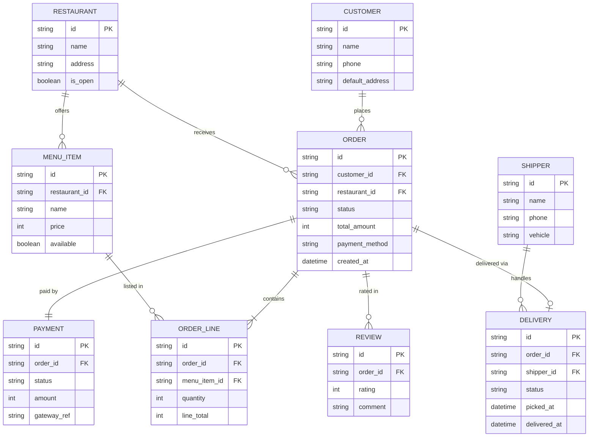

# Food Delivery — ERD (Mermaid)

> Output `/erd`. Data model nhúng inline, kiểu gọn cho BA đọc. Tầng chi tiết hơn (kiểu DB thật + enum + index) xem `dbdiagram/food-delivery.dbml` (output `/dbdiagram`).

