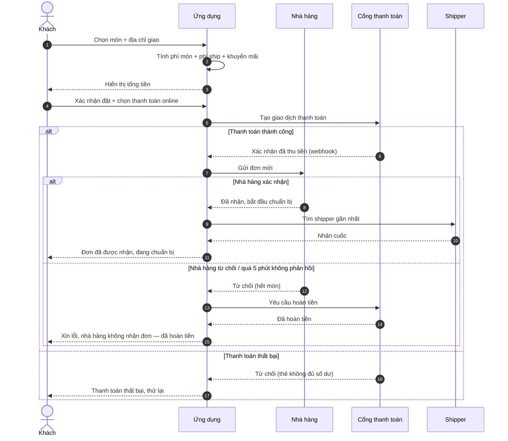
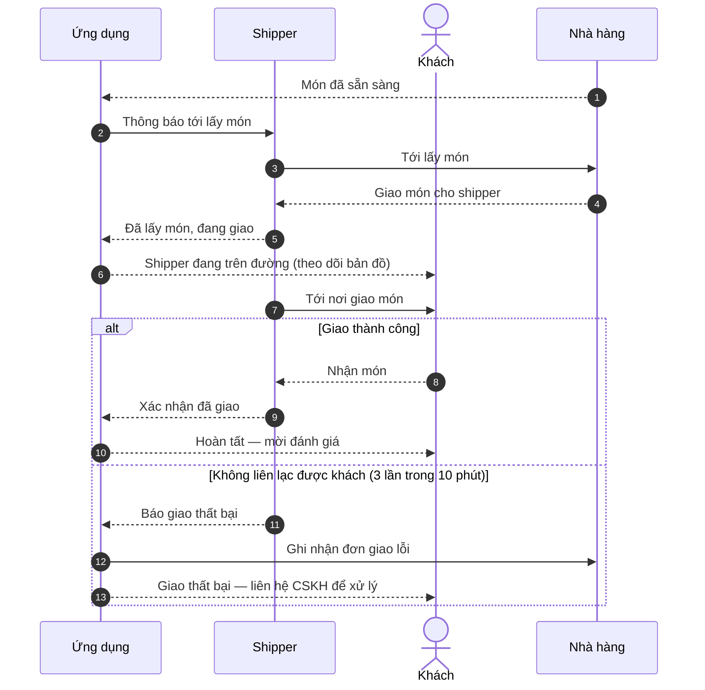
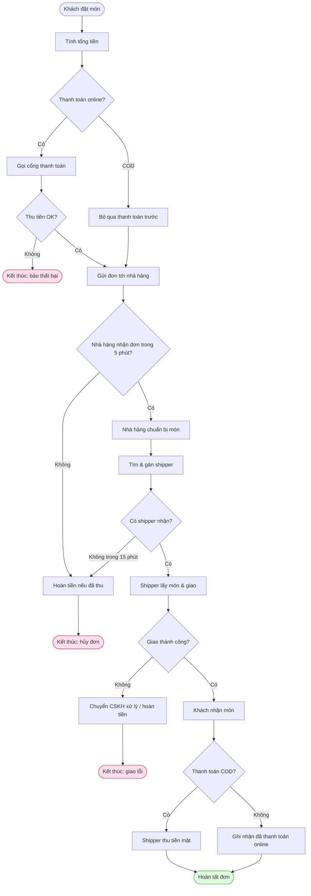

# Food Delivery — Sơ đồ luồng (Sequence + Activity)

> Bản mẫu do bộ **diagram-skills** sinh ra. Mỗi flow một section. Sequence diagram (output `/sequence`) và activity/flowchart (output `/activity`) cùng sống trong file này — theo quy ước `srs/{feature}-flows.md`.
>
> **Bối cảnh nghiệp vụ (dùng chung cho mọi diagram trong bộ example):** Ứng dụng đặt & giao đồ ăn. 4 vai trò: **Khách** đặt món, **Nhà hàng** xác nhận + chuẩn bị, **Shipper** nhận + giao, **Hệ thống** điều phối + tính tiền + gọi cổng thanh toán. Các nhánh khó: nhà hàng từ chối, hết shipper, khách hủy, giao thất bại, hoàn tiền.

---

## Flow: Đặt món và thanh toán (happy + error) — Sequence

---

## Flow: Giao hàng và xác nhận (happy + giao thất bại) — Sequence

---

## Flow: Xử lý đơn hàng đầu-cuối (Activity / flowchart)

