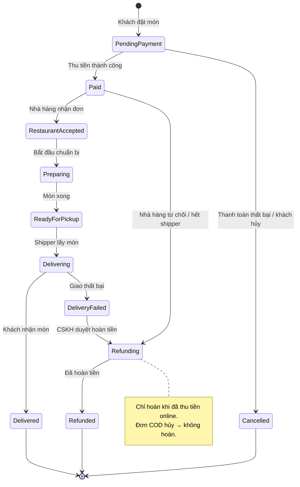
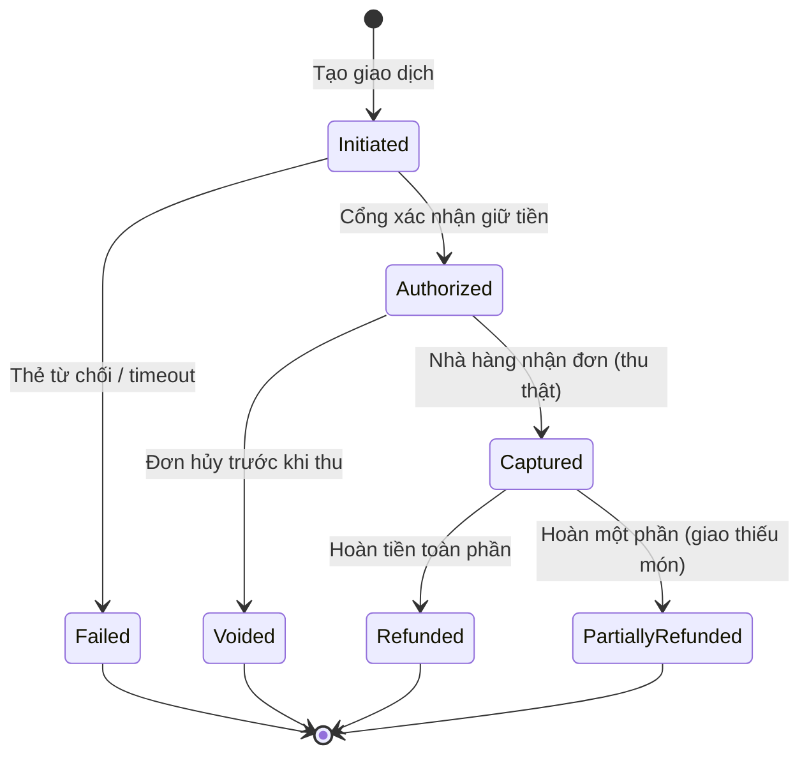

# Food Delivery — Sơ đồ trạng thái (State diagrams)

> Output `/state`. Mỗi entity một section `## State: {Entity}`.

---

## State: Order (Đơn hàng)

---

## State: Payment (Giao dịch thanh toán)

