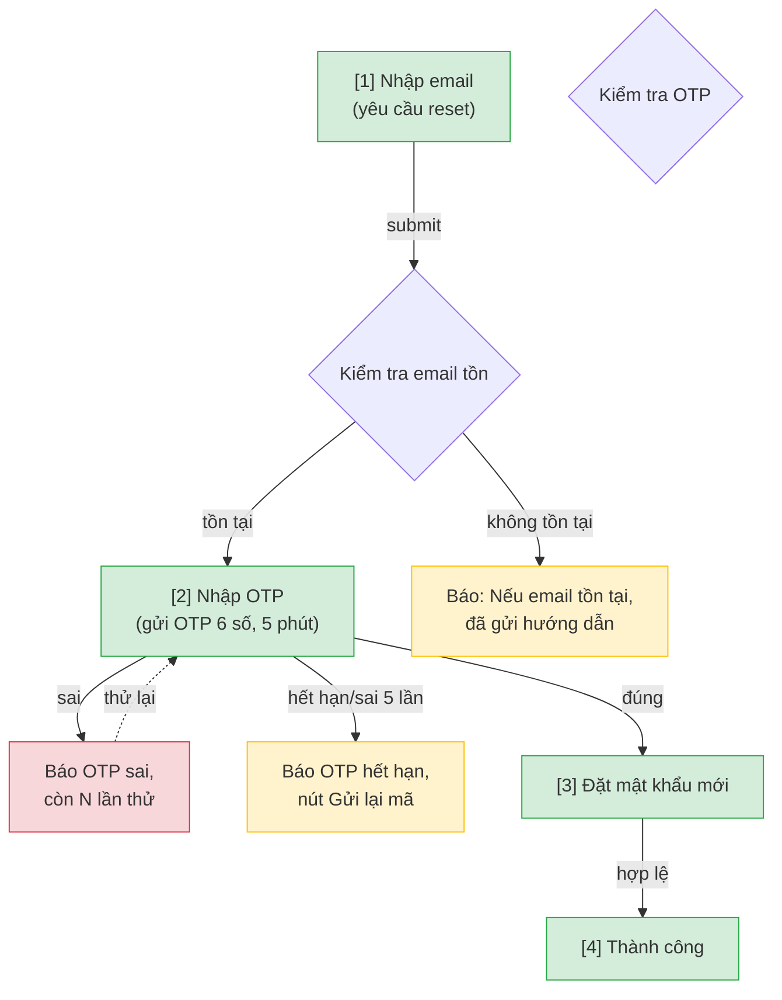

# /user-flow — Nghiệp vụ → User Flow (nguồn chia flow chung)

> **KHÔNG dùng `context: fork`.** Skill PHẢI chạy ở main conversation vì có HITL thật: clarify loop (Phase C, hỏi user chờ trả lời), duyệt text (Phase E, max 3 vòng), và HARD STOP (chốt/sửa/hủy). Fork = không có kênh user trả lời prompt → mọi gate bị auto-skip → skill tự đoán nghiệp vụ hoặc tự Write không hỏi (cùng root cause bug CR-20260612-001). Phân tích nặng đã delegate cho `flow-reviewer` qua Task tool nên không cần fork toàn skill.

## Goal

Đi từ **nghiệp vụ trừu tượng** (chỉ tên tính năng hoặc 1 đoạn mô tả) tới **user flow tổng đã duyệt**: sơ đồ mermaid thể hiện tương tác giữa các màn hình, phủ đủ **happy / error / edge case**, và chia sẵn feature thành các **flow** (flow-slug + danh sách screens/use case mỗi flow).

Output `docs/{feature}/srs/{feature}-userflow.md` là **nguồn chia flow DUY NHẤT** — `/wireframe-ascii` và `/wireframe-html` đều đọc file này để biết flow nào gồm những màn nào, rồi mỗi skill tự vẽ wireframe độc lập (KHÔNG đọc lẫn nhau). `/user-flow` PHẢI chạy trước cả hai — chưa biết flow dự kiến thì chưa vẽ được wireframe đúng scope.

> **User flow ≠ activity diagram.** User flow là view **UX** (tương tác giữa các MÀN HÌNH, phục vụ chia flow để vẽ wireframe) — dùng mermaid `flowchart` gọn. Activity/quy trình nghiệp vụ đa vai trò (ai làm bước nào) là việc của `/activity` (Mermaid), `/activity-swimlane` (PlantUML swimlane) hoặc `/bpmn`, sống ở `srs/{feature}-flows.md`. Đừng nhồi lane/actor nghiệp vụ vào userflow.

## Constraints

- **HARD STOP sau khi flow được duyệt.** Skill này CHỈ dừng ở user flow — KHÔNG vẽ wireframe (đó là việc của `/wireframe-ascii` hoặc `/wireframe-html`, gọi riêng hoặc qua `/srs`).
- **Hỏi khi không rõ — KHÔNG đoán.** Mọi điểm mơ hồ (luồng, điều kiện, giá trị cụ thể, case lỗi) phải hỏi user ngay trong chat (numbered list, 1 vòng/lần, chờ trả lời) trước khi đưa vào flow. Áp dụng `resolve-oqs` tinh thần: thà ghi Open Question còn hơn bịa.
- **Upstream priority**: brainstorm > URD > PRD/SRS > tự suy luận. Soft gate — thiếu vẫn proceed bằng suy luận + clarify.
- **Skip L3 cho mermaid** — flow tổng là mermaid `flowchart`, KHÔNG render được trong chat (khác ASCII cũ). Write file thẳng sau khi user duyệt nội dung bằng mô tả text (xem Phase E).
- **flow-reviewer gate (Phase E.5)** — sau khi user OK nội dung flow (mô tả text, chưa phải file), BẮT BUỘC spawn agent `flow-reviewer` (persona "UX_Reviewer") review flow + case coverage + grouping trước khi đưa user confirm cuối. Skill nhận findings → xử lý lại → mới sang HARD STOP.
- **L1 plan preview** trước khi Write file.
- **L2 diff** khi file đã tồn tại (chạy lại tự động vào update mode).
- **Vietnamese-first** labels + prose. User nói "viết bằng tiếng Anh" để switch.
- **BA conventions** (must follow) — Owner resolution, no-re-ask rule, IT-BA framing (KHÔNG hỏi DB/API/framework), Vietnamese typography ("Mục N" không dùng §), L1 prose preview. Per @../../rules/ba-conventions.md.
- **Mermaid syntax safety** — theo @../../rules/diagram-selection.md Mục "Mermaid syntax safety". Quan trọng nhất: **QUOTE PHÒNG THỦ** — bọc `"..."` mọi node label + edge label chứa ký tự đặc biệt (`≥ ≤ + / ? & ( ) :`), vd `d1{"...email/password"}`, `A -->|"fail ≥3 lần"| B` (nguồn lỗi "Invalid mermaid syntax" #1, và `mmdc` verify LẠI tha nên phải phòng khi viết). Không HTML entity `&amp;` trong label, không `"..."` lồng, `<br/>` cho newline.
- **Render-verify mermaid BẮT BUỘC sau Write** (Phase F.5) — chạy `mermaid-verify.mjs`, fail thì tự sửa ≤2 lần. KHÔNG báo "xong" khi mermaid chưa compile OK.

## Inputs

```
/user-flow <feature-slug>                 # vd: /user-flow forgot-password
/user-flow "mô tả tính năng tự do"        # vd: /user-flow "người dùng quên mật khẩu, gửi OTP qua email, đặt lại"
```

- Arg là **feature slug** (kebab-case) HOẶC **mô tả tính năng** (free text). Skill tự nhận diện: nếu arg khớp folder `docs/{arg}/` tồn tại → coi là feature slug; nếu là câu mô tả → derive slug + confirm ở L1. Mô tả không suy ra slug rõ → skill hỏi lại tên feature slug mong muốn trong câu trả lời.
- Chạy lại trên feature đã có `userflow.md` → tự vào update mode, L2 diff.
- Viết bằng tiếng Anh → nói "viết bằng tiếng Anh".

## Context (dynamic)

Today: !`date +%Y-%m-%d`
Features có sẵn: !`ls -d docs/*/ 2>/dev/null | xargs -I{} basename {} | grep -v "^_" | head -20`
Features có upstream (brainstorm/urd/prd — nguồn suy flow): !`for d in docs/*/; do f=$(basename "$d"); { [ -f "${d}$(basename "$d")-prd.md" ] || [ -f "${d}$(basename "$d")-urd.md" ] || ls "$d"brainstorms/*.md >/dev/null 2>&1; } && echo "$f"; done 2>/dev/null | grep -v "^_" | head -20`
Features đã có userflow.md: !`for d in docs/*/srs/*-userflow.md; do [ -f "$d" ] && dirname "$d" | xargs dirname | xargs basename; done 2>/dev/null | head -20`

## Output

```
docs/{feature}/srs/{feature}-userflow.md
```

Slim frontmatter (`type: srs-userflow`, `feature`, `updated` + state fields). Sự kiện ghi vào `docs/_shared/activity.log` qua hook (set env note trước Write — không phụ thuộc spec.md).

## Runtime flow (skill chạy thế nào)

```
/user-flow <arg>
        │
        ▼
[Phase A] Parse arg → feature slug (existing folder?) hoặc derive từ mô tả
        │
        ▼
[Phase A.5] Check docs/{feature}/srs/{feature}-userflow.md đã có stage: flow-approved chưa
            Có + flow_hash còn khớp Mục 1 hiện tại → báo "flow đã duyệt, dùng lại
            luôn" + dừng (không hỏi lại). Lệch → cảnh báo, hỏi user xác nhận lại.
            Chưa có → tiếp Phase B.
        │
        ▼
[Phase B] Đọc upstream: brainstorm > URD > PRD/SRS (Glob docs/{feature}/**).
        │
        ▼
[Phase C] Phân tích nghiệp vụ → điểm mơ hồ → HỎI user (numbered, chờ trả lời).
        │
        ▼
[Phase D] Sinh: (1) danh sách màn hình dự kiến, (2) chia flow (flow-slug +
          screens/UC mỗi flow), (3) user flow mermaid tổng (happy+error+edge).
        │
        ▼
[Phase E] Duyệt nội dung flow bằng mô tả text trong chat (max 3 vòng, KHÔNG
          phải L3 mermaid render — chỉ là preview có cấu trúc).
        │
        ▼
[Phase E.5] Spawn flow-reviewer → review flow + cases + flow grouping → findings.
            Skill xử lý lại → báo user đã sửa gì. Tối đa 2 vòng nếu còn BLOCKING.
        │
        ▼
  ╔═══════════════════ HARD STOP ═══════════════════╗
  ║ In flow (đã qua review) + danh sách màn + flow map║
  ║ + tóm tắt findings đã xử lý. Hỏi:                 ║
  ║ "Confirm để em ghi user flow? (chốt / sửa / hủy)" ║
  ║ Đợi user. KHÔNG tự đi tiếp.                       ║
  ╚══════════════════════════════════════════════════╝
        │ user "chốt"
        ▼
[Phase F] L1 plan preview → Write userflow.md, set stage: flow-approved.
        │
        ▼
[Phase F.5] Render-verify mermaid (mermaid-verify.mjs) → fail thì tự sửa ≤2 lần.
        │
        ▼
[Phase G] Final report + recommend next (/wireframe-ascii, /wireframe-html, /srs).
```

## Approach (chi tiết từng phase)

### Phase A — Parse & resolve feature

1. Lấy arg sau `/user-flow`.
2. `Glob docs/*/` — nếu arg (slugify) khớp 1 folder tồn tại → `feature = arg`.
3. Nếu arg là mô tả tự do → derive feature slug (kebab-case, ASCII, ≤50 ký tự, theo `naming-conventions.md`). Confirm slug ở L1 cuối. User không đồng ý slug tự suy → nói slug mong muốn trong câu trả lời, skill dùng luôn.

### Phase A.5 — Check state đã duyệt (tránh phân tích lại từ đầu)

> State artifact chống mất context khi turn bị ngắt (compact, session mới, quay lại sau nhiều ngày). KHÔNG dựa vào trí nhớ hội thoại.

1. `Read docs/{feature}/srs/{feature}-userflow.md` nếu tồn tại. Không tồn tại → tiếp Phase B bình thường.
2. Có tồn tại + frontmatter có `stage: flow-approved`:
   - Tính lại hash nội dung Mục 1 "User Flow (tổng)" hiện tại, so với `flow_hash` đã lưu.
   - **Khớp** → in "Flow đã duyệt từ {flow_approved_at}, dùng lại luôn" rồi **dừng ở đây** (không chạy lại Phase B-E.5-HARD STOP), trừ khi user nói rõ muốn rà lại (vd "chạy lại /user-flow", "rà lại flow") — coi như đã xong, báo user chạy `/wireframe-ascii` hoặc `/wireframe-html` tiếp.
   - **Lệch** (ai đó sửa Mục 1 sau khi duyệt — thủ công hoặc qua `/cr`) → CẢNH BÁO: "Flow đã đổi từ lúc duyệt ({flow_approved_at})." Hỏi user: dùng flow hiện tại làm chuẩn mới (tự cập nhật `flow_hash`) hay rà lại từ Phase C.
3. Có tồn tại nhưng KHÔNG có `stage: flow-approved` (HARD STOP chưa qua ở lần chạy trước) → tiếp Phase B bình thường.
4. User nói muốn rà lại/chạy lại từ đầu (dù đã khớp hash) → tiếp Phase B (rà lại có chủ đích), bỏ qua nhánh "khớp → dừng".

### Phase B — Đọc upstream nghiệp vụ

Đọc theo thứ tự ưu tiên (dừng khi đủ ngữ cảnh, nhưng nên đọc thêm nếu có):
- **KG chọn nguồn trước (rẻ hơn scan):** chạy `node .claude/skills/kg/engine/kg-query.mjs facts {feature}` và `node .claude/skills/kg/engine/kg-query.mjs neighbors <doc-path>` khi có doc mốc để lấy danh sách candidate/coverage, rồi VẪN Read đầy đủ prose file đã chọn. Tuân `.claude/rules/kg-usage.md` (3 nghĩa vụ: `--all` khi bị cap · đọc mục "Phải Read tay" · `KG-ERROR` → scan trực tiếp như cũ).

| Nguồn | Path | Trích gì |
|-------|------|----------|
| Brainstorm (ưu tiên 1) | `docs/{feature}/brainstorms/*.md` | Core flows, scenario matrix, state transitions, decision points, error cases, giá trị cụ thể |
| URD (ưu tiên 2) | `docs/{feature}/{feature}-urd.md` | Personas, user needs, user journeys, success criteria |
| PRD/SRS (nếu có) | `docs/{feature}/{feature}-prd.md`, `docs/{feature}/srs/{feature}-spec.md` | Capabilities, FR, screens đã định nghĩa |

- Có upstream → trích nghiệp vụ, KHÔNG hỏi lại cái đã có (no-re-ask).
- Thiếu hết → **suy luận mode**: skill tự dựng giả định nghiệp vụ từ tên/mô tả tính năng, rồi Phase C hỏi xác nhận giả định.

### Phase C — Phân tích nghiệp vụ & clarify (KHÔNG đoán)

1. Skill tóm tắt **hiểu biết hiện tại** về tính năng (2-4 dòng): mục tiêu, actor, luồng chính, nhánh nghi ngờ.
2. Liệt kê **điểm chưa rõ** thành numbered list. Hỏi tối đa 5-7 câu/vòng, **1 vòng một**, chờ trả lời. Câu hỏi bằng **ngôn ngữ nghiệp vụ** (IT-BA framing).
3. Loop tới khi đủ rõ HOẶC user nói "đủ rồi" → phần chưa trả lời ghi vào Open Questions, KHÔNG bịa nội dung.

### Phase D — Sinh màn hình + chia flow + user flow mermaid

0. **Primary device** (hỏi 1 câu ở Phase C nếu chưa rõ): feature này chủ yếu chạy trên **mobile (375px)**, **tablet (768px)** hay **desktop (1024px+)**? Đây là nguồn DUY NHẤT cho `/wireframe-html` + `/prototype-html` render đúng bề rộng khung. Không rõ → default `mobile` (mobile-first). Ghi vào frontmatter `primary_device`.
1. **Danh sách màn hình dự kiến**: mỗi màn 1 dòng (slug + mục đích 1 câu). Bao gồm màn trạng thái (success, error page, empty, loading nếu cần).
2. **Chia flow**: skill TỰ nhóm các màn cùng một mục tiêu nghiệp vụ thành 1 flow (vd `forgot-password-flow` = màn nhập email → OTP → đặt mật khẩu mới → thành công). Mỗi flow có 1 `flow-slug`. User duyệt cách chia này ở HARD STOP — đây là quyết định quan trọng vì `/wireframe-ascii` + `/wireframe-html` sẽ tạo 1 file/flow theo đúng cách chia này.
3. **User flow mermaid tổng**: `flowchart TD` (hoặc `TB`) thể hiện tương tác giữa màn hình, phủ **đủ 3 loại case**:
   - **Happy case** — luồng thành công chính.
   - **Error case** — sai input, lỗi hệ thống, sai OTP, hết hạn, vv.
   - **Edge case** — biên: account không tồn tại, đã dùng OTP, double-submit, quay lại giữa chừng, vv.
   Dùng style class riêng cho từng loại case (xem Mục "Mermaid user flow convention").
   **QUOTE PHÒNG THỦ khi compose (bắt buộc — tránh "Invalid mermaid syntax"):** bọc `"..."` MỌI node label và MỌI edge label chứa ký tự đặc biệt (`≥ ≤ + / ? & ( ) :`). Vd `d1{"Kiểm tra<br/>email/password"}` và `A -->|"fail ≥3 lần"| B`. Mặc định quote hết cho chắc — quote thừa vô hại. Đây là nguồn lỗi phổ biến nhất mà `mmdc` (Phase F.5) lại **tha**, nên phải phòng ngừa lúc viết, không dựa verify để phát hiện. Chi tiết: `diagram-selection.md` Mục "Mermaid syntax safety".
4. **Bảng chuyển màn (Mục 3.5)**: rút từ mermaid Mục 1 thành bảng `Từ màn [#] → Đến màn [#] | Trigger | Điều kiện`, phủ cả nhánh happy/error/edge. Đây là nguồn DUY NHẤT cho `/wireframe-html` + `/prototype-html` nối điều hướng (edge NAVIGATES_TO) — đừng để 3 nơi tự suy lại. Mỗi cạnh trong flowchart = 1 dòng bảng.

### Phase E — Duyệt nội dung flow (không phải L3 mermaid render)

> Mermaid KHÔNG render trong chat — khác ASCII trước đây. Thay vì L3 render-và-sửa, skill in **preview có cấu trúc bằng text** (không phải code mermaid thô) để user duyệt nội dung, rồi mới ghi mermaid thật vào file.

```
[/user-flow] Preview user flow — Phiên bản 1:

Primary device: {mobile 375 / tablet 768 / desktop 1024}

Luồng chính (happy): {A} → {B} → {C} → Thành công
Nhánh error: {điểm rẽ} → {error case 1}, {error case 2}
Nhánh edge: {điểm rẽ} → {edge case 1}, {edge case 2}

Danh sách màn hình ({N}):
  1. {slug} — {mục đích}
  ...

Chia flow ({M} flow):
  - {flow-slug-1}: gồm {màn a, b, c}
  - {flow-slug-2}: gồm {màn d, e}

Đồng ý / Sửa: <mô tả thay đổi> / Hủy:
```

- Max 3 vòng. User "Sửa: thêm case OTP hết hạn" → regen v2. Vòng 3 ép chốt.
- Mermaid thật (cú pháp đầy đủ) được compose SAU khi nội dung đã chốt ở bước này — tránh user phải đọc/sửa cú pháp mermaid thô.

### Phase E.5 — flow-reviewer review (BẮT BUỘC, trước khi confirm)

Sau khi user "Đồng ý" preview ở Phase E, skill **spawn agent `flow-reviewer`** (persona "UX_Reviewer") để review chi tiết trước khi đưa user chốt.

1. **Spawn agent** qua Task tool, `subagent_type: flow-reviewer`. Truyền vào prompt:
   - Preview flow (luồng chính + nhánh error/edge — dạng text như Phase E).
   - Danh sách màn hình (slug + mục đích).
   - Bảng chia flow (flow nào gồm màn nào, phủ case nào).
   - Tóm tắt nghiệp vụ + Open Questions hiện có.
   - Path upstream để agent tự đọc: `docs/{feature}/brainstorms/`, `docs/{feature}/{feature}-urd.md`.
2. **Nhận findings** (format `review-format.md`: verdict + BLOCKING/WARNING/SUGGESTION + section "Missing screens/branches").
3. **Skill xử lý lại flow:**
   - Mọi **BLOCKING** + **Missing screens/branches** → bổ sung vào flow + danh sách màn + flow map (skill tự xử lý, KHÔNG hỏi user từng cái — trừ khi cần giá trị nghiệp vụ chưa biết thì ghi Open Question).
   - **WARNING** → áp dụng nếu rõ ràng; nếu cần quyết định nghiệp vụ → ghi Open Question.
   - **SUGGESTION** → cân nhắc, không bắt buộc.
4. **Báo user** ngắn gọn đã sửa gì:
   ```
   🔍 UX_Reviewer đánh giá flow (verdict: {revise}):
     Đã bổ sung theo review:
       - {nhánh/màn vừa thêm}
       - {case vừa phủ}
     Ghi nhận Open Question: {nếu có}
   ```
5. **Loop**: nếu sau khi sửa vẫn còn BLOCKING bản chất, spawn lại review lần 2. **Tối đa 2 vòng** — vòng 2 vẫn block → ghi rõ điểm tồn đọng vào Open Question + để user quyết ở HARD STOP.

> Lưu ý phân vai: `UX_Reviewer` làm flow **tốt hơn về UX/nghiệp vụ**; **quyền chốt vẫn là user** ở HARD STOP.

### HARD STOP (sau Phase E.5)

```
✅ User flow + {N} màn hình + {M} flow (đã qua UX_Reviewer).
   Findings đã xử lý: {tóm tắt 1-2 dòng}.

Em sẽ ghi user flow vào docs/{feature}/srs/{feature}-userflow.md.
Confirm? (chốt / sửa / hủy)
```

- `chốt` / `ok` / `Y` → sang Phase F.
- `sửa: ...` → quay lại Phase D/E.
- `hủy` → dừng, KHÔNG write gì.

**KHÔNG được tự đi tiếp khi chưa có "chốt".**

### Phase F — L1 plan preview + Write

Theo `ba-conventions.md` Mục 5 (prose, không bảng tag dày):

```
Em sẽ tạo file `docs/{feature}/srs/{feature}-userflow.md`:

**Primary device:** {mobile 375 / tablet 768 / desktop 1024} (dùng cho wireframe/prototype render đúng khung).

**User flow tổng:** {N} màn hình, chia {M} flow, phủ happy/error/edge.

**Chia flow:**
- {flow-slug-1}: {màn a, b, c}
- {flow-slug-2}: {màn d, e}

**Câu hỏi mở:** {K} câu chưa chốt sẽ ghi vào file.

Apply? (Y / sửa)
```

User Y → Write `docs/{feature}/srs/{feature}-userflow.md` (xem Mục "Template userflow.md"). **Bắt buộc set state ngay lúc Write**: `primary_device: {mobile|tablet|desktop đã chốt}`, `stage: flow-approved`, `flow_approved_at: {date}`, `flow_hash: {sha256 8 ký tự đầu của nội dung Mục 1 vừa ghi}`.

Set env `CLAUDE_CHANGELOG_NOTE` trước Write — hook ghi activity.log (không phụ thuộc spec.md tồn tại hay chưa).

### Phase F.5 — Render-verify mermaid (BẮT BUỘC, chạy ngay sau Write)

Flow tổng là mermaid `flowchart` — KHÔNG render trong chat (lý do skip L3), nên đây là cách DUY NHẤT bắt lỗi cú pháp TRƯỚC khi báo "xong", thay vì để user tự phát hiện khi mở IDE/GitHub/Obsidian.

```bash
node .claude/scripts/mermaid-verify.mjs --file docs/{feature}/srs/{feature}-userflow.md
```

- **Pass** (compile OK) → **kiểm thêm bằng mắt trước khi báo xong:** `mmdc` lenient hơn GitHub/Obsidian nên compile OK vẫn có thể crash renderer thật. Rà block Mục 1: MỌI node label + edge label chứa ký tự đặc biệt (`≥ ≤ + / ? & ( ) :`) đã bọc `"..."` chưa? Chưa → quote ngay (đây đúng là lỗi "Invalid mermaid syntax" hay gặp nhất, mmdc không bắt). Xong → sang Phase G, report có dòng "mermaid compile OK".
- **Fail** → đọc lỗi dòng/cột script trả về, sửa **chỉ block mermaid Mục 1** (KHÔNG đụng Mục 2/3/4), verify lại. **Tự sửa tối đa 2 lần.** Lỗi hay gặp (theo `diagram-selection.md` Mục "Mermaid syntax safety"):
  - **Ký tự đặc biệt trần (`≥ + / ?`) trong node label `{...}`/`[...]` hoặc edge label `|...|`** → bọc cả label trong `"..."`. Vd `d1{"...email/password"}`, `A -->|"fail ≥3 lần"| B`. (Nguyên nhân #1.)
  - HTML entity trong label (`&amp;` `&lt;`) → thay bằng chữ thường ("và", "nhỏ hơn") hoặc bỏ.
  - Quote `"..."` LỒNG trong 1 label đã có `"..."` → bỏ lớp trong, dùng `<b>...</b>` nếu cần nhấn.
  - Ký tự `()[]{}` là nội dung trong label → bọc `"..."` hoặc escape `#40;#41;#91;#93;#123;#125;`.
  - `\n` → dùng `<br/>`.
- **Vẫn fail sau 2 lần tự sửa** → báo user rõ lỗi + đoạn mermaid, gợi ý paste mermaid.live để debug tay. **KHÔNG âm thầm để file lỗi mà báo "xong".**

> Nếu Mục 1 đã đổi do sửa cú pháp ở bước này → **tính lại `flow_hash`** cho khớp nội dung Mục 1 cuối cùng (tránh Phase A.5 lần sau báo "flow đã đổi" oan).

### Phase G — Final report

```
✅ User flow hoàn tất: docs/{feature}/srs/{feature}-userflow.md
   {N} màn hình, {M} flow, câu hỏi mở còn lại: {K}
   Mermaid: compile OK · Primary device: {mobile|tablet|desktop}

Recommended next:
  - /wireframe-ascii {feature}   — wireframe ASCII lo-fi (duyệt cấu trúc nhanh)
  - /wireframe-html {feature}    — wireframe HTML lo-fi B&W (khung device {primary_device})
  - /prototype-html {feature}    — prototype hi-fi clickable (design tokens + JS)
  - /srs {feature}                — kỹ thuật hoá thành SRS đầy đủ
```

## Mermaid user flow convention (cho userflow.md Mục 1)

`flowchart TD`, đánh số `[n]` mỗi màn hình (trong label, vì Mermaid node id không nhận số đứng đầu — dùng id dạng `n1`, `n2`...). Style class cho 3 loại case:



- Node label đánh số `[n]` cho màn hình thật; node quyết định (diamond `{...}`) và node thông báo không đánh số.
- `-->` cho luồng chính, `-.->` cho quay lại/retry.
- Style class `happy`/`error`/`edge` tô màu theo loại case — áp cho node kết quả (không nhất thiết áp cho node quyết định).
- Nếu flow quá rộng → tách thành nhiều `flowchart` block theo flow-slug, mỗi block 1 heading `### Flow: {flow-slug}`.
- Tuân `diagram-selection.md` Mục "Mermaid syntax safety" — KHÔNG dùng `"..."` lồng trong `[...]`, dùng `<br/>` cho newline.

## Template `userflow.md`

```yaml
---
type: srs-userflow
feature: {feature}
updated: {date}
primary_device: mobile          # mobile (375) | tablet (768) | desktop (1024) — nguồn bề rộng khung cho /wireframe-html + /prototype-html
stage: flow-approved
flow_approved_at: {date}
flow_hash: "{sha256 8 ký tự đầu của nội dung Mục 1 tại lúc user gõ 'chốt' ở HARD STOP}"
---

# {Feature} — User Flow

> Nguồn chia flow DUY NHẤT cho feature này. `/wireframe-ascii` và `/wireframe-html` đọc file này để biết flow nào gồm những màn nào — KHÔNG tự chia flow riêng.

## 1. User Flow (tổng)

> Phủ happy / error / edge cases. `[n]` = số màn hình đối chiếu Mục 2.

```mermaid
{mermaid flowchart — theo convention}
```

## 2. Danh sách màn hình

> Cột `Slug` = định danh máy-đọc DUY NHẤT của màn (khớp `## Screen: {slug}` bên wireframe + node KG). `[#]` chỉ để đối chiếu Mục 1/3.5.

| [#] | Slug | Màn hình | Mục đích | Thuộc flow |
|-----|------|----------|----------|------------|
| 1 | forgot-email | Nhập email | Người dùng nhập email để nhận OTP | forgot-password-flow |
| 2 | otp-input | Nhập OTP | Xác thực mã gửi qua email | forgot-password-flow |
| ... | | | | |

## 3. Danh sách flow

| Flow-slug | Tên flow | Màn hình gồm | Cases phủ |
|-----------|----------|--------------|-----------|
| forgot-password-flow | Quên mật khẩu | forgot-email → otp-input → reset-form → reset-done | happy, error (sai OTP), edge (hết hạn, email không tồn tại) |

## 3.5. Chuyển màn (transitions)

> Nguồn DUY NHẤT cho chuyển màn màn→màn (edge NAVIGATES_TO). `/wireframe-html` + `/prototype-html` đọc bảng này để nối nút/điều hướng — KHÔNG tự suy lại từ prose/mermaid (tránh 3 nơi maintain lệch nhau). 1 dòng = 1 chuyển; đủ phủ happy + error + edge của Mục 1.

| Từ màn [#] | Đến màn [#] | Trigger | Điều kiện |
|-----------|------------|---------|-----------|
| Nhập email [1] | Nhập OTP [2] | Submit email | email tồn tại |
| Nhập email [1] | (giữ nguyên) [1] | Submit email | email không tồn tại → báo lỗi |
| Nhập OTP [2] | Đặt mật khẩu [3] | Submit OTP | OTP đúng, còn hạn |

## 4. Open Questions

- [ ] OQ-1: {câu hỏi nghiệp vụ chưa chốt}

(Trống nếu nghiệp vụ đã rõ hết.)
```

> **KHÔNG có section Changelog trong file.** Lịch sử thay đổi sống ở `docs/_shared/activity.log` tập trung (hook `auto-changelog.sh` là writer duy nhất) — set env `CLAUDE_CHANGELOG_NOTE` trước Write.

## Gotchas

- **Không vẽ wireframe ở đây.** `/user-flow` dừng lại ở flow — vẽ ASCII/HTML là việc của `/wireframe-ascii` / `/wireframe-html`.
- **flow-reviewer chạy TRƯỚC HARD STOP.** Đừng đưa user confirm trước khi review xong.
- **Review ≠ tự ý đổi nghiệp vụ.** Findings cần giá trị nghiệp vụ chưa biết → ghi Open Question, KHÔNG bịa số.
- **Đừng đoán nghiệp vụ.** Mơ hồ → hỏi ngay, chờ trả lời. Không trả lời → Open Question.
- **Chia flow theo mục tiêu nghiệp vụ**, không theo màn rời — quyết định này ảnh hưởng trực tiếp `/wireframe-ascii` + `/wireframe-html` sau này.
- **Mermaid, không phải ASCII** — khác skill tiền nhiệm `/wireframe-n-userflow`. KHÔNG render trong chat; Phase E dùng preview text, không phải mermaid thô.
- **Verify mermaid sau Write (Phase F.5) — KHÔNG bỏ qua.** Mermaid không render trong chat nên lỗi cú pháp chỉ lộ khi user mở IDE/GitHub. Chạy `mermaid-verify.mjs`, tự sửa ≤2 lần. Lỗi hay gặp: `&amp;`/HTML entity trong label, quote lồng `[...]`. Nếu sửa Mục 1 → tính lại `flow_hash`.
- **`flow_hash` là cơ chế chống hỏi lại** — Phase A.5 dùng nó để biết flow đã duyệt chưa, tránh chạy lại toàn bộ phân tích mỗi lần `/wireframe-ascii` hay `/srs` cần đọc userflow.
- **User muốn rà lại chủ động** (dù flow đã duyệt và hash khớp) → nói rõ trong câu lệnh ("chạy lại", "rà lại từ đầu"), skill luôn chạy lại Phase B, L2 diff khi Write.
- **Folder chưa tồn tại** → tạo `docs/{feature}/srs/`. Feature folder `docs/{feature}/` chưa có → vẫn tạo (skill có thể chạy trước cả brainstorm).

## References

- @../../rules/approval-gate.md
- @../../rules/kg-usage.md
- @../../rules/naming-conventions.md
- @../../rules/feature-bootstrap.md
- @../../rules/ba-conventions.md
- @../../rules/resolve-oqs.md (chỉ áp dụng TINH THẦN "thà ghi Open Question còn hơn bịa" — user-flow là điểm-vào sớm, KHÔNG chạy Phase resolve-OQ đầy đủ; resolve OQ là việc của `/urd` `/srs` sau)
- @../../rules/diagram-selection.md
- @../../rules/review-format.md (findings format UX_Reviewer dùng)
- @../../scripts/mermaid-verify.mjs (render-verify sau Write — Phase F.5)
- @../../agents/flow-reviewer.md (UX_Reviewer — review flow ở Phase E.5)
- @../wireframe-ascii/SKILL.md (đọc userflow.md để chia flow)
- @../wireframe-html/SKILL.md (đọc userflow.md để chia flow)
