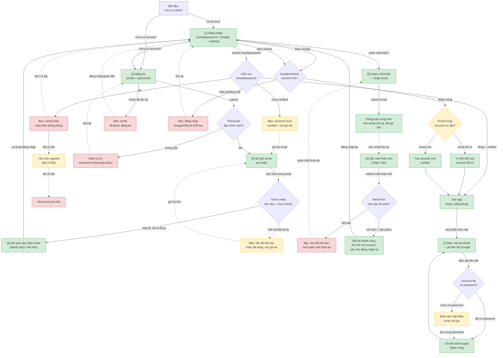

# Authentication — User Flow

> Nguồn chia flow DUY NHẤT cho feature này. `/wireframe-ascii` và `/wireframe-html` đọc file này để biết flow nào gồm những màn nào — KHÔNG tự chia flow riêng.
>
> Derived từ 7 use case hiện có (`docs/authentication/usecases/uc-*.md`) + màn hình đã tồn tại ở `ascii-wireframe/` và `html-wireframe/`. Cách chia flow giữ nhất quán với `html-wireframe/authentication-wireframe-html-index.md` (5 flow đã có) + bổ sung flow GitHub OAuth (uc-github-oauth thêm sau, CR-20260612-001, chưa có wireframe riêng).

## 1. User Flow (tổng)

> Phủ happy / error / edge cases. `[n]` = số màn hình đối chiếu Mục 2.

## 2. Danh sách màn hình

| [#] | Màn hình | Mục đích | Thuộc flow |
|-----|----------|----------|------------|
| 1 | login | Đăng nhập bằng email/password, hoặc qua Google/GitHub; lối vào đăng ký + quên mật khẩu | login-email-password, google-oauth, github-oauth |
| 2 | signup | Đăng ký tài khoản mới bằng email + password | signup-verify-email |
| 3 | verify-email-sent | Thông báo đã gửi email xác nhận, có nút gửi lại | signup-verify-email |
| 4 | verify-email-result | Kết quả click link xác nhận (thành công / hết hạn) | signup-verify-email |
| 5 | forgot-password-request | Nhập email để nhận link đặt lại mật khẩu | forgot-password |
| 6 | reset-password-form | Đặt mật khẩu mới (nhập 2 lần) sau khi click link reset | forgot-password |
| 7 | account-security | Gỡ liên kết Google, buộc tạo password nếu account chưa có | unlink-google |

## 3. Danh sách flow

| Flow-slug | Tên flow | Màn hình gồm | Cases phủ |
|-----------|----------|--------------|-----------|
| login-email-password | Đăng nhập email + password | login | happy (đăng nhập thành công, vào app/onboarding), error (sai email/password, chưa verified), edge (captcha ≥3 lần, khóa 24h ≥5 lần, lỗi mạng không tính fail) |
| signup-verify-email | Đăng ký + xác nhận email | signup → verify-email-sent → verify-email-result | happy (đăng ký + xác nhận thành công), error (password không đạt policy, email đã tồn tại, link hết hạn/đã dùng), edge (resend cooldown 60s max 5/ngày, 2 thiết bị cùng click 1 link) |
| google-oauth | Đăng nhập/đăng ký qua Google | login [chung với flow login-email-password] | happy (tạo account mới hoặc auto-link vào account có sẵn), error (callback thất bại), edge (đóng tab giữa chừng, email Google khác hoàn toàn email cũ) |
| github-oauth | Đăng nhập/đăng ký qua GitHub | login [chung với flow login-email-password] | happy (tạo account mới hoặc auto-link vào account có sẵn), error (callback thất bại, GitHub không trả email), edge (đóng tab giữa chừng, email GitHub khác hoàn toàn email cũ) |
| forgot-password | Quên mật khẩu / đặt lại | forgot-password-request → reset-password-form | happy (đặt lại thành công, thu hồi mọi session), error (link hết hạn 30 phút, password mới không đạt policy), edge (anti-enumeration — email không tồn tại vẫn báo trung tính) |
| unlink-google | Gỡ liên kết Google | account-security | happy (gỡ liên kết thành công khi đã có password), edge (account chưa có password → buộc tạo password trước, bỏ giữa chừng vẫn còn liên kết) |

## 4. Open Questions

- [ ] OQ-1 (kế thừa từ `uc-login-email.md`): vị trí nút đăng xuất trong app chính — ngoài scope màn hình auth, chốt khi thiết kế layout app chính.
- [ ] OQ-2 (kế thừa từ `uc-google-oauth.md` + `uc-github-oauth.md`): auto-link Google/GitHub không re-verify ownership — rủi ro chiếm tài khoản, cân nhắc P1 (đồng bộ OQ-3 ở `srs/spec.md`).
- [ ] OQ-3 (kế thừa từ `uc-github-oauth.md`): gỡ liên kết GitHub (unlink) chưa có UC/FR — hiện `account-security` chỉ hỗ trợ unlink Google. Flow `github-oauth` ở trên chỉ phủ link/login, chưa phủ unlink GitHub (enhancement sau, out of scope CR-20260612-001).

## Changelog

- 2026-07-11 | /user-flow | initial: derive từ 7 use case hiện có (signup/verify/login/forgot-password/google-oauth/unlink-google/github-oauth), chia 6 flow (thêm github-oauth mới so với 5 flow html-wireframe cũ), phủ happy/error/edge.
