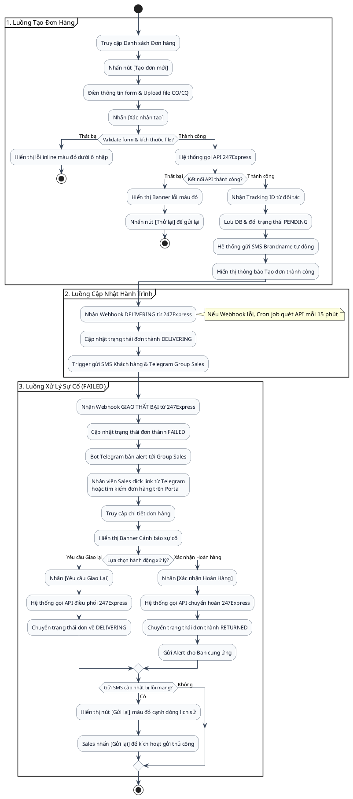

# Giải pháp Hệ thống Theo dõi Đơn hàng (Order Tracking System)

## 1. Tổng quan Kiến trúc (Architecture Overview)
Hệ thống được thiết kế theo dạng Web Application (Portal) kết hợp với các Background Workers (để xử lý tích hợp 247Express và gửi thông báo).
- **Backend:** Node.js (NestJS/Express) hoặc Python (FastAPI/Django) hoặc C# (.NET Core) phù hợp cho việc tích hợp API và xử lý bất đồng bộ.
- **Frontend:** React.js / Next.js / Vue.js cho Dashboard và Quản lý đơn hàng. Tối ưu UI/UX, hỗ trợ Responsive.
- **Database:** PostgreSQL hoặc MySQL. Đủ mạnh để lưu trữ quan hệ (Đơn hàng, Khách hàng, Lịch sử trạng thái).
- **Message Queue / Background Jobs:** Redis + BullMQ (Node) hoặc Celery (Python) hoặc Hangfire (.NET) để xử lý polling tracking từ 247Express và queue gửi tin nhắn (SMS/Telegram) đảm bảo không bị sót.
- **File Storage:** AWS S3, MinIO hoặc local storage để lưu trữ tài liệu CO/CQ dạng PDF/Image.

## 2. Chi tiết Giải pháp theo Yêu cầu

### 2.1 Quản lý Đơn hàng (Order Management)
- **Cấu trúc Dữ liệu Đơn hàng:**
  - `OrderInfo`: Mã đơn, ngày tạo, nhân viên Sales phụ trách, tổng chi phí.
  - `CustomerInfo`: Tên người nhận, số điện thoại, địa chỉ chi tiết.
  - `Items`: Danh sách hàng hoá (SKU, số lượng, đơn giá, khối lượng).
  - `Documents`: File đính kèm (CO/CQ, hoá đơn VAT). Lưu trữ url link tới File Storage.
- **Tính năng:**
  - Form tạo đơn hàng với khả năng upload file CO/CQ.
  - Tính năng **In chứng từ**: Template HTML sang PDF (VD: sử dụng thư viện Puppeteer/wkhtmltopdf) để in Phiếu xuất kho, Bill gửi hàng, Hoá đơn.

### 2.2 Tích hợp 247Express
- **Tạo đơn tự động:**
  - Khi user nhấn "Tạo đơn", hệ thống gọi API của 247Express (Create Order API) truyền các thông tin: người nhận, địa chỉ, hàng hoá, khối lượng.
  - Nhận lại `TrackingNumber` (Mã vận đơn của 247Express) và lưu vào Database.
- **Tracking trạng thái tự động:**
  - **Webhook (Ưu tiên):** Nếu 247Express hỗ trợ Webhook, hệ thống sẽ mở 1 endpoint để 247Express push trạng thái mới nhất về. (Real-time & tiết kiệm tài nguyên).
  - **Polling (Dự phòng):** Nếu 247Express không có Webhook, thiết lập Cron Job (VD: 15 phút/lần) lấy danh sách các đơn đang ở trạng thái "Đang giao" và gọi API Tracking của 247Express để cập nhật.

### 2.3 Thông báo Tự động (Notification System)
- **Quy tắc phân phối (Routing):**
  - Cấu hình Ma trận nhận thông báo. Ví dụ:
    - *Sales*: Nhận thông báo khi "Giao thành công" hoặc "Thất bại".
    - *Admin/Cung ứng*: Nhận thông báo "Hoàn hàng".
    - *Khách hàng*: SMS Brandname khi "Bắt đầu giao" và "Thành công".
- **Cơ chế chống Trùng lặp (Idempotency):**
  - Bảng `Order_Status_History`: Lưu `OrderID`, `Status`, `Notified_At`.
  - Trước khi gửi tin, check nếu `Status` này của `OrderID` đã có `Notified_At` thì bỏ qua.
- **Tích hợp:**
  - **Telegram:** Sử dụng Telegram Bot API, tạo các Group Chat tương ứng với từng bộ phận và add Bot vào. Hệ thống bắn message qua Bot.
  - **SMS Brandname:** Tích hợp với nhà mạng hoặc service SMS (như eSMS, VietGuys, Twilio).

### 2.4 Dashboard & Báo cáo
- **Giao diện Overview:** Các Card thống kê số lượng đơn (Đang giao / Thành công / Thất bại / Hoàn hàng) có thể lọc theo ngày/tuần/tháng.
- **Data Table:** Danh sách đơn hàng với các cột quan trọng (Mã, Trạng thái 247, Khách hàng, Sales).
  - Hỗ trợ Tìm kiếm text (Mã đơn, SĐT khách).
  - Bộ lọc (Filter) theo trạng thái, theo Sales.
- **Cảnh báo (Alerts):** Đưa ra các thẻ màu (Đỏ/Vàng) cho các đơn "Giao thất bại" hoặc "Quá N ngày chưa giao xong". Có module Rule Engine đơn giản để sau này mở rộng quy tắc.

## 3. Sơ đồ Cơ sở Dữ liệu (Dự kiến)

```sql
-- Lược đồ cơ bản (Pseudo-schema)
Table Orders {
  id uuid PK
  tracking_number varchar(50) [note: "Mã 247Express"]
  customer_name varchar
  customer_phone varchar
  customer_address text
  total_cost decimal
  sales_id uuid [ref: > Users.id]
  current_status varchar [note: "PENDING, DELIVERING, SUCCESS, FAILED, RETURNED"]
  created_at timestamp
}

Table Order_Items {
  id uuid PK
  order_id uuid [ref: > Orders.id]
  product_name varchar
  quantity int
  price decimal
}

Table Order_Documents {
  id uuid PK
  order_id uuid [ref: > Orders.id]
  doc_type varchar [note: "CO, CQ, INVOICE"]
  file_url text
}

Table Order_Status_Histories {
  id uuid PK
  order_id uuid [ref: > Orders.id]
  status varchar
  note text
  notified_telegram boolean default false
  notified_sms boolean default false
  created_at timestamp
}

Table Users {
  id uuid PK
  name varchar
  department varchar [note: "SALES, ADMIN, TELESALES, SUPPLY"]
  telegram_chat_id varchar
  phone varchar
}
```

## 4. Luồng Người Dùng (User Flow)

*Sơ đồ hoạt động (Activity Diagram) mô tả các luồng tương tác của Người dùng (Sales/Admin) trên giao diện Portal:*



### Mô tả chi tiết hành vi người dùng:
1. **Luồng tạo đơn mới:**
   * Người dùng thao tác trên form tạo đơn. Nếu nhập thiếu trường bắt buộc hoặc upload file CO/CQ quá dung lượng (5MB), hệ thống chặn lại ngay tại giao diện và hiển thị thông báo lỗi bằng chữ đỏ phía dưới ô nhập liệu.
   * Khi nhấn gửi và gặp lỗi hệ thống (API 247Express lỗi hoặc mất kết nối), Portal giữ nguyên dữ liệu đã nhập và hiển thị banner thông báo lỗi màu đỏ kèm nút **"Thử lại"** để người dùng có thể gửi lại yêu cầu mà không phải điền lại thông tin.
2. **Luồng cập nhật hành trình:**
   * Trạng thái đơn được cập nhật tự động qua Webhook hoặc Cronjob đồng bộ của hệ thống. Người dùng không cần thao tác trực tiếp, nhưng sẽ nhận tin nhắn báo hành trình qua thiết bị di động (Khách hàng) và Telegram (nhóm Sales).
3. **Luồng xử lý sự cố giao hàng:**
   * Khi bưu tá báo giao lỗi (trạng thái FAILED), Sales nhận cảnh báo chứa SĐT khách qua Telegram, click thẳng vào liên kết để mở trang chi tiết đơn hàng.
   * Tại trang chi tiết, một **Banner màu đỏ nổi bật** đề xuất hai hành động nhanh: **[Yêu cầu giao lại]** và **[Xác nhận hoàn hàng]**.
   * Ngoài ra, nếu có lỗi gửi SMS Brandname do nhà mạng, một nút **"Gửi lại"** màu đỏ sẽ hiển thị bên cạnh nhật ký sự cố để Sales có thể chủ động kích hoạt gửi lại bằng tay sau khi kiểm tra thông tin.

## 5. Câu hỏi Mở cần làm rõ (Next Steps)
> [!IMPORTANT]
> Để có thể lên kế hoạch triển khai chi tiết (Implementation Plan), chúng ta cần thống nhất một số điểm sau:

1. **API 247Express:** Bạn đã có tài liệu API (API Docs) hoặc thông tin kết nối (API Key) từ 247Express chưa? Họ có hỗ trợ Webhook để báo trạng thái không?
2. **Nền tảng công nghệ:** Đội ngũ của bạn đang quen với Tech Stack nào (Nodejs, Python, PHP, .NET)? Hay đây là dự án làm mới hoàn toàn từ đầu và tôi có thể tự do chọn?
3. **SMS Brandname:** Bạn đã đăng ký nhà cung cấp dịch vụ SMS Brandname nào chưa?
4. **Quản lý quyền (RBAC):** Cần phân quyền chi tiết đến mức nào? (Ví dụ: Sales A chỉ xem đơn của Sales A, Admin xem toàn bộ).
