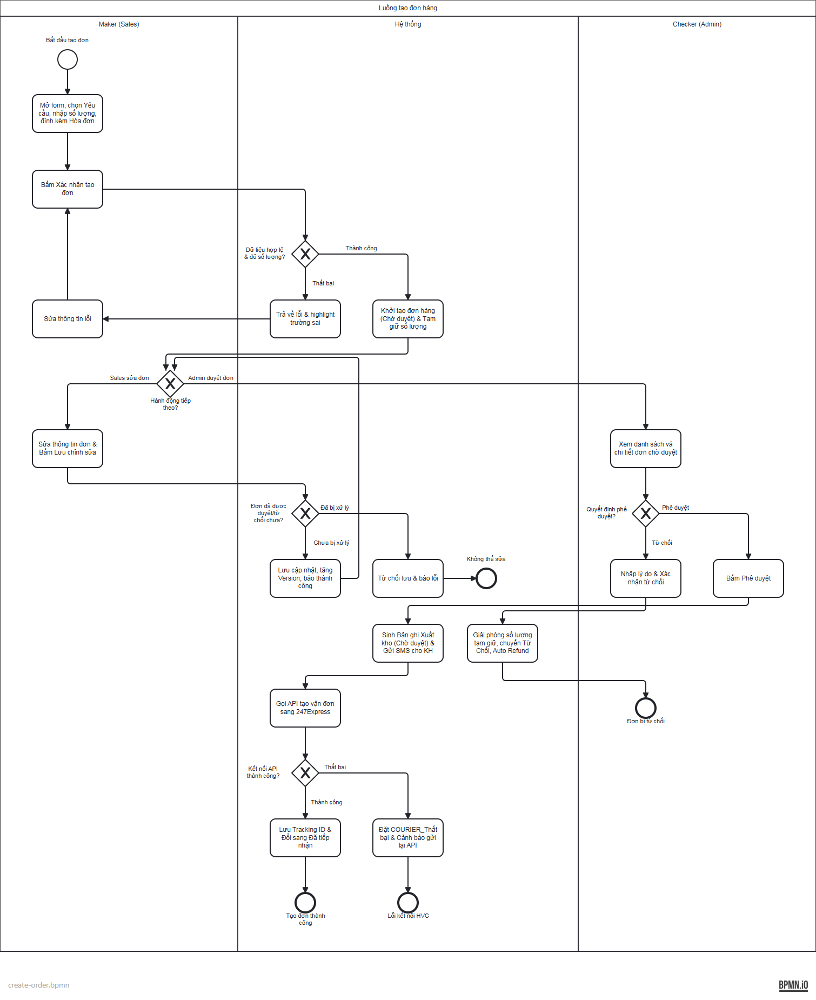

# Tổng Hợp Sơ Đồ Luồng Hệ Thống - Theo Dõi Đơn Hàng

Tài liệu chứa các sơ đồ tuần tự (Sequence Diagram) và sơ đồ hoạt động (Activity Diagram) của phân hệ Theo dõi Đơn hàng B2B.

---

## Flow: Luồng tương tác toàn hệ thống (Sequence Diagram)

```plantuml
@startuml
autonumber
skinparam BoxPadding 10
skinparam ParticipantPadding 15
skinparam MaxMessageSize 180
skinparam RoundCorner 10

skinparam SequenceLifeLineBorderColor #64748B
skinparam SequenceLifeLineBackgroundColor #F1F5F9
skinparam SequenceActorBorderColor #475569
skinparam SequenceActorBackgroundColor #F8FAFC
skinparam SequenceParticipantBorderColor #475569
skinparam SequenceParticipantBackgroundColor #F8FAFC
skinparam SequenceArrowColor #334155

actor "Khách hàng" as KH
participant "Web Portal (Hệ thống)" as Portal
actor "Sales phụ trách" as Sales
actor "Admin" as Admin
participant "247Express" as Courier
actor "Thủ kho" as WH

box "Kênh Khách Hàng" #F0F9FF
    participant KH
end box

box "Hệ Thống & Nhân Sự Nội Bộ" #FFFBEB
    participant Portal
    participant Sales
    participant Admin
    participant WH
    participant "Kế toán" as Accountant
end box

box "Đối Tác Vận Chuyển" #ECFDF5
    participant Courier
end box

== Luồng 1: Quản lý Hợp đồng & Yêu cầu giao hàng ==
Sales -> Portal: Tạo Khách hàng & Hợp đồng
activate Portal
Portal -> Portal: Lưu Hợp đồng (Trạng thái: Còn hiệu lực)
deactivate Portal
Admin -> Portal: Nhập Yêu cầu giao hàng (Dựa trên Hợp đồng)
activate Portal
Portal -> Portal: Tạo Yêu cầu (Trạng thái: Chờ xử lý)
deactivate Portal

== Luồng 2: Tạo đơn giao hàng (Từ Yêu cầu giao hàng) ==
Sales -> Portal: Chọn Yêu cầu giao hàng, nhập số lượng, upload Hóa đơn
activate Portal
Portal -> Portal: Validate số lượng
Portal -> Portal: Tạm giữ tồn kho (Trạng thái đơn: Chờ Duyệt)
Portal --> Sales: Báo tạo đơn thành công
deactivate Portal

alt Admin phê duyệt đơn hàng
    Admin -> Portal: Phê duyệt đơn (Approve)
    activate Portal
    Portal -> Portal: Tạo Bản ghi Xuất kho (Chờ duyệt), chỉ trừ tồn kho khi Đã duyệt
    Portal -> Courier: Gọi API tạo vận đơn giao hàng qua 247Express
    activate Courier
    Courier --> Portal: Trả về mã vận đơn (Tracking ID)
    deactivate Courier
    Portal -> Portal: Chuyển đơn sang Đã tiếp nhận
    Portal -> KH: Gửi SMS thông báo Đặt hàng thành công cho khách
    deactivate Portal
else Admin từ chối phê duyệt
    Admin -> Portal: Từ chối đơn (Reject) + Nhập lý do từ chối
    activate Portal
    Portal -> Portal: Hủy giữ kho, cộng lại tồn kho khả dụng
    Portal -> Portal: Chuyển trạng thái đơn thành Từ Chối
    Portal -> Sales: Báo từ chối duyệt kèm lý do
    deactivate Portal
end

opt Sales hủy đơn hàng trước khi bưu tá lấy hàng (Đơn ở trạng thái Đã tiếp nhận)
    Sales -> Portal: Nhấn [Hủy đơn hàng]
    activate Portal
    Portal -> Portal: Chuyển trạng thái đơn thành Hủy
    Portal -> Portal: Chuyển Bản ghi Xuất kho (Chờ duyệt) thành Hủy
    Portal -> Portal: Hủy vận đơn bên 247Express (nếu có)
    Portal -> Portal: Giải phóng tồn kho khả dụng
    deactivate Portal
end

== Luồng 3: Đóng gói & Bàn giao (Thủ kho) ==
WH -> Portal: Vào chi tiết Bản ghi Xuất kho, nhấn In Phiếu xuất kho
Portal --> WH: Trả về Phiếu Xuất Kho (Kèm Mã vận đơn)
WH -> Portal: Vào chi tiết Đơn hàng, nhấn In Nhãn vận đơn
Portal --> WH: Trả về Nhãn dán vận đơn 247Express
WH -> WH: Lấy hàng vật lý (theo Phiếu xuất kho), đóng gói, dán nhãn vận đơn
WH -> Courier: Bàn giao gói hàng cho bưu tá 247Express

== Luồng 4: Giao hàng & Cập nhật hành trình ==
Courier -> Portal: Bưu tá lấy hàng
activate Portal
Portal -> Portal: Cập nhật trạng thái Đơn hàng = Đã lấy hàng
Portal -> Portal: Bản ghi Xuất kho (Chờ duyệt) tự chuyển sang Đã duyệt (Trừ tồn kho)
deactivate Portal

Courier -> Portal: Đang vận chuyển về kho phân phối
activate Portal
Portal -> Portal: Cập nhật trạng thái Đang vận chuyển
deactivate Portal

Courier -> Portal: Đang đi phát hàng đến khách hàng
activate Portal
Portal -> Portal: Cập nhật trạng thái Đang đi phát
Portal -> KH: Gửi SMS thông báo "Đang đi phát hàng"
Portal -> Sales: Bắn cảnh báo Telegram "Đang đi phát hàng"
deactivate Portal

alt Trường hợp A: Giao hàng thành công
    Courier -> Portal: Cập nhật thành công
    activate Portal
    Portal -> Portal: Cập nhật trạng thái Phát thành công
    Portal -> Portal: Tăng Số lượng đã giao thực tế của Yêu cầu giao hàng
    Portal -> KH: Gửi SMS thông báo "Giao hàng thành công"
    Portal -> Sales: Bắn cảnh báo Telegram "Giao thành công"
    deactivate Portal
    
    alt Khách hàng có nhu cầu đổi trả (Hoàn 1 phần) sau khi nhận
        Sales -> Portal: Nhấn nút [Hoàn hàng], nhập SP, số lượng & Lý do
        activate Portal
        Portal -> Portal: Chuyển trạng thái đơn thành Chờ chuyển hoàn
        deactivate Portal
        Courier -> Portal: Shipper lấy hàng đi hoàn
        activate Portal
        Portal -> Portal: Chuyển trạng thái đơn thành Chờ chuyển hoàn, cộng Phí hoàn
        deactivate Portal
        Courier -> Portal: Hoàn hàng về kho công ty
        activate Portal
        Portal -> Portal: Chuyển trạng thái đơn thành Đã chuyển hoàn
        Portal -> Portal: Auto Refund (Trừ đi số lượng đã giao của Yêu cầu giao hàng)
        deactivate Portal
    end

else Trường hợp B: Giao hàng thất bại (Edge Case)
    Courier -> Portal: Giao hàng thất bại
    activate Portal
    Portal -> Portal: Cập nhật trạng thái Chờ xử lý + Lưu lý do
    Portal -> Sales: Bắn cảnh báo Telegram đơn giao thất bại
    deactivate Portal
    alt Shipper tự động giao lại (Tối đa 3 lần)
        Courier -> Portal: Cập nhật đang giao lại
        activate Portal
        Portal -> Portal: Chuyển trạng thái đơn về Đang đi phát
        deactivate Portal
    else Shipper tự động chuyển hoàn (Quá số lần/ngày lưu kho)
        Courier -> Portal: Bắt đầu chuyển hoàn
        activate Portal
        Portal -> Portal: Chuyển trạng thái đơn thành Chờ chuyển hoàn
        deactivate Portal
        Courier -> Portal: Hoàn hàng về kho công ty
        activate Portal
        Portal -> Portal: Chuyển trạng thái đơn thành Đã chuyển hoàn (Thủ kho tự kiểm đếm nhập kho)
        Portal -> Portal: Auto Refund (Trừ đi số lượng đã giao của Yêu cầu giao hàng)
        deactivate Portal
    end
end

Accountant -> Portal: Xem đơn hàng trạng thái Phát thành công
Accountant -> Portal: Phát hành Hóa đơn VAT (Lưu thông tin lên Portal)
Portal -> Portal: Ghi nhận doanh thu đơn hàng
@enduml
```

---

## Flow: Luồng tạo đơn hàng (BPMN)

Sơ đồ quy trình này đã được nâng cấp lên định dạng **BPMN 2.0 chuẩn OMG**.

👉 **Mở tab riêng (kéo thả, zoom)**: [order-tracking-bpmn-editor.html](file:///d:/VietMec/docs/order-tracking/bpmn/order-tracking-bpmn-editor.html)
👉 **Xem danh sách thống kê**: [BPMN Index](file:///d:/VietMec/docs/order-tracking/bpmn/order-tracking-bpmn-index.md)
👉 **File gốc XML**: [create-order.bpmn](file:///d:/VietMec/docs/order-tracking/bpmn/create-order.bpmn)
