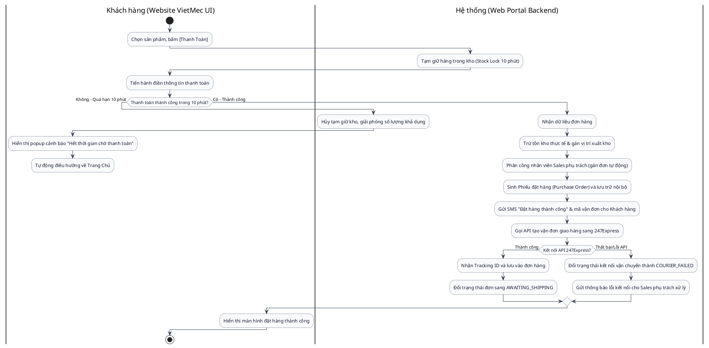
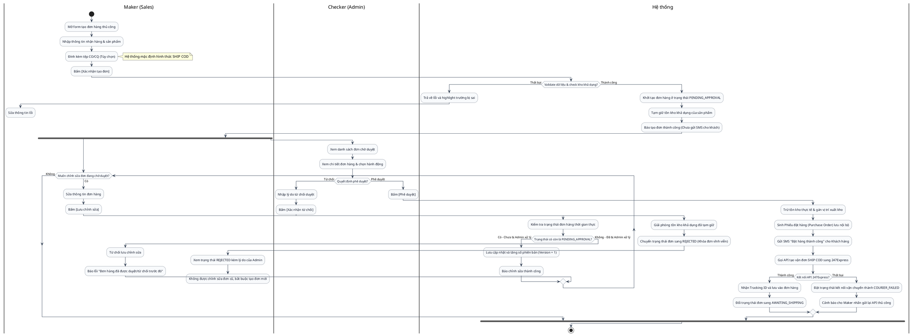

# Tổng Hợp Sơ Đồ Luồng Hệ Thống - Theo Dõi Đơn Hàng

Tài liệu chứa các sơ đồ tuần tự (Sequence Diagram) và sơ đồ hoạt động (Activity Diagram) của phân hệ Theo dõi Đơn hàng.

---

## Flow: Luồng tương tác toàn hệ thống (Sequence Diagram)

Sơ đồ tuần tự mô tả chi tiết tương tác thời gian thực giữa Khách hàng, Website VietMec, Portal nội bộ, Sales phụ trách, Admin, 247Express, Thủ kho và Kế toán:

```plantuml
@startuml
autonumber
skinparam BoxPadding 10
skinparam ParticipantPadding 15
skinparam MaxMessageSize 180
skinparam RoundCorner 10

skinparam SequenceLifeLineBorderColor #64748B
skinparam SequenceLifeLineBackgroundColor #F1F5F9
skinparam SequenceActorBorderColor #475569
skinparam SequenceActorBackgroundColor #F8FAFC
skinparam SequenceParticipantBorderColor #475569
skinparam SequenceParticipantBackgroundColor #F8FAFC
skinparam SequenceArrowColor #334155

actor "Khách hàng" as KH
participant "Website VietMec" as Web
participant "Web Portal (Hệ thống)" as Portal
actor "Sales phụ trách" as Sales
actor "Admin" as Admin
participant "247Express" as Courier
actor "Thủ kho" as WH
actor "Kế toán" as Accountant

box "Kênh Khách Hàng" #F0F9FF
    participant KH
    participant Web
end box

box "Hệ Thống & Nhân Sự Nội Bộ" #FFFBEB
    participant Portal
    participant Sales
    participant Admin
    participant WH
    participant Accountant
end box

box "Đối Tác Vận Chuyển" #ECFDF5
    participant Courier
end box

== Luồng 1: Đặt hàng tự động từ Website VietMec (Tự động Duyệt) ==
KH -> Web: Đặt hàng & Nhấn Thanh toán
activate Web
Web -> Portal: Yêu cầu tạm khóa tồn kho
Portal -> Portal: Tạm giữ hàng trong kho (Stock Lock 10 phút)
Web -> KH: Hiển thị cổng thanh toán
alt Khách hàng không thanh toán sau 10 phút (Edge Case 1)
    Portal -> Portal: Background Worker giải phóng tồn kho (Hết 10 phút)
    Portal --> Web: Báo hết hạn giữ hàng
    Web -> KH: Hiển thị popup "Hết thời gian thanh toán" & tự động điều hướng về Trang Chủ
else Thanh toán thành công
    KH -> Web: Xác nhận thanh toán thành công
    Web -> Portal: Gửi thông tin đơn hàng mới
    deactivate Web
    activate Portal
    Portal -> Portal: Tự động phân công Sales phụ trách
    Portal -> Portal: Trừ tồn kho thực tế & gán vị trí xuất kho
    Portal -> Portal: Tự động sinh Phiếu đặt hàng (Purchase Order) lưu nội bộ
    Portal -> KH: Gửi SMS thông báo Đặt hàng thành công & tạo đơn
    Portal -> Courier: Gọi API tạo vận đơn giao hàng
    activate Courier
    Courier --> Portal: Trả về mã vận đơn (Tracking ID)
    deactivate Courier
    Portal -> Portal: Cập nhật trạng thái đơn (AWAITING_SHIPPING) & lưu mã vận đơn
    deactivate Portal
end

== Luồng 2: Tạo đơn thủ công (Đơn Offline/B2B - Maker/Checker) ==
Sales -> Portal: Tạo đơn thủ công (Chọn hàng, CO/CQ tùy chọn, hình thức mặc định SHIP COD)
activate Portal
Portal -> Portal: Tạm giữ tồn kho (Trạng thái đơn: PENDING_APPROVAL)
Portal --> Sales: Báo tạo đơn thành công (Chưa gửi SMS cho khách, cho phép Sales sửa đơn)
deactivate Portal

alt Admin phê duyệt đơn hàng
    Admin -> Portal: Phê duyệt đơn (Approve)
    activate Portal
    Portal -> Portal: Trừ tồn kho thực tế, sinh Phiếu đặt hàng (PO)
    Portal -> KH: Gửi SMS thông báo Đặt hàng thành công cho khách
    Portal -> Courier: Gọi API tạo vận đơn giao hàng (Ship COD)
    activate Courier
    Courier --> Portal: Trả về mã vận đơn (Tracking ID)
    deactivate Courier
    Portal -> Portal: Chuyển đơn sang AWAITING_SHIPPING
    deactivate Portal
else Admin từ chối phê duyệt (Edge Case 2)
    Admin -> Portal: Từ chối đơn (Reject) + Nhập lý do từ chối
    activate Portal
    Portal -> Portal: Hủy giữ kho, cộng lại tồn kho khả dụng
    Portal -> Portal: Chuyển trạng thái đơn thành REJECTED (Khóa đơn vĩnh viễn, cấm sửa)
    Portal -> Sales: Báo từ chối duyệt kèm lý do
    deactivate Portal
    Sales -> Sales: Bắt buộc tạo một đơn hàng mới thay thế
end

== Luồng 3: Đóng gói & Bàn giao (Thủ kho) ==
WH -> Portal: Xem danh sách đơn trạng thái AWAITING_SHIPPING (Đã có mã vận đơn)
WH -> Portal: Nhấn In Phiếu xuất kho & nhãn dán vận đơn
Portal --> WH: File in (Có vị trí kệ chứa hàng & nhãn vận đơn 247Express)
WH -> WH: Lấy hàng vật lý theo vị trí kệ, đóng gói, dán nhãn vận đơn
WH -> Courier: Bàn giao gói hàng cho bưu tá 247Express

== Luồng 4: Giao hàng & Cập nhật hành trình ==
Courier -> Portal: Bưu tá lấy hàng & cập nhật (Webhook: DELIVERING)
activate Portal
Portal -> Portal: Cập nhật trạng thái DELIVERING
Portal -> KH: Gửi SMS thông báo "Đang giao hàng"
Portal -> Sales: Bắn cảnh báo Telegram "Đang giao hàng"
deactivate Portal

alt Trường hợp A: Giao hàng thành công (Khách nhận toàn bộ)
    Courier -> Portal: Cập nhật thành công (Webhook: SUCCESS)
    activate Portal
    Portal -> Portal: Cập nhật trạng thái SUCCESS
    Portal -> KH: Gửi SMS thông báo "Giao hàng thành công"
    Portal -> Sales: Bắn cảnh báo Telegram "Giao thành công"
    deactivate Portal
else Trường hợp B: Giao hàng thất bại / Khách từ chối nhận toàn bộ (Edge Case 3)
    Courier -> Portal: Cập nhật thất bại (Webhook: FAILED + Lý do)
    activate Portal
    Portal -> Portal: Cập nhật trạng thái FAILED + Lưu lý do
    Portal -> Sales: Bắn cảnh báo Telegram khẩn cấp kèm link xử lý
    deactivate Portal
    Sales -> Portal: Mở chi tiết đơn hàng giao lỗi
    alt Sales xử lý: Yêu cầu Giao lại lần 2
        Sales -> Portal: Nhấn nút [Yêu cầu Giao Lại]
        activate Portal
        Portal -> Courier: Gọi API yêu cầu giao lại
        Portal -> Portal: Chuyển trạng thái đơn về DELIVERING
        deactivate Portal
    else Sales xử lý: Xác nhận Hoàn Hàng toàn bộ (Không giao bán phần)
        Sales -> Portal: Nhấn nút [Xác nhận Hoàn Hàng]
        activate Portal
        Portal -> Courier: Gọi API yêu cầu chuyển hoàn toàn bộ
        Portal -> Portal: Chuyển trạng thái đơn thành RETURNED
        Portal -> Portal: Tự động cộng lại toàn bộ số lượng sp vào tồn kho tại vị trí cũ
        deactivate Portal
    end
end

== Luồng 5: Kế toán đối soát & Xuất hóa đơn ==
Accountant -> Portal: Xem đơn hàng trạng thái SUCCESS
Accountant -> Portal: Phát hành Hóa đơn VAT (Lưu thông tin lên Portal)
Portal -> Portal: Ghi nhận công nợ đơn hàng
Portal -> Courier: Đối soát COD thu hộ định kỳ
activate Courier
Courier --> Portal: Trả về dữ liệu thực nhận tiền COD
deactivate Courier
alt Số tiền COD khớp hóa đơn
    Portal -> Portal: Tự động tất toán công nợ đơn hàng
else Lệch tiền COD đối soát (Edge Case 4)
    Portal -> Portal: Đổi trạng thái sang Reconciliation Discrepancy + Gắn cờ cảnh báo đỏ
    Accountant -> Portal: Kiểm tra chênh lệch, xử lý thủ công với 247Express và Tất toán
end
@enduml
```

---

## Flow: Luồng đặt hàng tự động từ Website VietMec (Activity Diagram)

Sơ đồ hoạt động mô tả chi tiết tương tác giữa Khách hàng trên VietMec và hệ thống:

---

## Flow: Luồng tạo đơn hàng thủ công (Activity Diagram)

Sơ đồ hoạt động phân chia 3 phân làn nghiệp vụ: Maker (Sales), Checker (Admin), và Hệ thống:

