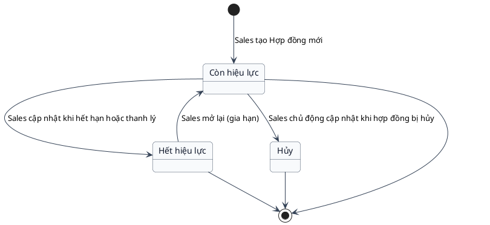
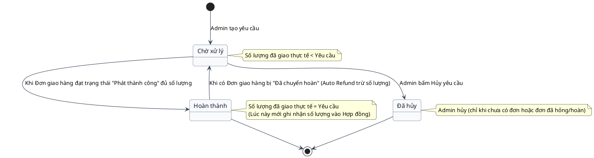
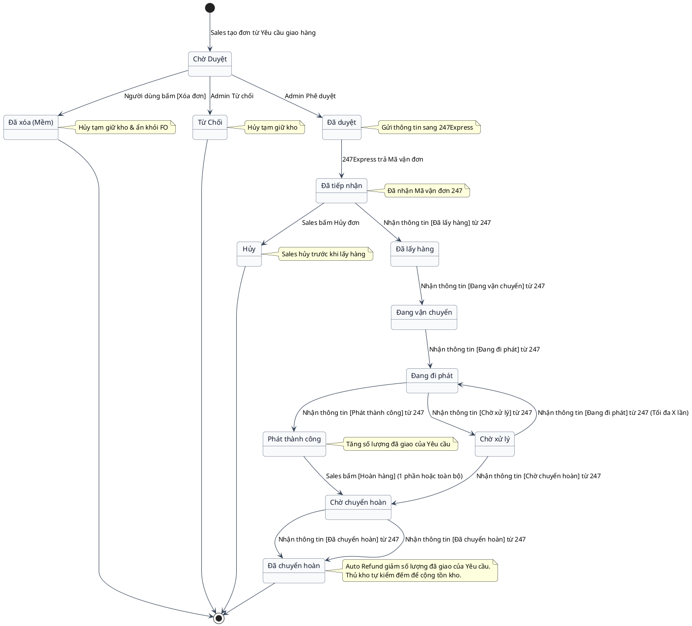
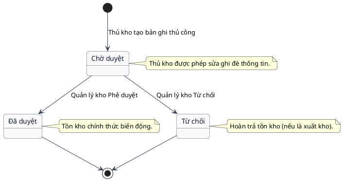
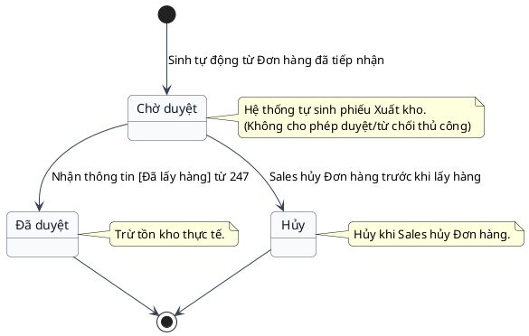
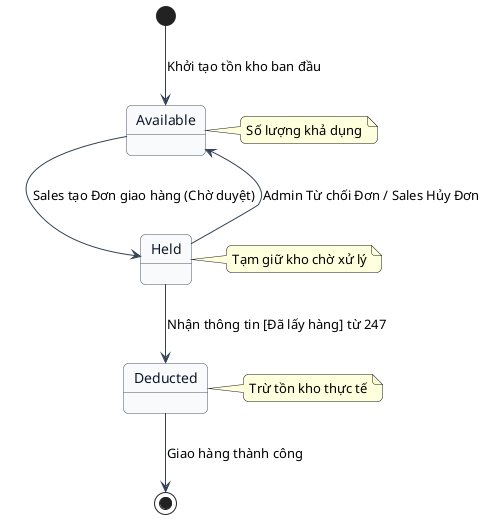
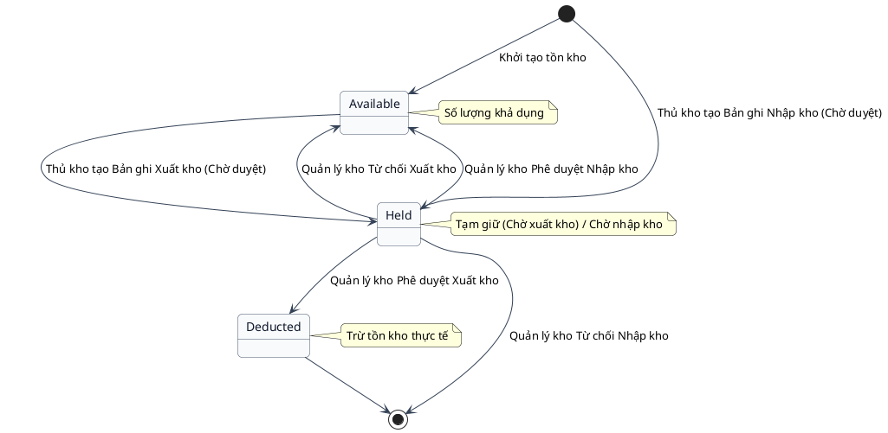

# Sơ Đồ Trạng Thái - Theo Dõi Đơn Hàng

Tài liệu chứa sơ đồ trạng thái (State Diagram) biểu diễn chu kỳ vòng đời của các thực thể nghiệp vụ cốt lõi: Hợp đồng, Yêu cầu giao hàng, và Đơn giao hàng.

---

## Entity: Hợp đồng (Contract)

Mô tả vòng đời đơn giản của Hợp đồng B2B do Sales tự quản lý trạng thái.

### Bảng giải thích trạng thái: Hợp đồng

| Trạng thái | Ý nghĩa | Chuyển trạng thái khi |
|---|---|---|
| **Còn hiệu lực** | Hợp đồng đang trong thời hạn giao dịch, có thể tạo Yêu cầu giao hàng. | Sales tạo mới hợp đồng hoặc gia hạn hợp đồng cũ. |
| **Hết hiệu lực** | Hợp đồng đã thanh lý, hết hạn, hoặc bị hủy bỏ. Không thể giao dịch thêm. | Sales chủ động cập nhật trạng thái khi hết hạn/thanh lý. |
| **Hủy** | Hợp đồng bị hủy bỏ trước thời hạn. | Sales chủ động cập nhật khi hợp đồng bị hủy. |

---

## Entity: Yêu cầu giao hàng (Delivery Request)

Mô tả vòng đời của một Yêu cầu giao hàng được Admin tạo ra từ Hợp đồng. Số lượng hoàn thành phụ thuộc vào tiến độ của Đơn giao hàng.

### Bảng giải thích trạng thái: Yêu cầu giao hàng

| Trạng thái | Ý nghĩa | Chuyển trạng thái khi |
|---|---|---|
| **Chờ xử lý** | Yêu cầu giao hàng đã được tạo, nhưng chưa giao đủ số lượng hàng theo yêu cầu. | Admin khởi tạo yêu cầu, hoặc có đơn hàng chuyển hoàn khiến số lượng thực tế bị giảm. |
| **Hoàn thành** | Đã giao đủ 100% số lượng hàng hóa trong yêu cầu cho khách hàng. | Các đơn giao hàng thuộc yêu cầu này đạt trạng thái "Phát thành công" và đủ tổng số lượng. |
| **Đã hủy** | Yêu cầu giao hàng bị Admin hủy bỏ, không tiếp tục giao. | Admin chủ động hủy (chỉ thực hiện được khi chưa có đơn hàng nào, hoặc các đơn hàng đều đã hủy/hoàn). |

---

## Entity: Đơn giao hàng (Delivery Order)

Mô tả các trạng thái chuyển đổi của thực thể Đơn giao hàng từ lúc khởi tạo đến khi giao thành công, kèm theo 2 luồng hoàn hàng (Tự động hoàn do giao lỗi và Khách yêu cầu hoàn sau khi nhận).

### Bảng giải thích trạng thái: Đơn giao hàng

| Trạng thái | Ý nghĩa | Chuyển trạng thái khi |
|---|---|---|
| **Chờ Duyệt** | Đơn giao hàng vừa được Sales tạo, chờ Admin phê duyệt. | Sales tạo đơn thành công. |
| **Đã xóa (Mềm)** | Đơn hàng ở trạng thái Chờ duyệt bị người dùng xóa. | Người dùng bấm [Xóa đơn] khi đơn ở trạng thái Chờ duyệt. |
| **Từ Chối** | Đơn hàng bị Admin từ chối phê duyệt. | Admin bấm Từ chối. |
| **Đã duyệt** | Admin phê duyệt đơn, hệ thống đang gửi thông tin sang 247Express. | Admin phê duyệt đơn. |
| **Đã tiếp nhận** | Đơn hàng đã nhận mã vận đơn từ 247Express. | 247Express trả về mã vận đơn (Tracking ID). |
| **Hủy** | Đơn hàng bị hủy bỏ trước khi bưu tá đến lấy hàng. | Sales chủ động hủy đơn khi ở trạng thái Đã tiếp nhận. |
| **Đã lấy hàng** | Bưu tá 247Express đã đến kho và lấy hàng thành công. | Nhận thông tin [Đã lấy hàng] từ 247. |
| **Đang vận chuyển** | Hàng hóa đang luân chuyển giữa các kho của 247Express. | Nhận thông tin [Đang vận chuyển] từ 247. |
| **Đang đi phát** | Bưu tá 247Express đang đi giao hàng đến tay người nhận. | Nhận thông tin [Đang đi phát] từ 247. |
| **Chờ xử lý** | Quá trình giao hàng gặp sự cố, bưu tá giao thất bại. | Nhận thông tin [Chờ xử lý] từ 247. |
| **Phát thành công** | Giao hàng thành công đến tay khách hàng. | Nhận thông tin [Phát thành công] từ 247. |
| **Chờ chuyển hoàn** | Đơn hàng đang trên đường chuyển hoàn lại về kho công ty. | Nhận thông tin [Chờ chuyển hoàn] từ 247. |
| **Đã chuyển hoàn** | Đơn hàng đã hoàn trả vật lý về kho công ty. | Nhận thông tin [Đã chuyển hoàn] từ 247. |

---

## Entity: Bản ghi Nhập/Xuất kho (Warehouse Record)

Mô tả vòng đời của một yêu cầu Nhập/Xuất kho. Bản ghi có thể được tạo thủ công (Maker/Checker) hoặc tự động sinh từ Đơn giao hàng.

### 1. Luồng Thủ công (Nhập/Xuất kho nội bộ)

### 2. Luồng Tự động (Từ Đơn giao hàng)

Lưu ý: Luồng này không đi qua bước phê duyệt thủ công, hệ thống tự động sinh phiếu Xuất kho ngay từ khi sinh bản ghi Chờ duyệt.

### Bảng giải thích trạng thái: Bản ghi Nhập/Xuất kho

| Trạng thái | Ý nghĩa | Chuyển trạng thái khi |
|---|---|---|
| **Chờ duyệt** | Bản ghi chờ xác nhận để chính thức biến động kho. Hệ thống đã tự động sinh phiếu Nhập/Xuất kho. | Thủ kho tạo bản ghi thủ công, hoặc hệ thống tự động sinh khi Đơn giao hàng được duyệt (Đã tiếp nhận). Nếu là bản tự động, không được Duyệt/Từ chối thủ công. |
| **Từ chối** | Bản ghi thủ công bị từ chối duyệt. | Quản lý kho bấm Từ chối bản ghi thủ công. |
| **Đã duyệt** | Hàng hóa đã chính thức xuất/nhập, biến động tồn kho thực tế. | Quản lý kho bấm Phê duyệt (đối với bản thủ công), hoặc hệ thống nhận thông tin [Đã lấy hàng] từ 247 (đối với bản tự động). |
| **Hủy** | Bản ghi xuất kho bị hủy bỏ do đơn hàng bị hủy. | Sales hủy đơn hàng giao hàng trước khi lấy hàng. |

---

## Entity: Tồn kho (Inventory)

Mô tả các trạng thái của số lượng sản phẩm trong kho. Việc biến động tồn kho được thực hiện thông qua 2 luồng: Tự động và Thủ công.

### 1. Luồng Tự động (Từ Đơn giao hàng)

### 2. Luồng Thủ công (Nhập/Xuất kho nội bộ)

Yêu cầu nhập/xuất kho thủ công độc lập, không bắt buộc phải đi từ Yêu cầu giao hàng.

### Bảng giải thích trạng thái: Tồn kho

| Trạng thái | Ý nghĩa | Chuyển trạng thái khi |
|---|---|---|
| **Available (Khả dụng)** | Số lượng sản phẩm có sẵn trong kho, có thể bán và giao dịch. | - Quản lý duyệt phiếu Nhập kho thủ công. - Giải phóng tồn kho do Đơn hàng bị hủy/từ chối, hoặc phiếu Xuất kho thủ công bị từ chối. |
| **Held (Tạm giữ / Chờ xử lý)** | Tồn kho bị khóa chờ xuất, hoặc hàng hóa đang chờ xác nhận nhập kho. | - **[Tự động]**: Sales tạo đơn giao hàng (Chờ duyệt). - **[Thủ công]**: Thủ kho tạo bản ghi xuất/nhập kho (Chờ duyệt). |
| **Deducted (Đã trừ thực tế)** | Số lượng hàng hóa đã chính thức bị trừ khỏi hệ thống tồn kho vật lý. | - **[Tự động]**: Bưu tá lấy hàng đi giao (Nhận thông tin Đã lấy hàng từ 247). - **[Thủ công]**: Quản lý kho duyệt phiếu xuất thủ công. |

---
