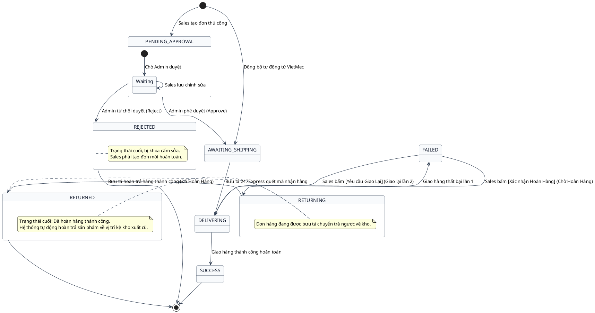
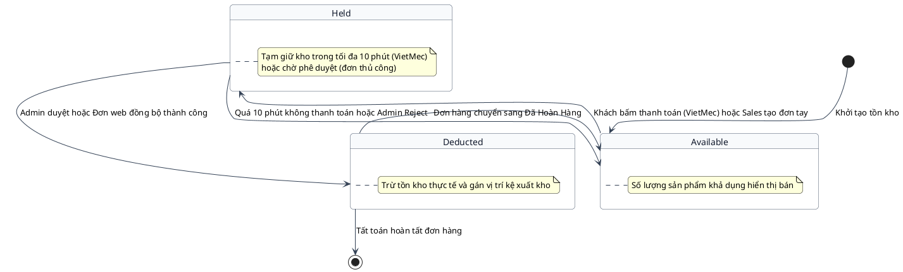

# Sơ Đồ Trạng Thái - Theo Dõi Đơn Hàng

Tài liệu chứa sơ đồ trạng thái (State Diagram) biểu diễn chu kỳ vòng đời của các thực thể nghiệp vụ cốt lõi.

---

## Entity: Đơn hàng (Order)

Mô tả các trạng thái chuyển đổi của thực thể Đơn hàng (Order) từ lúc khởi tạo đến trạng thái tất toán hoặc từ chối duyệt:

---

## Entity: Tồn kho (Inventory)

Mô tả các trạng thái của số lượng sản phẩm trong kho (Khả dụng, Tạm giữ, Đã khấu trừ, Hoàn trả):

