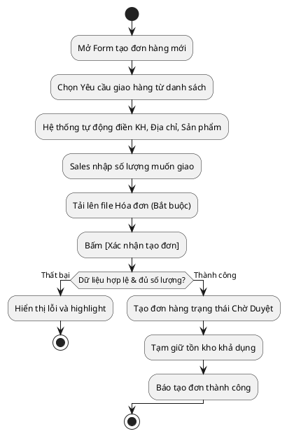

# Đặc Tả Use Case: UC-order-01 - Tạo đơn giao hàng (Từ Yêu cầu)

## 1. Thông tin chung (General Information)

| Thuộc tính | Mô tả chi tiết |
| :--- | :--- |
| **Mã Use Case (UC ID):** | UC-order-01 |
| **Tên Use Case:** | Tạo đơn giao hàng từ Yêu cầu |
| **Người tạo:** | System |
| **Ngày tạo:** | 2026-07-02 |
| **Ngày cập nhật:** | 2026-07-16 |
| **Tác nhân (Actor):** | Sales phụ trách |
| **Độ ưu tiên:** | Cao (P0) |
| **Tần suất sử dụng:** | Diễn ra hàng ngày. |
| **Bao gồm (Includes):** | UC-delivery-01 |

---

## 2. Mô tả & Điều kiện

### Mô tả nghiệp vụ
Nhân viên Sales thực hiện tạo đơn hàng dựa trên các "Yêu cầu giao hàng" do Admin đã tạo sẵn. Hệ thống sẽ tự động điền danh sách sản phẩm từ Yêu cầu, Sales nhập số lượng muốn giao cho đợt này. Hệ thống đảm bảo số lượng Sales nhập không được vượt quá số lượng còn lại của Yêu cầu giao hàng. 

### Điều kiện tiên quyết (Preconditions)
1. Có ít nhất một Yêu cầu giao hàng đang ở trạng thái **Chờ xử lý**.
2. Sản phẩm trong kho khả dụng còn đủ số lượng đặt.

### Điều kiện sau khi hoàn thành (Postconditions)
1. Đơn hàng được tạo thành công ở trạng thái **Chờ Duyệt**.
2. Tồn kho khả dụng bị tạm giữ tương ứng.
3. Hóa đơn được lưu trữ cùng đơn hàng (Bắt buộc).

---

## 3. Sơ đồ Flowchart luồng xử lý

---

## 4. Luồng sự kiện (Course of Events)

### Luồng sự kiện thông thường (Normal Course)
1. Sales nhấn nút [+ Tạo Đơn Mới] trên giao diện.
2. Hệ thống hiển thị form tạo đơn.
3. Sales bấm chọn một **Yêu cầu giao hàng** đang "Chờ xử lý".
4. Hệ thống tự động điền thông tin Khách hàng, Địa chỉ, và Danh sách sản phẩm của yêu cầu đó.
5. Sales nhập số lượng thực tế muốn giao cho từng sản phẩm.
6. Sales tải lên tài liệu Hóa đơn (Bắt buộc).
7. Sales chọn phương thức vận chuyển của 247Express.
8. Sales nhấn nút [Xác nhận tạo đơn].
9. Hệ thống validate toàn bộ dữ liệu hợp lệ và đảm bảo: Số lượng nhập <= (Số lượng yêu cầu - Tổng số lượng đã giao của các đơn trước).
10. Hệ thống khởi tạo đơn hàng ở trạng thái **Chờ Duyệt**, tạm giữ tồn kho.
11. Đưa Sales về trang chi tiết đơn hàng Chờ Duyệt.

### Luồng ngoại lệ (Exceptions)
**UC-order-01.EX.1: Vượt hạn mức yêu cầu**
1. Tại bước 9, nếu số lượng Sales nhập > số lượng còn lại của Yêu cầu giao hàng.
2. Hệ thống báo lỗi: *"Số lượng giao vượt quá hạn mức cho phép của Yêu cầu."*
3. Chặn lưu dữ liệu.

---

## 5. Mô tả trường dữ liệu màn hình

| STT | Tên trường dữ liệu | Định dạng | Bắt buộc? | Mô tả chi tiết ràng buộc |
| :--- | :--- | :--- | :--- | :--- |
| 1 | Yêu cầu giao hàng | Dropdown | Y | Chỉ hiển thị các Yêu cầu đang "Chờ xử lý". |
| 2 | Khách hàng | Read-only | Y | Tự động điền theo Yêu cầu. |
| 3 | Sản phẩm | Read-only | Y | Tự động điền theo Yêu cầu. |
| 4 | Số lượng giao | Number | Y | Phải > 0 và <= Quota của Yêu cầu. |
| 5 | File Hóa đơn | Upload | Y | Bắt buộc. Dung lượng tệp <= 5 MB (.pdf, .png, .jpg). |

---

## 6. Giao diện Phác thảo (Wireframe)
Xem chi tiết tại: [order-management-dashboard.md](../../wireframes/order-management-dashboard.md)
