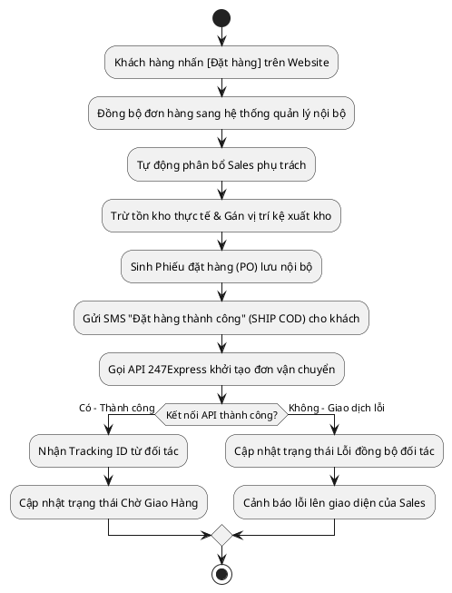

# Đặc Tả Use Case: UC-order-01 - Đặt hàng tự động từ Website VietMec

## 1. Thông tin chung (General Information)

| Thuộc tính | Mô tả chi tiết |
| :--- | :--- |
| **Mã Use Case (UC ID):** | UC-order-01 |
| **Tên Use Case:** | Đặt hàng tự động từ Website VietMec |
| **Người tạo:** | @nlchis |
| **Cập nhật lần cuối bởi:** | @nlchis |
| **Ngày tạo:** | 2026-07-02 |
| **Ngày cập nhật:** | 2026-07-02 |
| **Tác nhân (Actor):** | Khách hàng (Tác nhân chính), Hệ thống, Hệ thống đối tác 247Express (Tác nhân phụ) |
| **Độ ưu tiên:** | Cao (P0) |
| **Tần suất sử dụng:** | Diễn ra liên tục (24/7) mỗi khi khách đặt hàng trên web. |
| **Bao gồm (Includes):** | Không có. |
| **Giả định:** | Giao diện lập trình ứng dụng (API) của đối tác 247Express và cổng tin nhắn thương hiệu (SMS Brandname) hoạt động ổn định. |

---

## 2. Mô tả & Điều kiện

### Mô tả nghiệp vụ
Khách hàng thực hiện đặt mua hàng thành công trên Website VietMec (hình thức thanh toán mặc định là SHIP COD). Hệ thống tự động đồng bộ đơn hàng sang hệ thống quản lý nội bộ, phân công nhân viên Sales phụ trách, khấu trừ tồn kho thực tế và gán vị trí xuất kho dự kiến, sinh Phiếu đặt hàng (PO) lưu nội bộ, gửi tin nhắn thương hiệu (SMS) đặt hàng thành công và gọi API đối tác 247Express để lấy mã vận đơn tự động.

### Điều kiện tiên quyết (Preconditions)
1. Website VietMec đã tích hợp thành công API kết nối với hệ thống quản lý nội bộ.
2. Sản phẩm hiển thị trên VietMec còn đủ số lượng tồn kho khả dụng.
3. Kết nối API giữa hệ thống quản lý nội bộ và đối tác 247Express hoạt động bình thường.

### Điều kiện sau khi hoàn thành (Postconditions)
1. Đơn hàng được khởi tạo thành công trên hệ thống quản lý nội bộ ở trạng thái **Chờ Giao Hàng** (mặc định SHIP COD).
2. Mã vận đơn (Tracking ID) từ đối tác 247Express được cập nhật vào đơn hàng.
3. Số lượng tồn kho sản phẩm bị khấu trừ thực tế, gán vị trí kệ xuất kho dự kiến theo quy tắc.
4. Phiếu đặt hàng (PO) được sinh tự động và lưu trữ nội bộ.
5. Khách hàng nhận được tin nhắn thương hiệu (SMS) xác nhận đặt hàng thành công ngay khi đồng bộ đơn.

---

## 3. Sơ đồ Flowchart luồng xử lý

---

## 4. Luồng sự kiện (Course of Events)

### Luồng sự kiện thông thường (Normal Course)
1. Khách hàng hoàn tất chọn sản phẩm và bấm nút [Đặt Hàng] (chọn hình thức thanh toán khi nhận hàng SHIP COD) trên Website VietMec.
2. Hệ thống Website gửi thông tin đơn hàng đồng bộ trực tiếp sang hệ thống quản lý nội bộ.
3. Hệ thống tự động phân bổ đơn hàng cho Sales phụ trách theo quy tắc.
4. Hệ thống thực hiện khấu trừ tồn kho thực tế, gán vị trí xuất kệ kho xuất dự kiến, và sinh Phiếu đặt hàng (PO) lưu nội bộ.
5. Hệ thống gọi API đối tác 247Express để tạo đơn vận chuyển.
6. Đối tác 247Express phản hồi mã vận đơn (Tracking ID) thành công.
7. Hệ thống cập nhật trạng thái đơn hàng sang **Chờ Giao Hàng** và lưu mã vận đơn.
8. Hệ thống kích hoạt gửi tin nhắn thương hiệu (SMS Brandname) đặt hàng thành công kèm mã vận đơn tới Khách hàng.

### Luồng ngoại lệ (Exceptions)
* **UC-order-01.EX.1: Lỗi kết nối API đối tác 247Express**
  * Tại bước 5 của luồng chính, cuộc gọi API tới 247Express bị lỗi hoặc timeout.
  * Hệ thống giữ trạng thái đơn hàng là **Chờ Giao Hàng** nhưng gắn cờ vận chuyển là *Lỗi đồng bộ đối tác*.
  * Hệ thống gửi thông báo lỗi lên giao diện của Sales phụ trách để chuẩn bị xử lý thủ công (nhấn Thử lại).

---

## 5. Yêu cầu đặc biệt & Giao diện

### Yêu cầu đặc biệt
API đồng bộ đơn hàng từ VietMec sang hệ thống quản lý nội bộ phải hoàn tất phản hồi trong vòng ≤ 2 giây.

### Mô tả trường dữ liệu đồng bộ qua API

Vì đây là tính năng tự động chạy ngầm, không có màn hình nhập liệu trực tiếp. Hệ thống tiếp nhận payload đồng bộ chứa các trường thông tin sau:

| STT | Trường thông tin | Loại dữ liệu | Bắt buộc | Mô tả chi tiết |
| :--- | :--- | :--- | :--- | :--- |
| 1 | Mã đơn hàng từ Web | String | Y | Mã đơn gốc do hệ thống Website VietMec sinh ra. |
| 2 | Họ tên khách hàng | String | Y | Họ tên người mua hàng. |
| 3 | Số điện thoại | String | Y | SĐT người nhận hàng (10 chữ số). |
| 4 | Địa chỉ giao hàng | String | Y | Địa chỉ chi tiết nhận hàng (Tỉnh/Huyện/Xã và số nhà). |
| 5 | Danh mục sản phẩm | Array | Y | Danh sách sản phẩm mua gồm: Mã sản phẩm, số lượng, đơn giá. |
| 6 | Tổng giá trị đơn | Number | Y | Số tiền hàng thực tế phải thanh toán. |
| 7 | Hình thức thanh toán | String | Y | Mặc định là "SHIP_COD" (Thu tiền mặt khi giao hàng). |

---

## 6. Vấn đề chưa giải quyết (Notes & Issues)

| ID | Vấn đề cần làm rõ | Người phụ trách | Hạn hoàn thành | Trạng thái xử lý |
| :--- | :--- | :--- | :--- | :--- |
| **TBD-1** | Cần làm rõ chi tiết API kết nối 247Express để cấu hình payload đồng bộ. | Admin | 2026-07-15 | Đang xử lý |
