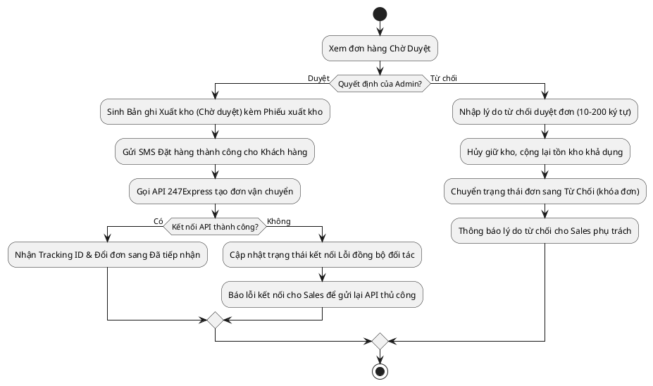

# Đặc Tả Use Case: UC-order-02 - Duyệt hoặc từ chối đơn hàng (Checker)

## 1. Thông tin chung (General Information)

| Thuộc tính | Mô tả chi tiết |
| :--- | :--- |
| **Mã Use Case (UC ID):** | UC-order-02 |
| **Tên Use Case:** | Duyệt hoặc từ chối đơn hàng (Checker) |
| **Người tạo:** | @nlchis |
| **Cập nhật lần cuối bởi:** | @nlchis |
| **Ngày tạo:** | 2026-07-02 |
| **Ngày cập nhật:** | 2026-07-02 |
| **Tác nhân (Actor):** | Admin / Người phê duyệt (Tác nhân chính), Hệ thống, Hệ thống đối tác 247Express (Tác nhân phụ) |
| **Độ ưu tiên:** | Cao (P0) |
| **Tần suất sử dụng:** | Diễn ra thường xuyên trong ngày khi có đơn hàng thủ công chờ duyệt. |
| **Bao gồm (Includes):** | Không có. |
| **Giả định:** | Không có. |

---

## 2. Mô tả & Điều kiện

### Mô tả nghiệp vụ
Quản trị viên Admin (Checker) kiểm tra thông tin các đơn hàng thủ công đang ở trạng thái **Chờ Duyệt** và thực hiện Phê duyệt hoặc Từ chối đơn hàng.

### Điều kiện tiên quyết (Preconditions)
1. Admin đăng nhập thành công vào hệ thống quản lý nội bộ và có quyền "Phê duyệt đơn hàng".
2. Có đơn hàng đang ở trạng thái **Chờ Duyệt** trên hệ thống.

### Điều kiện sau khi hoàn thành (Postconditions)
1. *Nếu duyệt:* Đơn chuyển sang trạng thái **Đã tiếp nhận**, hệ thống tự tạo Bản ghi Xuất kho (Chờ duyệt) tự động in phiếu, gọi API 247Express lấy mã vận đơn thành công và gửi SMS. (Tồn kho thực tế chỉ bị trừ khi bưu tá Đã lấy hàng).
2. *Nếu từ chối:* Đơn chuyển sang trạng thái **Từ Chối** (khóa đơn vĩnh viễn), tồn kho khả dụng được giải phóng, ghi nhận lý do từ chối và báo động cho Sales phụ trách.

---

## 3. Sơ đồ Flowchart luồng xử lý



---

## 4. Luồng sự kiện (Course of Events)

### Luồng sự kiện thông thường (Normal Course)
1. Admin truy cập trang Danh sách Đơn hàng Chờ Duyệt trên hệ thống quản lý nội bộ.
2. Admin chọn một đơn hàng cần duyệt để xem thông tin chi tiết.
3. Admin nhấn nút [Phê Duyệt] đơn hàng.
4. Hệ thống tự động tạo 1 Bản ghi Xuất kho ở trạng thái **Chờ duyệt** trong phân hệ Kho, đính kèm tệp Phiếu xuất kho tự động.
5. Hệ thống gửi tin nhắn thương hiệu (SMS) đặt hàng thành công cho Khách hàng.
6. Hệ thống gọi API đối tác 247Express tạo đơn giao hàng.
7. Đối tác 247Express phản hồi mã vận đơn (Tracking ID) thành công.
8. Hệ thống lưu mã vận đơn và cập nhật trạng thái đơn hàng sang **Đã tiếp nhận**.

### Luồng thay thế (Alternative Courses)
**UC-order-02.AC.1: Admin từ chối phê duyệt đơn hàng**
1. Tại bước 3 của luồng chính, Admin nhấn nút [Từ Chối].
2. Hệ thống hiển thị popup yêu cầu nhập lý do từ chối duyệt đơn.
3. Admin nhập lý do từ chối nghiệp vụ và nhấn [Xác nhận từ chối].
4. Hệ thống chuyển trạng thái đơn sang **Từ Chối** (khóa đơn vĩnh viễn, cấm sửa).
5. Hệ thống giải phóng tồn kho khả dụng đã tạm giữ.
6. Hệ thống gửi thông báo từ chối kèm lý do cho Sales phụ trách qua Telegram.

### Luồng ngoại lệ (Exceptions)
* **UC-order-02.EX.1: Xung đột thao tác đồng thời (Maker/Checker Race Condition)**
  * Tại bước 3 của luồng chính, khi Admin nhấn Phê duyệt đúng lúc Sales đang thực hiện Lưu chỉnh sửa đơn hàng đó.
  * Hệ thống đối chiếu phiên bản dữ liệu (Kiểm soát phiên bản ghi) và phát hiện phiên bản đã bị thay đổi.
  * Hệ thống chặn hành động phê duyệt của Admin, hiển thị thông báo lỗi: *"Đơn hàng đã được duyệt hoặc thay đổi bởi người khác. Vui lòng tải lại trang"* và rollback giao dịch.
* **UC-order-02.EX.2: Lỗi API đối tác 247Express khi duyệt đơn**
  * Tại bước 7 của luồng chính, API kết nối đối tác 247Express gặp sự cố mất mạng hoặc sập hệ thống.
  * Đơn hàng vẫn chuyển sang trạng thái **Đã tiếp nhận** nhưng trạng thái kết nối vận chuyển là *Lỗi đồng bộ đối tác*.
  * Hệ thống cảnh báo lỗi trên giao diện của Sales phụ trách để xử lý thủ công (nhấn Thử lại).

---

## 5. Yêu cầu đặc biệt & Giao diện

### Yêu cầu đặc biệt
Popup nhập lý do từ chối bắt buộc Admin phải gõ tối thiểu 10 ký tự.

### Mô tả trường dữ liệu màn hình

| STT | Tên trường dữ liệu | Định dạng | Bắt buộc? | Mô tả chi tiết ràng buộc |
| :--- | :--- | :--- | :--- | :--- |
| 1 | Nút Phê duyệt | Button | Y | Nhấn để chuyển trạng thái sang **Đã tiếp nhận**. |
| 2 | Nút Từ chối | Button | Y | Nhấn để mở popup từ chối duyệt đơn. |
| 3 | Lý do từ chối | Textarea | Y (khi từ chối) | Nhập lý do từ chối nghiệp vụ, từ 10 đến 200 ký tự. |
| 4 | Nút Xác nhận từ chối | Button | Y (trong popup) | Hoàn tất lưu lý do và cập nhật đơn sang **Từ Chối**. |

---

## 7. Giao diện Phác thảo (Wireframe)

### Màn hình 7: Giao diện duyệt đơn hàng & Popup nhập lý do từ chối (Checker)
```text
┌────────────────────────────────────────────────────────────┐
│ DANH SÁCH ĐƠN HÀNG CHỜ PHÊ DUYỆT (Checker)                 │
├────────────────────────────────────────────────────────────┤
│ Tìm kiếm: [ Nhập mã đơn...         ]                       │
│ ┌────────────────────────────────────────────────────────┐ │
│ │ Mã Đơn    | Khách Hàng      | Người Tạo   | Thao tác   │ │
│ ├────────────────────────────────────────────────────────┤ │
│ │ 247-00132 | Nguyễn Thị K    | Sales A     | [Duyệt][X] │ │
│ │ 247-00133 | Phạm Minh L     | Sales B     | [Duyệt][X] │ │
│ └────────────────────────────────────────────────────────┘ │
├────────────────────────────────────────────────────────────┤
│ popup: TỪ CHỐI PHÊ DUYỆT ĐƠN HÀNG #247-00132               │
├────────────────────────────────────────────────────────────┤
│ Lý do từ chối (*) (Tối thiểu 10 ký tự):                    │
│ [ Địa chỉ nhận hàng không cụ thể, thiếu số nhà.          ] │
│                                                            │
│                     [ HUỶ BỎ ]    [ Xác Nhận Từ Chối ]     │
└────────────────────────────────────────────────────────────┘
```

## 8. Vấn đề chưa giải quyết (Notes & Issues)
Không có.
