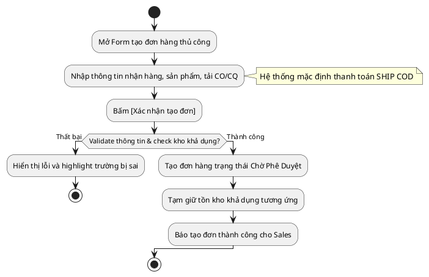

# Đặc Tả Use Case: UC-order-02 - Tạo đơn hàng thủ công (Maker)

## 1. Thông tin chung (General Information)

| Thuộc tính | Mô tả chi tiết |
| :--- | :--- |
| **Mã Use Case (UC ID):** | UC-order-02 |
| **Tên Use Case:** | Tạo đơn hàng thủ công (Maker) |
| **Người tạo:** | @nlchis |
| **Cập nhật lần cuối bởi:** | @nlchis |
| **Ngày tạo:** | 2026-07-02 |
| **Ngày cập nhật:** | 2026-07-02 |
| **Tác nhân (Actor):** | Sales phụ trách (Tác nhân chính), Hệ thống (Tác nhân phụ) |
| **Độ ưu tiên:** | Cao (P0) |
| **Tần suất sử dụng:** | Diễn ra hàng ngày khi có đơn B2B/Offline phát sinh. |
| **Bao gồm (Includes):** | Không có. |
| **Giả định:** | Không có. |

---

## 2. Mô tả & Điều kiện

### Mô tả nghiệp vụ
Nhân viên Sales phụ trách thực hiện tạo đơn hàng thủ công trực tiếp trên giao diện hệ thống quản lý nội bộ. Đơn hàng sau khi tạo sẽ chuyển sang trạng thái **Chờ Phê Duyệt** của Admin (Checker), mặc định hình thức giao hàng là thu hộ tiền mặt (SHIP COD).

### Điều kiện tiên quyết (Preconditions)
1. Sales đăng nhập thành công vào hệ thống quản lý nội bộ và có quyền "Tạo đơn hàng".
2. Sản phẩm trong kho khả dụng còn đủ số lượng đặt.

### Điều kiện sau khi hoàn thành (Postconditions)
1. Đơn hàng được tạo thành công trên hệ thống nội bộ ở trạng thái **Chờ Phê Duyệt**.
2. Tồn kho khả dụng của sản phẩm bị tạm giữ tương ứng.
3. Tài liệu chứng từ đính kèm (CO/CQ) được lưu trữ cùng đơn hàng (nếu có tải lên).
4. Hệ thống chưa gửi tin nhắn SMS cho Khách hàng và chưa gọi API sang đối tác vận chuyển 247Express.

---

## 3. Sơ đồ Flowchart luồng xử lý



---

## 4. Luồng sự kiện (Course of Events)

### Luồng sự kiện thông thường (Normal Course)
1. Sales truy cập phân hệ Quản lý Đơn hàng trên hệ thống quản lý nội bộ và nhấn nút [+ Tạo Đơn Mới].
2. Hệ thống hiển thị form nhập liệu tạo đơn hàng mới.
3. Sales điền thông tin người nhận (Họ tên, SĐT, Địa chỉ chi tiết chọn theo dropdown Tỉnh/Huyện/Phường).
4. Sales chọn sản phẩm, nhập số lượng, khối lượng đơn hàng. Hệ thống tự động đặt hình thức vận chuyển là thu hộ (SHIP COD).
5. Sales tải lên tài liệu chứng từ chất lượng CO/CQ (nếu có - tùy chọn).
6. Sales nhấn nút [Xác nhận tạo đơn].
7. Hệ thống thực hiện kiểm tra dữ liệu nhập (Quy tắc kiểm tra) và đối chiếu tồn kho khả dụng.
8. Hệ thống khởi tạo đơn hàng ở trạng thái **Chờ Phê Duyệt**, thực hiện tạm giữ tồn kho khả dụng của sản phẩm.
9. Hệ thống hiển thị thông báo tạo đơn thành công và đưa Sales về trang chi tiết đơn hàng Chờ Duyệt.

### Luồng thay thế (Alternative Courses)
Không có.

### Luồng ngoại lệ (Exceptions)
* **UC-order-02.EX.1: Kiểm tra dữ liệu thất bại hoặc Hết hàng khả dụng**
  * Tại bước 7 của luồng chính, nếu dữ liệu nhập sai định dạng số điện thoại hoặc thiếu trường bắt buộc, hoặc tài liệu CO/CQ vượt quá dung lượng 5MB, hoặc kho đã hết hàng.
  * Hệ thống chặn lại không cho tạo đơn, giữ nguyên dữ liệu đã nhập, viền đỏ các trường lỗi và hiển thị thông báo lỗi (ví dụ: *"Số điện thoại phải đủ 10 chữ số"*, *"Dung lượng file vượt quá giới hạn 5MB"*).

---

## 5. Yêu cầu đặc biệt & Giao diện

### Yêu cầu đặc biệt
Giao diện form tạo đơn phải hỗ trợ tự động tìm kiếm và hiển thị địa chỉ hành chính Việt Nam thông qua droplist lựa chọn.

### Mô tả trường dữ liệu màn hình

| STT | Tên trường dữ liệu | Định dạng | Bắt buộc? | Mô tả chi tiết ràng buộc |
| :--- | :--- | :--- | :--- | :--- |
| 1 | Họ Tên | Textbox | Y | Nhập họ tên đầy đủ của người nhận hàng. |
| 2 | Số Điện Thoại | Textbox | Y | Bắt buộc nhập. Số điện thoại di động Việt Nam gồm đúng 10 chữ số, bắt đầu bằng số `0` (ví dụ: `0901234567`). |
| 3 | Tỉnh/Thành | Droplist | Y | Lựa chọn Tỉnh/Thành phố trực thuộc Trung ương. |
| 4 | Quận/Huyện | Droplist | Y | Lựa chọn Quận/Huyện theo Tỉnh/Thành đã chọn. |
| 5 | Phường/Xã | Droplist | Y | Lựa chọn Phường/Xã theo Quận/Huyện đã chọn. |
| 6 | Địa chỉ chi tiết | Textbox | Y | Nhập số nhà, ngõ/ngách, tên đường/thôn/xóm. |
| 7 | Tên sản phẩm | Searchbox | Y | Chọn sản phẩm từ danh mục sản phẩm của VietMec. |
| 8 | Số lượng sản phẩm | Number | Y | Bắt buộc. Số lượng sản phẩm phải > 0. Validate theo tồn kho khả dụng thời gian thực tế tại thời điểm lưu đơn (nếu số lượng đặt đơn > số tồn kho khả dụng -> chặn và báo lỗi). |
| 9 | Đơn giá sản phẩm | Number | Y | Bắt buộc. Giá bán của một đơn vị sản phẩm (VNĐ). |
| 10 | Khối lượng | Number | Y | Đơn vị: kg. Phải lớn hơn 0. |
| 11 | Thu hộ (COD) | Number | Y | Bắt buộc nhập. Số tiền thu hộ COD = Đơn giá * Số lượng (hệ thống tự động tính toán, không cho sửa trực tiếp). |
| 12 | File CO/CQ | Upload | N | Đính kèm file CO/CQ của đơn hàng (tùy chọn). Dung lượng tệp phải ≤ 5 MB và có định dạng hỗ trợ là .pdf, .png, hoặc .jpg. |
---

## 7. Giao diện Phác thảo (Wireframe)

### Màn hình 3: Form tạo đơn vận chuyển mới (Sales - Maker)
```text
┌────────────────────────────────────────────────────────────┐
│ TẠO ĐƠN VẬN CHUYỂN MỚI                                     │
├────────────────────────────────────────────────────────────┤
│ NGƯỜI NHẬN:  [ Họ tên khách nhận hàng                  ]   │
│ ĐIỆN THOẠI:  [ SĐT nhận hàng (10 số)                   ]   │
│ ĐỊA CHỈ:     [ Số nhà, tên đường                       ]   │
│ Tỉnh/Thành:  [ Chọn Tỉnh/Thành v]  Quận/Huyện: [ Chọn H v] │
│ Phường/Xã:   [ Chọn Phường/Xã  v]                          │
│ SẢN PHẨM:    [ Nhập tên sản phẩm                       v]  │
│ ĐƠN GIÁ:     [ 20,000,000  ] đ     SỐ LƯỢNG:   [ 1 ] chiếc │
│ K.LƯỢNG:     [ 1.5 ] kg          COD THU HỘ: [ 20,000,000]đ│
│ CHỨNG TỪ:    [ Chọn tệp đính kèm... ]        [ Tải lên ]   │
├────────────────────────────────────────────────────────────┤
│                                                            │
│                     [ HUỶ BỎ ]    [ XÁC NHẬN TẠO ĐƠN ]     │
└────────────────────────────────────────────────────────────┘
```
