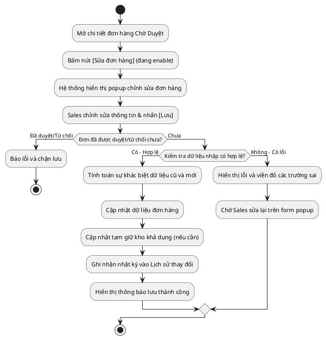

# Đặc Tả Use Case: UC-order-04 - Chỉnh sửa đơn hàng Chờ Duyệt

## 1. Thông tin chung (General Information)

| Thuộc tính | Mô tả chi tiết |
| :--- | :--- |
| **Mã Use Case (UC ID):** | UC-order-04 |
| **Tên Use Case:** | Chỉnh sửa đơn hàng Chờ Duyệt |
| **Người tạo:** | @nlchis |
| **Cập nhật lần cuối bởi:** | @nlchis |
| **Ngày tạo:** | 2026-07-03 |
| **Ngày cập nhật:** | 2026-07-03 |
| **Tác nhân (Actor):** | Sales phụ trách (Tác nhân chính - quyền Maker), Hệ thống (Tác nhân phụ) |
| **Độ ưu tiên:** | Cao (P0) |
| **Tần suất sử dụng:** | Diễn ra khi Sales phát hiện nhập sai thông tin và đơn chưa được Admin duyệt. |
| **Bao gồm (Includes):** | Không có. |
| **Giả định:** | Không có. |

---

## 2. Mô tả & Điều kiện

### Mô tả nghiệp vụ
Cho phép bất kỳ nhân viên Sales nào (quyền Maker) thực hiện sửa đổi thông tin (Họ tên, SĐT, Địa chỉ, Hàng hoá, Cân nặng, Tiền COD, Chứng từ đính kèm) của đơn hàng thủ công khi đơn đang ở trạng thái **Chờ Duyệt**. Hệ thống tự động tính toán các trường thay đổi, cập nhật số lượng tạm giữ tồn kho khả dụng nếu có thay đổi và ghi nhận nhật ký chỉnh sửa vào Lịch sử thay đổi đơn hàng.

### Điều kiện tiên quyết (Preconditions)
1. Người dùng đăng nhập thành công và có vai trò Sales (Maker).
2. Đơn hàng cần sửa đang ở trạng thái **Chờ Duyệt** (**Chờ Duyệt**).

### Điều kiện sau khi hoàn thành (Postconditions)
1. Dữ liệu đơn hàng được cập nhật thành công trên hệ thống Portal.
2. Tồn kho khả dụng của sản phẩm được cập nhật chính xác (hoàn lại kho cũ, giữ kho mới nếu thay đổi sản phẩm/số lượng).
3. Ghi lại log lịch sử chỉnh sửa đơn hàng gồm các giá trị cũ (Old Value) và giá trị mới (New Value) chi tiết.

---

## 3. Sơ đồ Flowchart luồng xử lý



---

## 4. Luồng sự kiện (Course of Events)

### Luồng sự kiện thông thường (Normal Course)
1. Sales truy cập trang Chi tiết Đơn hàng của một đơn hàng đang ở trạng thái **Chờ Duyệt**.
2. Sales nhận thấy nút **[Sửa đơn hàng]** đang được kích hoạt (enable). Sales nhấn nút này.
3. Hệ thống hiển thị một **Popup chỉnh sửa đơn hàng** đè lên màn hình hiện tại. Form điền sẵn toàn bộ dữ liệu hiện có của đơn.
4. Sales thực hiện sửa đổi các trường thông tin nhận hàng, hàng hóa, khối lượng, tiền COD hoặc tải lên file Hóa đơn mới.
5. Sales nhấn nút **[Lưu]** trên popup.
6. Hệ thống kiểm tra xem đơn hàng đã bị Admin duyệt/từ chối chưa (Maker/Checker Race). Nếu chưa, hệ thống tiến hành validate dữ liệu đầu vào. Khi dữ liệu hợp lệ, hệ thống tiến hành:
   * So sánh thông tin mới nhập với thông tin cũ của đơn để lấy ra danh sách các trường có sự thay đổi.
   * Cập nhật đè dữ liệu mới vào bản ghi đơn hàng.
   * Điều chỉnh số lượng sản phẩm tạm giữ trong kho khả dụng nếu Sales thay đổi tên sản phẩm hoặc số lượng sản phẩm.
   * Ghi nhận nhật ký chỉnh sửa vào Lịch sử thay đổi đơn hàng (chứa: Thời gian, Tài khoản thực hiện, Tên trường thay đổi, Giá trị cũ, Giá trị mới).
7. Hệ thống đóng popup chỉnh sửa, hiển thị thông báo thành công và cập nhật lại giao diện hiển thị chi tiết đơn.

### Luồng ngoại lệ (Exceptions)
* **UC-order-04.EX.1: Dữ liệu nhập sai quy định**
  * Tại bước 6, nếu SĐT sai định dạng, thiếu trường bắt buộc, hoặc file Hóa đơn vượt quá 5MB.
  * Hệ thống chặn lưu, giữ nguyên popup và hiển thị thông báo lỗi chi tiết tại các trường tương ứng trên form.
* **UC-order-04.EX.2: Xung đột thao tác đồng thời (Maker/Checker Race)**
  * Tại bước 6, khi hệ thống phát hiện Đơn hàng đã chuyển sang trạng thái Đã tiếp nhận hoặc Từ Chối.
  * Hệ thống hủy giao dịch chỉnh sửa, đóng popup và báo lỗi: *"Đơn hàng đã được duyệt hoặc thay đổi bởi người khác. Vui lòng tải lại trang"*.
* **UC-order-04.EX.3: Tồn kho thực tế không đủ đáp ứng**
  * Tại bước 6, nếu Sales chỉnh sửa tăng số lượng hoặc thay đổi sang sản phẩm khác mà số lượng yêu cầu lớn hơn tồn kho khả dụng thời gian thực tế của sản phẩm đó.
  * Hệ thống chặn không cho lưu, giữ nguyên popup và hiển thị thông báo lỗi: *"Số lượng yêu cầu vượt quá tồn kho khả dụng hiện tại (Còn lại: X sản phẩm)"*.

---

## 5. Đặc tả dữ liệu giao diện (Screen Data Fields)

### Bảng các trường thông tin trong Form popup chỉnh sửa đơn hàng:

| STT | Tên trường dữ liệu | Định dạng | Bắt buộc | Chỉnh sửa? | Mô tả chi tiết ràng buộc |
| :--- | :--- | :--- | :--- | :--- | :--- |
| 1 | Họ Tên người nhận | Textbox | Y | Y | Cho phép sửa họ tên người nhận hàng. |
| 2 | Số Điện Thoại | Textbox | Y | Y | Bắt buộc nhập. Số điện thoại di động Việt Nam gồm đúng 10 chữ số, bắt đầu bằng số `0` (ví dụ: `0901234567`). |
| 3 | Tỉnh/Thành | Droplist | Y | Y | Cho phép chọn lại Tỉnh/Thành phố. |
| 4 | Quận/Huyện | Droplist | Y | Y | Cho phép chọn lại Quận/Huyện theo Tỉnh/Thành. |
| 5 | Phường/Xã | Droplist | Y | Y | Cho phép chọn lại Phường/Xã theo Quận/Huyện. |
| 6 | Địa chỉ chi tiết | Textbox | Y | Y | Cho phép sửa số nhà, tên đường. |
| 7 | Tên sản phẩm | Searchbox | Y | Y | Chọn sản phẩm từ danh mục sản phẩm của VietMec. |
| 8 | Số lượng sản phẩm | Number | Y | Y | Bắt buộc. Số lượng sản phẩm phải > 0. Validate theo tồn kho khả dụng thời gian thực tế tại thời điểm lưu đơn (nếu số lượng đặt đơn > số tồn kho khả dụng -> chặn và báo lỗi). |
| 9 | Đơn giá sản phẩm | Number | Y | Y | Bắt buộc. Giá bán của một đơn vị sản phẩm (VNĐ). |
| 10 | Khối lượng | Number | Y | Y | Đơn vị: kg. Phải lớn hơn 0. |
| 11 | Thu hộ (COD) | Number | Y | N | Bắt buộc nhập. Số tiền thu hộ COD = Đơn giá * Số lượng (hệ thống tự động tính toán, không cho sửa trực tiếp). |
| 12 | File Hóa đơn | Upload | N | Y | Đính kèm file Hóa đơn của đơn hàng (tùy chọn). Dung lượng tệp phải ≤ 5 MB và có định dạng hỗ trợ là .pdf, .png, hoặc .jpg. |

---

## 6. Giao diện Phác thảo (Wireframes)

### Màn hình 3: Form Popup Chỉnh sửa Đơn hàng (Sales - Maker)
```text
┌────────────────────────────────────────────────────────────┐
│ popup: CHỈNH SỬA ĐƠN HÀNG #247-00123                       │
├────────────────────────────────────────────────────────────┤
│ NGƯỜI NHẬN:  [ Nguyen Van A                            ]   │
│ ĐIỆN THOẠI:  [ 0901234567                              ]   │
│ ĐỊA CHỈ:     [ Số 10 Đường số 4, Thủ Đức               ]   │
│ SẢN PHẨM:    [ Macbook Pro M3                          v]  │
│ ĐƠN GIÁ:     [ 20,000,000  ] đ     SỐ LƯỢNG:   [ 1 ] chiếc │
│ K.LƯỢNG:     [ 1.5 ] kg          COD THU HỘ: [ 20,000,000]đ│
│ CHỨNG TỪ:    [ CO_CQ_Macbook_M3.pdf ]        [ Tải lên ]   │
├────────────────────────────────────────────────────────────┤
│                                                            │
│                     [ HUỶ BỎ ]    [ Lưu ]                  │
└────────────────────────────────────────────────────────────┘
```
