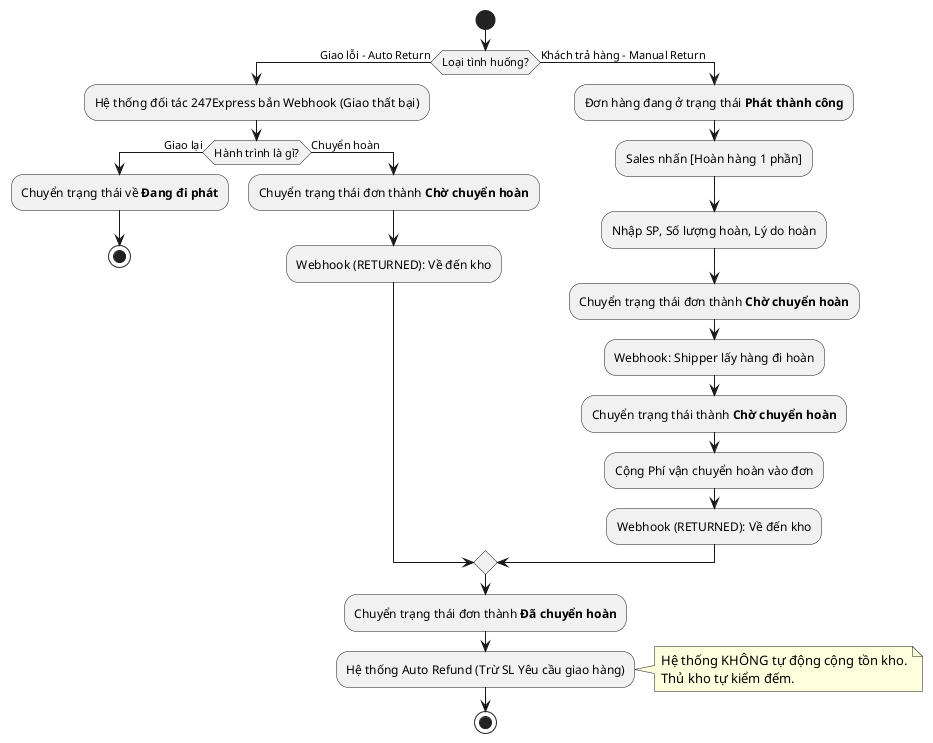

# Đặc Tả Use Case: UC-order-05 - Xử lý Hoàn hàng (Tự động & Chủ động)

## 1. Thông tin chung (General Information)

| Thuộc tính | Mô tả chi tiết |
| :--- | :--- |
| **Mã Use Case (UC ID):** | UC-order-05 |
| **Tên Use Case:** | Xử lý Hoàn hàng (Tự động & Chủ động) |
| **Người tạo:** | System |
| **Ngày tạo:** | 2026-07-02 |
| **Ngày cập nhật:** | 2026-07-16 |
| **Tác nhân (Actor):** | Hệ thống 247Express (API/Webhook), Sales phụ trách |
| **Độ ưu tiên:** | Cao (P0) |
| **Tần suất sử dụng:** | Khi giao hàng thất bại hoặc khi Khách hàng yêu cầu trả hàng sau khi nhận. |
| **Bao gồm (Includes):** | Không có. |

---

## 2. Mô tả & Điều kiện

### Mô tả nghiệp vụ
Use Case này xử lý 2 tình huống hoàn hàng của hệ thống:
1. **Hoàn hàng tự động do giao thất bại (System):** Khi đơn hàng bị bưu tá giao thất bại và quá hạn lưu kho, 247Express tự động hoàn hàng. Hệ thống nhận Webhook và chuyển trạng thái về **Chờ chuyển hoàn** -> **Đã chuyển hoàn**.
2. **Hoàn hàng chủ động do Khách yêu cầu (Sales):** Đơn hàng đã giao thành công (Trạng thái **Phát thành công**). Khách hàng yêu cầu hoàn 1 phần. Sales thao tác trên hệ thống để khởi tạo vòng lặp hoàn hàng. Hệ thống không tạo đơn mới mà ghi đè trạng thái lên đơn cũ, cộng thêm Phí vận chuyển hoàn, và ghi nhận song song toàn bộ lịch sử tracking.

### Điều kiện tiên quyết (Preconditions)
1. **Luồng tự động:** Đơn hàng đang ở trạng thái **Thất bại** hoặc đang giao.
2. **Luồng chủ động:** Đơn hàng phải đang ở trạng thái **Phát thành công**.

### Điều kiện sau khi hoàn thành (Postconditions)
1. Cả 2 luồng đều dẫn đơn hàng về trạng thái cuối cùng là **Đã chuyển hoàn**.
2. Khi trạng thái là **Đã chuyển hoàn** (hoặc **Từ chối**), hệ thống kích hoạt Auto Refund: tự động trừ đi số lượng đã giao của Yêu cầu giao hàng tương ứng.
3. Không tự động cộng tồn kho (Thủ kho tự đếm).
4. Lưu vết Tracking History (bao gồm cả chiều đi và chiều về).

---

## 3. Sơ đồ Flowchart luồng xử lý

---

## 4. Luồng sự kiện (Course of Events)

### Luồng 1: Shipper tự động hoàn hàng (System)
1. Đơn hàng giao thất bại. 247Express bắn Webhook thông báo bắt đầu chuyển hoàn (RETURNING) do vượt quá số lần giao lại.
2. Hệ thống chuyển trạng thái đơn hàng thành **Chờ chuyển hoàn**.
3. Bưu tá hoàn hàng thành công về kho. 247Express bắn Webhook hoàn thành (RETURNED).
4. Hệ thống cập nhật trạng thái đơn thành **Đã chuyển hoàn**. Trừ đi hạn mức SL đã giao của Yêu cầu giao hàng (Nếu có).

### Luồng 2: Khách hàng yêu cầu hoàn 1 phần (Sales)
1. Sales truy cập chi tiết đơn hàng đang ở trạng thái **Phát thành công**.
2. Sales bấm nút **[Hoàn hàng]**.
3. Hệ thống hiển thị Popup: Sales chọn Sản phẩm, nhập số lượng hoàn lại và Lý do. Hệ thống validate đảm bảo SL hoàn <= SL ban đầu.
4. Sales xác nhận. Hệ thống lưu lại SL hoàn, hiển thị "SL thực tế đã giao" = SL ban đầu - SL hoàn.
5. Hệ thống đổi trạng thái đơn thành **Chờ chuyển hoàn**.
6. 247Express cử Shipper đi lấy hàng. Bắn Webhook đang hoàn. Hệ thống đổi trạng thái thành **Chờ chuyển hoàn**. Hệ thống chèn **Phí vận chuyển hoàn** vào đơn.
7. Khi hàng về kho, Webhook bắn trạng thái RETURNED. Hệ thống đổi trạng thái thành **Đã chuyển hoàn**. Kích hoạt Auto Refund hạn mức Yêu cầu giao hàng.

---

## 5. Mô tả trường dữ liệu màn hình (Dành cho luồng Chủ động)

| STT | Tên trường dữ liệu | Định dạng | Bắt buộc? | Mô tả chi tiết ràng buộc |
| :--- | :--- | :--- | :--- | :--- |
| 1 | Số lượng hoàn lại | Number | Y | Phải <= Số lượng ban đầu. > 0. |
| 2 | Lý do hoàn | Textarea | Y | Mô tả lý do khách trả. |
| 3 | Phí vận chuyển hoàn | Number | N/A | Hệ thống tự điền dựa trên hóa đơn vận chuyển lượt về. |

---

## 6. Giao diện Phác thảo (Wireframe)
Xem chi tiết Popup hoàn hàng tại: [order-management-dashboard.md](../../wireframes/order-management-dashboard.md).
