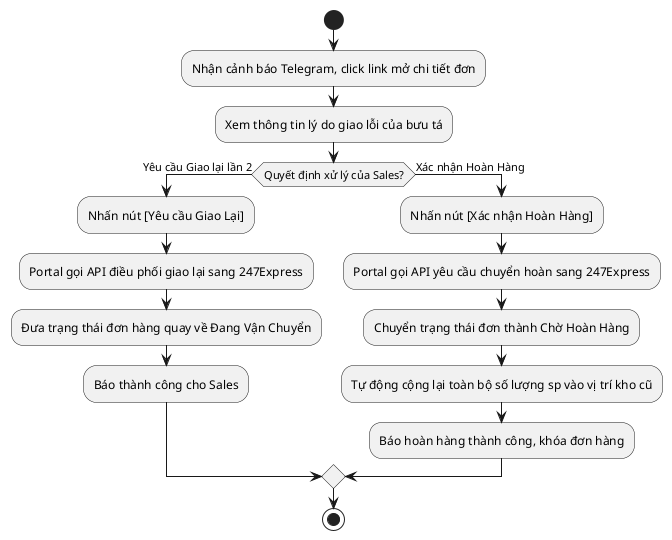

# Đặc Tả Use Case: UC-order-06 - Xử lý sự cố giao hàng thất bại

## 1. Thông tin chung (General Information)

| Thuộc tính | Mô tả chi tiết |
| :--- | :--- |
| **Mã Use Case (UC ID):** | UC-order-06 |
| **Tên Use Case:** | Xử lý sự cố giao hàng thất bại |
| **Người tạo:** | @nlchis |
| **Cập nhật lần cuối bởi:** | @nlchis |
| **Ngày tạo:** | 2026-07-02 |
| **Ngày cập nhật:** | 2026-07-02 |
| **Tác nhân (Actor):** | Sales phụ trách (Tác nhân chính), Hệ thống, Hệ thống đối tác 247Express (Tác nhân phụ) |
| **Độ ưu tiên:** | Cao (P0) |
| **Tần suất sử dụng:** | Diễn ra khi có đơn hàng gặp sự cố giao thất bại từ đối tác vận chuyển. |
| **Bao gồm (Includes):** | Không có. |
| **Giả định:** | Không có. |

---

## 2. Mô tả & Điều kiện

### Mô tả nghiệp vụ
Nhân viên Sales phụ trách tiếp nhận cảnh báo giao hàng lỗi lần 1 từ nhóm Telegram, truy cập hệ thống nội bộ và đưa ra quyết định điều phối: Yêu cầu Giao lại lần 2 hoặc Xác nhận Hoàn hàng về kho (hoàn trả toàn bộ).

### Điều kiện tiên quyết (Preconditions)
1. Sales đăng nhập thành công vào hệ thống quản lý nội bộ.
2. Đơn hàng phụ trách đang ở trạng thái **Giao Thất Bại** (giao hàng lỗi lần 1).

### Điều kiện sau khi hoàn thành (Postconditions)
1. *Nếu chọn giao lại:* Trạng thái đơn đổi về **Đang Vận Chuyển**, gửi API yêu cầu giao lại thành công sang đối tác 247Express.
2. *Nếu chọn hoàn hàng:* Trạng thái đơn hàng chuyển sang **Chờ Hoàn Hàng**, gọi API chuyển hoàn sang 247Express. Hệ thống tự động giải phóng tồn kho và cộng lại tồn kho thực tế ở kệ xuất cũ chỉ khi trạng thái đơn hàng cập nhật thành **Đã Hoàn Hàng** (đơn vị vận chuyển đã hoàn lại hàng thành công cho nhà cung cấp).

---

## 3. Sơ đồ Flowchart luồng xử lý



---

## 4. Luồng sự kiện (Course of Events)

### Luồng sự kiện thông thường (Normal Course)
1. Sales nhận tin nhắn cảnh báo sự cố từ Bot Telegram, nhấn vào link đính kèm.
2. Giao diện hệ thống nội bộ hiển thị chi tiết đơn hàng giao lỗi kèm banner cảnh báo đỏ và lý do giao lỗi cụ thể từ bưu tá đối tác 247Express.
3. Sales liên hệ với khách hàng qua điện thoại để làm rõ địa chỉ hoặc thời gian nhận hàng.
4. Sales quyết định nhấn nút [Yêu cầu Giao Lại] trên hệ thống nội bộ.
5. Hệ thống gửi yêu cầu giao lại sang giao diện API của đối tác 247Express.
6. Đối tác 247Express phản hồi nhận yêu cầu thành công.
7. Hệ thống chuyển trạng thái đơn hàng quay lại **Đang Vận Chuyển** để bưu tá tiếp tục đi giao lần 2.

### Luồng thay thế (Alternative Courses)
**UC-order-06.AC.1: Sales xác nhận chuyển hoàn đơn hàng**
1. Tại bước 4 của luồng chính, Sales không chọn giao lại mà nhấn nút [Xác nhận Hoàn Hàng].
2. Hệ thống gửi yêu cầu chuyển hoàn sang API của đối tác 247Express.
3. Đối tác 247Express xác nhận yêu cầu và cập nhật hành trình chuyển hoàn đơn hàng.
4. Hệ thống chuyển trạng thái đơn hàng thành **Chờ Hoàn Hàng**.
6. Khi bưu tá hoàn hàng thành công và trạng thái cập nhật thành **Đã Hoàn Hàng**, hệ thống tự động cộng lại tồn kho thực tế ở vị trí kệ xuất cũ.

### Luồng ngoại lệ (Exceptions)
Không có.

---

## 5. Yêu cầu đặc biệt & Giao diện

### Yêu cầu đặc biệt
Giao diện hệ thống nội bộ hiển thị nổi bật banner cảnh báo và 2 nút hành động xử lý nhanh màu cam/đỏ ở đầu trang chi tiết khi đơn hàng ở trạng thái **Giao Thất Bại**.

### Mô tả trường dữ liệu màn hình

| STT | Tên trường dữ liệu | Định dạng | Bắt buộc? | Mô tả chi tiết ràng buộc |
| :--- | :--- | :--- | :--- | :--- |
| 1 | Banner lý do giao lỗi | Panel | Y | Hiển thị lý do giao lỗi từ bưu tá 247Express. |
| 2 | Nút Yêu cầu Giao Lại | Button | Y | Nhấn gửi API yêu cầu giao lại sang đối tác 247Express. |
| 3 | Nút Xác nhận Hoàn Hàng | Button | Y | Nhấn gửi API yêu cầu chuyển hoàn và hoàn trả tồn kho. |

---

## 7. Giao diện Phác thảo (Wireframe)

### Màn hình 6: Chi tiết Đơn hàng - Giao hàng Thất bại (Sales)
```text
┌────────────────────────────────────────────────────────────┐
│ CHI TIẾT ĐƠN HÀNG: #247-00125         Trạng thái: THẤT BẠI │
├────────────────────────────────────────────────────────────┤
│ [ Thông tin chung & Hành trình ]      [ Lịch sử thay đổi ] │
├────────────────────────────────────────────────────────────┤
│ CẢNH BÁO: ĐƠN HÀNG GIAO KHÔNG THÀNH CÔNG LẦN 1             │
│ Lý do bưu tá: "Khách hàng thuê bao không liên lạc được"    │
│ [ YÊU CẦU GIAO LẠI (LẦN 2) ]     [ XÁC NHẬN HOÀN HÀNG ]    │
├────────────────────────────────────────────────────────────┤
│ KHÁCH HÀNG: Le Van C - 0933444555                          │
│ ĐỊA CHỈ:    36 Hoàng Hoa Thám, Tân Bình, TP. Hồ Chí Minh   │
│ HÀNG HOÁ:   Macbook Air M2 (1.3 kg)                        │
│ THU HỘ COD: 15,000,000 đ                                   │
├────────────────────────────────────────────────────────────┤
│ [!] LỖI: Gửi SMS thất bại (Nhà mạng lỗi)         [Gửi lại] │
└────────────────────────────────────────────────────────────┘
```

### Màn hình 8: Telegram Alert Notification (Cảnh báo tự động nhóm Sales)
```text
┌────────────────────────────────────────────────────────────┐
│ [BOT] CẢNH BÁO SỰ CỐ GIAO HÀNG LỖI (Group Sales VietMec)   │
├────────────────────────────────────────────────────────────┤
│ Thời gian: 01/07/2026 16:02                                │
│ Mã đơn hàng: #247-00125 (Sales phụ trách: Vũ Thị G)        │
│ Khách hàng:  Le Van C - SĐT: 0933444555                    │
│ Sản phẩm:    Macbook Air M2                                │
│ Bưu tá báo:  "Khách hàng thuê bao không liên lạc được"     │
├────────────────────────────────────────────────────────────┤
│ [!] Vui lòng truy cập đường link để xử lý điều phối đơn:   │
│ https://vietmec.vn/orders/247-00125/resolve                │
└────────────────────────────────────────────────────────────┘
```

## 8. Vấn đề chưa giải quyết (Notes & Issues)
Không có.
