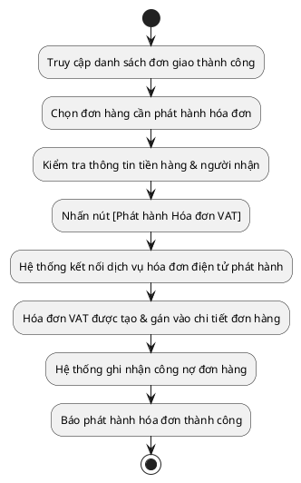

# Đặc Tả Use Case: UC-order-07 - Phát hành hóa đơn VAT (Kế toán)

## 1. Thông tin chung (General Information)

| Thuộc tính | Mô tả chi tiết |
| :--- | :--- |
| **Mã Use Case (UC ID):** | UC-order-07 |
| **Tên Use Case:** | Phát hành hóa đơn VAT |
| **Người tạo:** | @nlchis |
| **Cập nhật lần cuối bởi:** | @nlchis |
| **Ngày tạo:** | 2026-07-02 |
| **Ngày cập nhật:** | 2026-07-02 |
| **Tác nhân (Actor):** | Kế toán (Tác nhân chính), Hệ thống (Tác nhân phụ) |
| **Độ ưu tiên:** | Cao (P0) |
| **Tần suất sử dụng:** | Diễn ra hàng ngày sau khi bưu tá đối tác 247Express báo giao hàng thành công. |
| **Bao gồm (Includes):** | Không có. |
| **Giả định:** | Dịch vụ hóa đơn điện tử liên kết hoạt động bình thường. |

---

## 2. Mô tả & Điều kiện

### Mô tả nghiệp vụ
Kế toán thực hiện phát hành và lưu trữ hóa đơn điện tử VAT cho đơn hàng đã giao thành công (trạng thái **Giao Thành Công**) trực tiếp trên hệ thống quản lý nội bộ trong vòng 24 giờ làm việc.

### Điều kiện tiên quyết (Preconditions)
1. Kế toán đăng nhập thành công vào hệ thống nội bộ và có quyền "Quản lý hóa đơn".
2. Đơn hàng đang ở trạng thái **Giao Thành Công**.

### Điều kiện sau khi hoàn thành (Postconditions)
1. Hóa đơn điện tử VAT được phát hành và liên kết trực tiếp với mã đơn hàng trên hệ thống.
2. Ghi nhận doanh thu đơn hàng và ghi nhận công nợ đơn hàng cho kế toán theo dõi.

---

## 3. Sơ đồ Flowchart luồng xử lý



---

## 4. Luồng sự kiện (Course of Events)

### Luồng sự kiện thông thường (Normal Course)
1. Kế toán truy cập trang danh sách đơn hàng đã giao thành công trên hệ thống quản lý nội bộ.
2. Kế toán chọn đơn hàng cụ thể để xem thông tin chi tiết.
3. Kế toán kiểm tra đối chiếu thông tin người mua, mặt hàng và giá trị tiền hàng thực tế.
4. Kế toán điền thông tin thuế doanh nghiệp (nếu khách yêu cầu hóa đơn công ty) và nhấn nút [Phát hành Hóa đơn VAT].
5. Hệ thống gửi yêu cầu phát hành hóa đơn sang dịch vụ hóa đơn điện tử tích hợp.
6. Dịch vụ hóa đơn điện tử trả về số hóa đơn và file PDF hóa đơn VAT.
7. Hệ thống lưu trữ thông tin hóa đơn, liên kết trực tiếp vào đơn hàng và cập nhật trạng thái hóa đơn là *Đã phát hành*.

### Luồng thay thế (Alternative Courses)
Không có.

### Luồng ngoại lệ (Exceptions)
* **UC-order-07.EX.1: Quá hạn 24 giờ chưa xuất hóa đơn**
  * Tại bước 1 của luồng chính, nếu đơn hàng đã ở trạng thái **Giao Thành Công** quá 24 giờ làm việc mà chưa được xuất hóa đơn điện tử VAT.
  * Hệ thống tự động đổi màu dòng đơn hàng thành màu đỏ và hiển thị icon cảnh báo quá hạn trên giao diện của Kế toán.
  * Hệ thống tự động gửi email cảnh báo hàng ngày cho bộ phận Kế toán.

---

## 5. Yêu cầu đặc biệt & Giao diện

### Yêu cầu đặc biệt
Hóa đơn VAT phát hành phải được kiểm tra đối chiếu tự động thông tin Mã số thuế (MST) và Tên công ty nếu là khách hàng doanh nghiệp.

### Mô tả trường dữ liệu màn hình

| STT | Tên trường dữ liệu | Định dạng | Bắt buộc? | Mô tả chi tiết ràng buộc |
| :--- | :--- | :--- | :--- | :--- |
| 1 | Nút Phát hành Hóa đơn VAT | Button | Y | Nhấn để kích hoạt phát hành hóa đơn điện tử. |
| 2 | Mã số thuế (MST) | Textbox | N | Nhập mã số thuế doanh nghiệp (khi xuất hóa đơn cty). |
| 3 | Tên công ty / Doanh nghiệp | Textbox | N | Nhập tên doanh nghiệp tương ứng. |
| 4 | Email nhận hóa đơn | Textbox | N | Nhập địa chỉ email của khách hàng để hệ thống gửi hóa đơn VAT. |

---

## 7. Giao diện Phác thảo (Wireframe)

### Màn hình 9: Giao diện xuất hóa đơn điện tử VAT (Kế toán)
```text
┌────────────────────────────────────────────────────────────┐
│ XUẤT HÓA ĐƠN ĐIỆN TỬ VAT                         [Kế toán] │
├────────────────────────────────────────────────────────────┤
│ ĐƠN HÀNG: #247-00124                 Trạng thái: THÀNH CÔNG│
│ Tiền hàng thực thu: 20,000,000 đ      Ngày giao: 02/07/2026│
├────────────────────────────────────────────────────────────┤
│ THÔNG TIN XUẤT HÓA ĐƠN VAT:                                │
│ [ ] Khách hàng doanh nghiệp (Xuất hóa đơn công ty)         │
│ Tên Công Ty: [ Công ty Cổ phần VietMec                  ]  │
│ Mã Số Thuế:  [ 0102345678                               ]  │
│ Địa Chỉ Cty: [ Số 10 Tràng Thi, Hoàn Kiếm, Hà Nội        ] │
│ Email Nhận:  [ ketoan@vietmec.vn                        ]  │
│                                                            │
│ [ HUY BỎ ]                          [ PHÁT HÀNH HÓA ĐƠN ]  │
├────────────────────────────────────────────────────────────┤
│ TRẠNG THÁI HÓA ĐƠN ĐÃ PHÁT HÀNH:                           │
│ Số hóa đơn: HD-2026-0004562    Ngày xuất: 02/07/2026       │
│ File PDF hóa đơn VAT: [Download_Invoice_HD-0004562.pdf]    │
└────────────────────────────────────────────────────────────┘
```

## 8. Vấn đề chưa giải quyết (Notes & Issues)
Không có.
