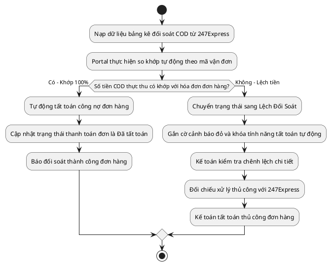

# Đặc Tả Use Case: UC-order-08 - Đối soát COD & Tất toán (Kế toán)

## 1. Thông tin chung (General Information)

| Thuộc tính | Mô tả chi tiết |
| :--- | :--- |
| **Mã Use Case (UC ID):** | UC-order-08 |
| **Tên Use Case:** | Đối soát COD & Tất toán |
| **Người tạo:** | @nlchis |
| **Cập nhật lần cuối bởi:** | @nlchis |
| **Ngày tạo:** | 2026-07-02 |
| **Ngày cập nhật:** | 2026-07-02 |
| **Tác nhân (Actor):** | Kế toán (Tác nhân chính), Hệ thống, Hệ thống đối tác 247Express (Tác nhân phụ) |
| **Độ ưu tiên:** | Cao (P0) |
| **Tần suất sử dụng:** | Thực hiện định kỳ hàng tuần hoặc hàng tháng. |
| **Bao gồm (Includes):** | Không có. |
| **Giả định:** | Tệp tin Excel đối soát tải lên đúng cấu trúc định dạng chuẩn của 247Express. |

---

## 2. Mô tả & Điều kiện

### Mô tả nghiệp vụ
Kế toán thực hiện đối soát tự động số tiền thu hộ COD thực tế nhận được từ đối tác vận chuyển 247Express so với giá trị hóa đơn VAT của đơn hàng trên hệ thống để thực hiện tất toán công nợ đơn hàng hoặc xử lý chênh lệch công nợ.

### Điều kiện tiên quyết (Preconditions)
1. Kế toán đăng nhập thành công vào hệ thống quản lý nội bộ.
2. Đơn hàng ở trạng thái **Giao Thành Công** và đã có thông tin hóa đơn điện tử VAT (*Đã phát hành*).

### Điều kiện sau khi hoàn thành (Postconditions)
1. *If khớp:* Công nợ đơn hàng được tất toán tự động thành công (Trạng thái công nợ: *Đã tất toán*).
2. *If lệch:* Đơn hàng chuyển sang trạng thái **Lệch Đối Soát**, gắn cờ cảnh báo đỏ, khóa tính năng tất toán tự động để kế toán xử lý chênh lệch thủ công.

---

## 3. Sơ đồ Flowchart luồng xử lý



---

## 4. Luồng sự kiện (Course of Events)

### Luồng sự kiện thông thường (Normal Course)
1. Kế toán truy cập phân hệ Đối soát Công nợ trên hệ thống quản lý nội bộ.
2. Kế toán nạp tệp dữ liệu bảng kê đối soát COD (định dạng Excel) nhận được từ đối tác vận chuyển 247Express lên hệ thống.
3. Hệ thống tự động đọc dữ liệu, thực hiện so khớp mã vận đơn và số tiền COD thu hộ thực tế.
4. Hệ thống so sánh tiền COD thực tế đối tác đã chuyển khoản với giá trị hóa đơn VAT tương ứng.
5. Hệ thống phát hiện số tiền COD khớp hoàn toàn 100% với giá trị hóa đơn.
6. Hệ thống tự động tất toán công nợ đơn hàng, cập nhật trạng thái thanh toán là *Đã tất toán* và ghi nhận lịch sử thanh toán thành công.

### Luồng thay thế (Alternative Courses)
**UC-order-08.AC.1: Phát hiện chênh lệch tiền đối soát (Lệch công nợ)**
1. Tại bước 5 của luồng chính, hệ thống phát hiện số tiền COD thực thu lệch so với giá trị hóa đơn (do bưu tá thu sai hoặc đối tác tính sai chi phí).
2. Hệ thống tự động chuyển trạng thái đơn hàng sang **Lệch Đối Soát** và gắn cờ cảnh báo đỏ.
3. Hệ thống khóa tính năng tất toán tự động đối với đơn hàng này.
4. Kế toán thực hiện xem chi tiết chênh lệch trên trang đối soát chi tiết.
5. Kế toán liên hệ đối tác 247Express xử lý chênh lệch nghiệp vụ thủ công.
6. Sau khi xử lý xong, Kế toán thực hiện nhấn nút [Tất toán thủ công] để cập nhật trạng thái đơn thành *Đã tất toán* và ghi nhận lý do điều chỉnh công nợ.

### Luồng ngoại lệ (Exceptions)
Không có.

---

## 5. Yêu cầu đặc biệt & Giao diện

### Yêu cầu đặc biệt
Hệ thống phải tự động tính toán và tách riêng phần Phí vận chuyển (do 247Express tính) và tiền COD thực nhận để kế toán dễ dàng đối chiếu.

### Mô tả trường dữ liệu màn hình

| STT | Tên trường dữ liệu | Định dạng | Bắt buộc? | Mô tả chi tiết ràng buộc |
| :--- | :--- | :--- | :--- | :--- |
| 1 | Nút Nạp File đối soát | Button | Y | Nhấp tải file Excel đối soát từ đối tác 247Express. |
| 2 | Bảng đối soát hiển thị | View | Y | Hiển thị: Mã đơn, Mã vận đơn, Tiền HĐ, Tiền COD, Phí ship, Trạng thái (Khớp/Lệch). |
| 3 | Nút Tất toán thủ công | Button | Y (khi lệch) | Nhấn ghi đè trạng thái công nợ sang *Đã tất toán* sau khi xử lý lệch tay. |

---

## 7. Giao diện Phác thảo (Wireframe)

### Màn hình 10: Đối soát & Nạp tệp đối soát COD (Kế toán)
```text
┌────────────────────────────────────────────────────────────┐
│ ĐỐI SOÁT CÔNG NỢ COD                             [Kế toán] │
├────────────────────────────────────────────────────────────┤
│ NẠP BẢNG KÊ ĐỐI SOÁT:                                      │
│ Chọn tệp bảng kê (.xlsx): [ bang_ke_247_t7_2026.xlsx ]     │
│ [ ] Tải Lên Và So Khớp Tự Động                             │
├────────────────────────────────────────────────────────────┤
│ KẾT QUẢ ĐỐI CHIẾU SO KHỚP TỰ ĐỘNG:                         │
│ Tổng đơn so khớp: 3 đơn | Khớp: 2 đơn | [!] Lệch: 1 đơn    │
│                                                            │
│ ┌────────────────────────────────────────────────────────┐ │
│ │ Mã Vận Đơn | Tiền Hóa Đơn | Tiền Đối Soát| Trạng Thái  │ │
│ ├────────────────────────────────────────────────────────┤ │
│ │ 247XYZ123  | 0 đ          | 0 đ          | KHỚP 100%   │ │
│ │ 247XYZ124  | 20,000,000 đ | 20,000,000 đ | KHỚP 100%   │ │
│ │ 247XYZ125  | 15,000,000 đ | 14,800,000 đ | [!] LỆCH    │ │
│ └────────────────────────────────────────────────────────┘ │
│ Chi tiết lệch đơn 247XYZ125: Thiếu 200,000 đ COD thực thu. │
│ [ HỦY BỎ ĐỐI SOÁT ]             [ XỬ LÝ TẤT TOÁN THỦ CÔNG] │
└────────────────────────────────────────────────────────────┘
```

## 8. Vấn đề chưa giải quyết (Notes & Issues)
Không có.
