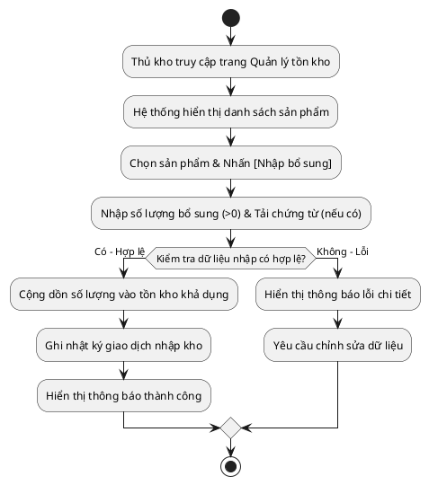

# Đặc Tả Ca Sử Dụng: UC-order-09 - Nhập Bổ Sung Tồn Kho

Tài liệu này đặc tả chi tiết ca sử dụng cho phép Thủ kho nhập thêm số lượng tồn kho khả dụng cho các sản phẩm trực tiếp trên hệ thống Portal nội bộ.

---

## 1. Tóm tắt Ca sử dụng (Use Case Summary)
* **Mã ca sử dụng:** UC-order-09
* **Tên ca sử dụng:** Nhập bổ sung tồn kho
* **Tác nhân chính:** Thủ kho
* **Tác nhân phụ:** Hệ thống
* **Độ ưu tiên:** P0 - Quan trọng bậc nhất

---

## 2. Các Ràng buộc & Điều kiện (Pre/Post Conditions)
* **Tiền điều kiện (Preconditions):** 
  * Thủ kho đăng nhập thành công vào hệ thống quản lý nội bộ.
  * Thủ kho được phân quyền "Quản lý tồn kho".
* **Hậu điều kiện (Postconditions):** 
  * Số lượng tồn kho khả dụng của sản phẩm được cộng dồn chính xác lượng nhập thêm.
  * Ghi nhận lịch sử giao dịch kho (Audit Log) đầy đủ.
  * File đính kèm CO/CQ (nếu có) được lưu trữ và liên kết thành công với lịch sử nhập kho.

---

## 3. Sơ đồ Luồng xử lý (Flowchart)



---

## 4. Luồng sự kiện (Course of Events)

### 4.1 Luồng sự kiện chính (Normal Course)
1. Thủ kho truy cập phân hệ **Quản lý Tồn kho** trên thanh điều hướng của Portal nội bộ.
2. Hệ thống hiển thị danh sách toàn bộ các sản phẩm của hệ thống kèm theo: Mã sản phẩm, Tên sản phẩm, Vị trí kệ kho, và Số lượng khả dụng hiện tại.
3. Thủ kho tìm kiếm sản phẩm cần cập nhật, sau đó nhấn nút **[Nhập bổ sung]** tại dòng sản phẩm tương ứng.
4. Hệ thống hiển thị Form/Popup nhập bổ sung hàng tồn kho gồm các trường thông tin:
   * Tên sản phẩm (Chỉ đọc)
   * Số lượng khả dụng hiện tại (Chỉ đọc)
   * Số lượng nhập thêm (*)
   * Tài liệu chứng từ đính kèm/CO/CQ (Tùy chọn - Tải file)
5. Thủ kho nhập số lượng là số nguyên dương lớn hơn 0 và chọn tệp chứng từ đính kèm (nếu có), sau đó nhấn nút **[Xác nhận]**.
6. Hệ thống thực hiện kiểm tra kiểm thực (validation) dữ liệu. Dữ liệu hợp lệ, hệ thống tiến hành:
   * Cộng dồn số lượng nhập thêm vào số lượng khả dụng của sản phẩm.
   * Ghi nhận Nhật ký giao dịch nhập kho (thời gian, tài khoản Thủ kho thực hiện, mã sản phẩm, số lượng ban đầu, số lượng nhập thêm, số lượng sau cập nhật, và liên kết tải file chứng từ nếu có).
7. Hệ thống hiển thị thông báo thành công và cập nhật số lượng tồn kho khả dụng mới ngay trên màn hình danh sách.

### 4.2 Các luồng ngoại lệ (Exceptions)
* **UC-order-09.EX.1: Số lượng nhập không hợp lệ:**
  * Tại bước 5, nếu Thủ kho nhập số lượng bằng 0, số âm, không phải là số nguyên hoặc để trống, hệ thống sẽ chặn thao tác và hiển thị thông báo lỗi tại trường nhập liệu: *"Số lượng nhập bổ sung bắt buộc phải là số nguyên dương lớn hơn 0"*.
* **UC-order-09.EX.2: Tệp đính kèm không đúng định dạng hoặc quá dung lượng:**
  * Tại bước 5, nếu Thủ kho tải lên tệp đính kèm có dung lượng lớn hơn 5MB hoặc định dạng không phải là PDF, PNG, JPG, hệ thống sẽ hiển thị thông báo lỗi: *"Dung lượng tệp đính kèm vượt quá giới hạn 5MB hoặc định dạng không được hỗ trợ. Vui lòng chọn tệp khác."* và chặn không cho lưu.

---

## 5. Đặc tả dữ liệu màn hình (Screen Data Fields)

| Trường thông tin | Loại dữ liệu | Ràng buộc dữ liệu | Mô tả chi tiết |
| :--- | :--- | :--- | :--- |
| **Số lượng nhập thêm** | Số nguyên (Integer) | Bắt buộc, phải > 0. | Số lượng sản phẩm vật lý thực tế nhập thêm vào kho khả dụng. |
| **Tài liệu chứng từ đính kèm** | Tệp tin (File) | Bắt buộc. Chứng từ CO/CQ nhập kho bổ sung, dung lượng tệp phải ≤ 5 MB. Định dạng hỗ trợ: .pdf, .png, .jpg. |

## 7. Giao diện Phác thảo (Wireframe)

### Màn hình 11: Màn hình Quản lý Tồn kho & Nhập hàng (Thủ kho)
```text
┌────────────────────────────────────────────────────────────┐
│ QUẢN LÝ TỒN KHO & NHẬP BỔ SUNG             [User: Thủ kho] │
├────────────────────────────────────────────────────────────┤
│ DANH SÁCH MẶT HÀNG TRONG KHO:                              │
│                                                            │
│ ┌────────────────────────────────────────────────────────┐ │
│ │ Mã SP    | Tên Sản Phẩm      | Vị Trí Kệ | Khả Dụng    | │
│ ├────────────────────────────────────────────────────────┤ │
│ │ SP-001   | Macbook Pro M3    | KỆ-B03    | 5           | │
│ │ SP-002   | iPad Air 5        | KỆ-C12    | 12          | │
│ │ SP-003   | iPhone 15 Pro     | KỆ-A01    | 8           | │
│ └────────────────────────────────────────────────────────┘ │
│                                                            │
│ Thao tác: Chọn sản phẩm cần nhập rồi bấm [ Nhập Bổ Sung ]  │
│                                                            │
│ ┌────────────────────────────────────────────────────────┐ │
│ │ popup: NHẬP BỔ SUNG TỒN KHO                            │ │
│ ├────────────────────────────────────────────────────────┤ │
│ │ Sản phẩm: iPad Air 5                                   │ │
│ │ Tồn khả dụng hiện tại: 12                              │ │
│ │ Số lượng nhập thêm (*): [ 10                         ] │ │
│ │ File chứng từ/CO/CQ:    [ Xem_CO_CQ.pdf ]   [ Tải lên ]│ │
│ │                                                        │ │
│ │ [ HUỶ BỎ ]                       [ XÁC NHẬN NHẬP KHO ] │ │
│ └────────────────────────────────────────────────────────┘ │
└────────────────────────────────────────────────────────────┘
```

## 8. Vấn đề chưa giải quyết (Notes & Issues)
Không có.
