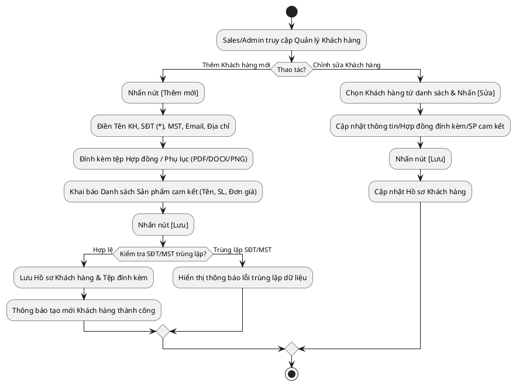

# Đặc Tả Use Case: UC-order-01 - Quản lý Khách hàng

## 1. Thông tin chung (General Information)

| Thuộc tính | Mô tả chi tiết |
| :--- | :--- |
| **Mã Use Case (UC ID):** | UC-order-01 |
| **Tên Use Case:** | Quản lý Khách hàng |
| **Người tạo:** | @nlchis |
| **Ngày tạo:** | 2026-07-16 |
| **Cập nhật lần cuối:** | 2026-07-24 bởi @nlchis |
| **Tác nhân (Actor):** | Sales phụ trách, Admin |
| **Độ ưu tiên:** | Cao (P0) |
| **Tần suất sử dụng:** | Khi có khách hàng mới phát sinh giao dịch hoặc cần tra cứu/cập nhật hồ sơ Hợp đồng. |
| **Bao gồm (Includes):** | Không có. |

---

## 2. Mô tả & Điều kiện

### Mô tả nghiệp vụ
Cho phép Sales và Admin thêm mới, chỉnh sửa, và tra cứu thông tin Hồ sơ Khách hàng (Bao gồm Doanh nghiệp B2B và Cá nhân). Đây là bước đầu tiên để khởi tạo Khách hàng, đồng thời hỗ trợ đính kèm tệp Hợp đồng / Phụ lục ban đầu và khai báo danh sách thông tin sản phẩm thuộc Hợp đồng / Phụ lục.

### Điều kiện tiên quyết (Preconditions)
1. Người dùng (Sales/Admin) đăng nhập thành công vào hệ thống.

### Điều kiện sau khi hoàn thành (Postconditions)
1. Thông tin khách hàng, tệp Hợp đồng/Phụ lục đính kèm và thông tin danh sách sản phẩm cam kết được lưu trữ thành công vào Database.
2. Hồ sơ khách hàng sẵn sàng để trích xuất tạo các Yêu cầu giao hàng (Delivery Request).

---

## 3. Sơ đồ Flowchart luồng xử lý

---

## 4. Luồng sự kiện (Course of Events)

### Luồng sự kiện thông thường (Normal Course: Thêm Khách hàng)
1. Tác nhân truy cập menu "Quản lý Khách hàng" và nhấn nút [Thêm mới].
2. Hệ thống hiển thị Form điền thông tin Khách hàng.
3. Tác nhân điền các thông tin: Tên khách hàng (Cá nhân/Doanh nghiệp), SĐT, Mã số thuế, Email, Địa chỉ.
4. Tác nhân thực hiện đính kèm tệp Hợp đồng / Phụ lục (nếu có).
5. Tác nhân nhập Danh sách Sản phẩm thuộc Hợp đồng / Phụ lục (Tên sản phẩm, Số lượng cam kết, Đơn giá).
6. Tác nhân nhấn nút [Lưu].
7. Hệ thống kiểm tra trùng lặp Số điện thoại hoặc Mã số thuế và kiểm tra tính hợp lệ của tệp đính kèm/thông tin sản phẩm.
8. Hệ thống lưu Hồ sơ Khách hàng cùng thông tin Hợp đồng/Phụ lục và hiển thị thông báo thành công.

### Luồng thay thế (Alternative Courses)
**UC-order-01.AC.1: Chỉnh sửa thông tin Khách hàng & Hợp đồng/Phụ lục**
1. Tác nhân tìm kiếm Khách hàng trên danh sách.
2. Tác nhân chọn Khách hàng và nhấn [Sửa].
3. Hệ thống hiển thị Form thông tin hiện tại.
4. Tác nhân cập nhật thông tin cá nhân/doanh nghiệp, tải lên tệp Hợp đồng/Phụ lục bổ sung hoặc chỉnh sửa danh sách sản phẩm cam kết.
5. Tác nhân nhấn [Lưu].
6. Hệ thống cập nhật bản ghi thành công.

### Luồng ngoại lệ (Exceptions)
**UC-order-01.EX.1: Trùng lặp thông tin**
1. Tại bước 7 luồng chính, hệ thống phát hiện SĐT hoặc MST đã tồn tại.
2. Hệ thống báo lỗi và chặn việc lưu dữ liệu, yêu cầu tác nhân kiểm tra lại.

---

## 5. Mô tả trường dữ liệu màn hình

| STT | Tên trường dữ liệu | Định dạng | Bắt buộc? | Mô tả chi tiết ràng buộc |
| :--- | :--- | :--- | :--- | :--- |
| 1 | Tên Khách hàng | Text | Y | Tên Công ty hoặc Cá nhân. Tối đa 255 ký tự. |
| 2 | Số điện thoại | Số | Y | Độ dài 10 số, bắt đầu bằng số 0. Không được trùng lặp. |
| 3 | Mã số thuế | Text | N | Dành cho KH doanh nghiệp. |
| 4 | Email | Text | N | Định dạng Email chuẩn. |
| 5 | Địa chỉ | Text | Y | Địa chỉ chi tiết để sử dụng làm mặc định khi giao hàng. |
| 6 | File Hợp đồng / Phụ lục đính kèm | File Upload | N | Cho phép định dạng PDF, DOCX, PNG, JPG. Dung lượng tối đa 10MB/file. |
| 7 | Danh sách Sản phẩm (Hợp đồng/Phụ lục) | Grid / Bảng | N | Bảng danh sách chi tiết các mặt hàng cam kết theo Hợp đồng / Phụ lục. |
| 7.1 | - Tên sản phẩm | Dropdown / Text | Y | Chọn sản phẩm từ danh mục hệ thống hoặc nhập tên sản phẩm mới. |
| 7.2 | - Số lượng cam kết | Số nguyên | Y | Số lượng mặt hàng đăng ký trong Hợp đồng/Phụ lục (> 0). |
| 7.3 | - Đơn giá cam kết | Số tiền (VND) | Y | Đơn giá thỏa thuận theo Hợp đồng/Phụ lục (>= 0). |
| 7.4 | - Ghi chú phụ lục | Text | N | Ghi chú điều khoản bổ sung nếu có. |

---

## 6. Giao diện Phác thảo (Wireframe)
Xem chi tiết tại: [customer-management-dashboard.md](../wireframes/customer-management-dashboard.md)
