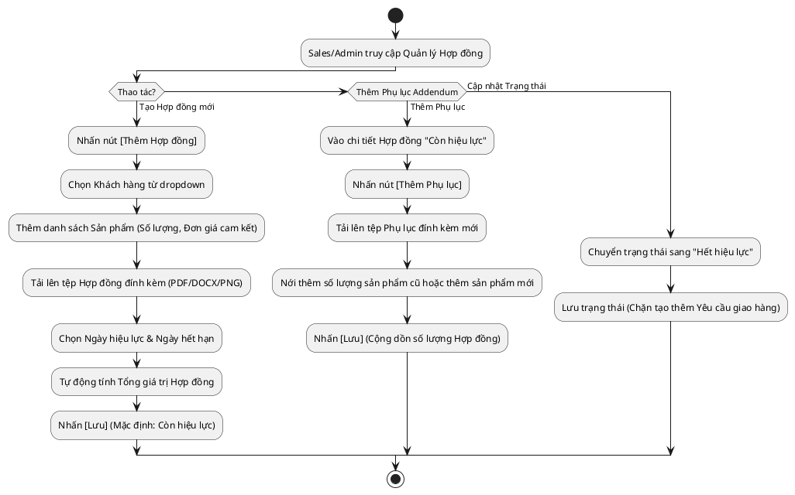

# Đặc Tả Use Case: UC-order-02 - Quản lý Hợp đồng & Phụ lục

## 1. Thông tin chung (General Information)

| Thuộc tính | Mô tả chi tiết |
| :--- | :--- |
| **Mã Use Case (UC ID):** | UC-order-02 |
| **Tên Use Case:** | Quản lý Hợp đồng & Phụ lục |
| **Người tạo:** | @nlchis |
| **Ngày tạo:** | 2026-07-16 |
| **Cập nhật lần cuối:** | 2026-07-24 bởi @nlchis |
| **Tác nhân (Actor):** | Sales phụ trách, Admin |
| **Độ ưu tiên:** | Cao (P0) |
| **Tần suất sử dụng:** | Khi ký kết hợp đồng mới hoặc phát sinh thêm sản phẩm/phụ lục cần cập nhật tệp đính kèm. |
| **Bao gồm (Includes):** | UC-order-01 |

---

## 2. Mô tả & Điều kiện

### Mô tả nghiệp vụ
Cho phép Sales tạo Hợp đồng bán hàng với Khách hàng. Hợp đồng định nghĩa danh sách sản phẩm, số lượng, đơn giá, tổng giá trị và tệp Hợp đồng / Phụ lục đính kèm. Hợp đồng có thể được bổ sung Phụ lục (Addendum) để nới rộng số lượng sản phẩm. Hợp đồng là cơ sở để Admin tạo các Yêu cầu giao hàng (Delivery Request).
Sales có thể tự do thay đổi trạng thái của Hợp đồng ("Còn hiệu lực" / "Hết hiệu lực") mà không cần qua quy trình duyệt (No Maker/Checker).

### Điều kiện tiên quyết (Preconditions)
1. Đã có thông tin Khách hàng trên hệ thống (hoặc tạo nhanh trong quá trình tạo Hợp đồng).

### Điều kiện sau khi hoàn thành (Postconditions)
1. Hợp đồng, tệp đính kèm Hợp đồng/Phụ lục và danh sách sản phẩm cam kết được lưu trữ.
2. Sẵn sàng cho Admin trích xuất để tạo Yêu cầu giao hàng.

---

## 3. Sơ đồ Flowchart luồng xử lý

---

## 4. Luồng sự kiện (Course of Events)

### Luồng sự kiện thông thường (Normal Course: Tạo Hợp đồng mới)
1. Sales truy cập menu "Quản lý Hợp đồng" và nhấn nút [Thêm Hợp đồng].
2. Sales chọn Khách hàng từ danh sách thả xuống.
3. Sales thêm danh sách Sản phẩm, nhập Số lượng tổng, Đơn giá cho từng sản phẩm.
4. Sales tải lên tệp Hợp đồng / Phụ lục đính kèm (PDF/DOCX/PNG).
5. Sales chọn Ngày hiệu lực và Ngày hết hạn.
6. Hệ thống tự động tính Tổng giá trị hợp đồng.
7. Sales nhấn [Lưu]. Trạng thái mặc định là "Còn hiệu lực".

### Luồng thay thế (Alternative Courses)
**UC-order-02.AC.1: Thêm Phụ lục (Addendum)**
1. Sales truy cập chi tiết Hợp đồng đang "Còn hiệu lực".
2. Sales nhấn nút [Thêm Phụ lục].
3. Hệ thống hiển thị Form phụ lục nối tiếp hợp đồng hiện tại.
4. Sales tải lên tệp Phụ lục đính kèm mới và thêm sản phẩm mới hoặc nới thêm số lượng cho sản phẩm cũ.
5. Sales nhấn [Lưu]. Số lượng tổng của Hợp đồng sẽ được cộng dồn tương ứng.

**UC-order-02.AC.2: Cập nhật Trạng thái Hợp đồng**
1. Sales vào chi tiết Hợp đồng.
2. Sales thay đổi trạng thái từ "Còn hiệu lực" sang "Hết hiệu lực".
3. Hệ thống lưu lại thay đổi. Hợp đồng hết hiệu lực sẽ không thể tạo thêm Yêu cầu giao hàng.

---

## 5. Mô tả trường dữ liệu màn hình

| STT | Tên trường dữ liệu | Định dạng | Bắt buộc? | Mô tả chi tiết ràng buộc |
| :--- | :--- | :--- | :--- | :--- |
| 1 | Khách hàng | Dropdown | Y | Tham chiếu ID Khách hàng. |
| 2 | Danh sách Sản phẩm | Grid / Bảng | Y | Danh sách SP kèm đơn giá cam kết và số lượng cam kết. |
| 2.1 | - Tên sản phẩm | Dropdown / Text | Y | Sản phẩm thuộc Hợp đồng/Phụ lục. |
| 2.2 | - Số lượng cam kết | Số nguyên | Y | > 0. |
| 2.3 | - Đơn giá cam kết | Số tiền (VND) | Y | >= 0. |
| 3 | File Hợp đồng / Phụ lục đính kèm | File Upload | N | Tệp скан / PDF / DOCX đính kèm của Hợp đồng hoặc Phụ lục bổ sung (Max 10MB). |
| 4 | Ngày hiệu lực | Date | Y | Ngày bắt đầu tính hiệu lực. |
| 5 | Ngày hết hạn | Date | Y | Ngày kết thúc hiệu lực. |
| 6 | Trạng thái | Dropdown | Y | Có 2 giá trị: Còn hiệu lực / Hết hiệu lực. |

---

## 6. Giao diện Phác thảo (Wireframe)
Xem chi tiết tại: [contract-management-dashboard.md](../wireframes/contract-management-dashboard.md)
