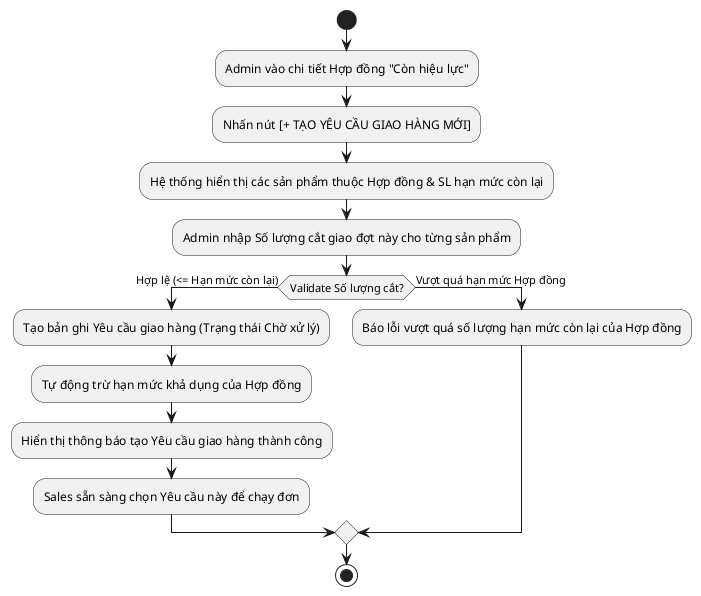

# Đặc Tả Use Case: UC-order-03 - Tạo Yêu cầu giao hàng (Delivery Request)

## 1. Thông tin chung (General Information)

| Thuộc tính | Mô tả chi tiết |
| :--- | :--- |
| **Mã Use Case (UC ID):** | UC-order-03 |
| **Tên Use Case:** | Tạo Yêu cầu giao hàng |
| **Người tạo:** | @nlchis |
| **Ngày tạo:** | 2026-07-16 |
| **Cập nhật lần cuối:** | 2026-07-24 bởi @nlchis |
| **Tác nhân (Actor):** | Admin |
| **Độ ưu tiên:** | Cao (P0) |
| **Tần suất sử dụng:** | Khi Khách hàng yêu cầu phát sinh đợt giao hàng mới từ Hợp đồng B2B. |
| **Bao gồm (Includes):** | UC-order-02 |

---

## 2. Mô tả & Điều kiện

### Mô tả nghiệp vụ
Cho phép Quản trị viên Admin trích xuất số lượng sản phẩm từ Hợp đồng "Còn hiệu lực" để tạo các Yêu cầu giao hàng (Delivery Request). Yêu cầu giao hàng đóng vai trò là "Quota / Hạn mức giao" để Sales phụ trách chọn và tạo các đơn hàng thủ công nhỏ chạy giao nhiều đợt.
Không cần qua bước duyệt (No Maker/Checker đối với Yêu cầu giao hàng).

### Điều kiện tiên quyết (Preconditions)
1. Đã có Hợp đồng ở trạng thái **Còn hiệu lực** và còn số lượng khả dụng chưa trích xuất hết.

### Điều kiện sau khi hoàn thành (Postconditions)
1. Yêu cầu giao hàng được tạo ở trạng thái **Chờ xử lý**.
2. Hạn mức số lượng của Hợp đồng tự động trừ bớt tương ứng với số lượng vừa trích xuất.
3. Sales có thể nhìn thấy Yêu cầu giao hàng này để bắt đầu lên đơn.

---

## 3. Sơ đồ Flowchart luồng xử lý

---

## 4. Luồng sự kiện (Course of Events)

### Luồng sự kiện thông thường (Normal Course: Tạo Yêu cầu giao hàng)
1. Admin chọn Hợp đồng đang "Còn hiệu lực" từ danh sách Hợp đồng.
2. Admin chuyển sang Tab "Yêu cầu giao hàng" và nhấn [+ Tạo Yêu cầu giao hàng mới].
3. Hệ thống hiển thị Form danh sách sản phẩm của Hợp đồng kèm hạn mức còn lại.
4. Admin nhập số lượng sản phẩm cần trích xuất cho đợt giao này.
5. Admin nhấn [Lưu Yêu cầu].
6. Hệ thống validate số lượng nhập <= hạn mức còn lại của Hợp đồng.
7. Hệ thống tạo Yêu cầu giao hàng mới (Trạng thái "Chờ xử lý") và tự động trừ hạn mức Hợp đồng.

---

## 5. Mô tả trường dữ liệu màn hình

| STT | Tên trường dữ liệu | Định dạng | Bắt buộc? | Mô tả chi tiết ràng buộc |
| :--- | :--- | :--- | :--- | :--- |
| 1 | Mã Hợp đồng | Text / Readonly | Y | Mã Hợp đồng gốc được trích xuất. |
| 2 | Danh sách Sản phẩm trích xuất | Grid / Bảng | Y | Danh sách SP thuộc Hợp đồng. |
| 2.1 | - Tên sản phẩm | Text / Readonly | Y | Tên sản phẩm trong Hợp đồng. |
| 2.2 | - Số lượng Hợp đồng còn lại | Số nguyên | Y | Hạn mức còn lại chưa cắt giao. |
| 2.3 | - Số lượng cắt giao đợt này | Số nguyên | Y | > 0 và <= Số lượng Hợp đồng còn lại. |
| 3 | Ghi chú đợt giao | Text | N | Ghi chú yêu cầu giao hàng đặc biệt. |

---

## 6. Giao diện Phác thảo (Wireframe)
Xem chi tiết tại: [contract-management-dashboard.md](../wireframes/contract-management-dashboard.md)
