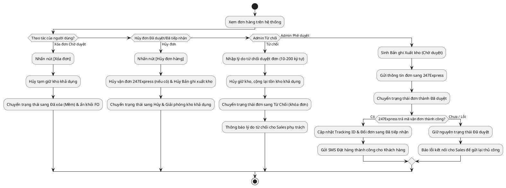

# Đặc Tả Use Case: UC-order-05 - Duyệt hoặc từ chối đơn hàng (Checker)

## 1. Thông tin chung (General Information)

| Thuộc tính | Mô tả chi tiết |
| :--- | :--- |
| **Mã Use Case (UC ID):** | UC-order-05 |
| **Tên Use Case:** | Duyệt hoặc từ chối đơn hàng (Checker) |
| **Người tạo:** | @nlchis |
| **Cập nhật lần cuối bởi:** | AI BA |
| **Ngày tạo:** | 2026-07-02 |
| **Ngày cập nhật:** | 2026-07-23 |
| **Tác nhân (Actor):** | Admin / Người phê duyệt (Tác nhân chính), Hệ thống, Hệ thống đối tác 247Express (Tác nhân phụ) |
| **Độ ưu tiên:** | Cao (P0) |
| **Tần suất sử dụng:** | Diễn ra thường xuyên trong ngày khi có đơn hàng thủ công chờ duyệt. |
| **Bao gồm (Includes):** | Không có. |
| **Giả định:** | Không có. |

---

## 2. Mô tả & Điều kiện

### Mô tả nghiệp vụ
Quản trị viên Admin (Checker) kiểm tra thông tin các đơn hàng thủ công đang ở trạng thái **Chờ Duyệt** và thực hiện Phê duyệt, Từ chối, hoặc người dùng thực hiện Xóa đơn / Hủy đơn.

### Điều kiện tiên quyết (Preconditions)
1. Admin/Sales đăng nhập thành công vào hệ thống quản lý nội bộ và có quyền tương ứng.
2. Có đơn hàng ở trạng thái **Chờ Duyệt**, **Đã duyệt** hoặc **Đã tiếp nhận** trên hệ thống.

### Điều kiện sau khi hoàn thành (Postconditions)
1. *Nếu duyệt:* Đơn chuyển sang trạng thái **Đã duyệt**, hệ thống tự tạo Bản ghi Xuất kho (Chờ duyệt) và gửi thông tin đơn sang 247Express. Khi 247Express trả về mã vận đơn (Tracking ID), đơn tự chuyển sang **Đã tiếp nhận**. (Tồn kho thực tế chỉ bị trừ khi bưu tá Đã lấy hàng).
2. *Nếu từ chối:* Đơn chuyển sang trạng thái **Từ Chối** (khóa đơn vĩnh viễn), tồn kho khả dụng được giải phóng (không ảnh hưởng số lượng đã giao của Yêu cầu giao hàng do chưa từng cộng).
3. *Nếu xóa mềm (Chờ duyệt):* Đơn chuyển sang trạng thái **Đã xóa (Mềm)**, giải phóng kho khả dụng bị tạm giữ và ẩn bản ghi khỏi giao diện FO.
4. *Nếu hủy đơn (Đã duyệt / Đã tiếp nhận):* Đơn chuyển sang trạng thái **Hủy**, hủy vận đơn 247Express (nếu có), hủy Bản ghi Xuất kho (Chờ duyệt) và giải phóng tồn kho khả dụng.

---

## 3. Sơ đồ Flowchart luồng xử lý

---

## 4. Luồng sự kiện (Course of Events)

### Luồng sự kiện thông thường (Normal Course: Phê duyệt đơn)
1. Admin truy cập trang Danh sách Đơn hàng Chờ Duyệt trên hệ thống quản lý nội bộ.
2. Admin chọn một đơn hàng cần duyệt để xem thông tin chi tiết.
3. Admin nhấn nút [Phê Duyệt] đơn hàng.
4. Hệ thống tự động chuyển đơn hàng sang trạng thái **Đã duyệt** và tạo 1 Bản ghi Xuất kho ở trạng thái **Chờ duyệt** trong phân hệ Kho.
5. Hệ thống gửi thông tin đơn hàng sang đối tác 247Express.
6. Đối tác 247Express phản hồi mã vận đơn (Tracking ID) thành công.
7. Hệ thống lưu mã vận đơn, cập nhật trạng thái đơn hàng sang **Đã tiếp nhận** và gửi SMS thông báo Đặt hàng thành công cho Khách hàng.

### Luồng thay thế (Alternative Courses)

**UC-order-05.AC.1: Admin từ chối phê duyệt đơn hàng**
1. Tại bước 3 của luồng chính, Admin nhấn nút [Từ Chối].
2. Hệ thống hiển thị popup yêu cầu nhập lý do từ chối duyệt đơn.
3. Admin nhập lý do từ chối nghiệp vụ và nhấn [Xác nhận từ chối].
4. Hệ thống chuyển trạng thái đơn sang **Từ Chối** (khóa đơn vĩnh viễn, cấm sửa).
5. Hệ thống giải phóng tồn kho khả dụng đã tạm giữ.

**UC-order-05.AC.2: Người dùng xóa mềm đơn Chờ duyệt**
1. Người dùng bấm nút [Xóa đơn] khi đơn hàng đang ở trạng thái **Chờ Duyệt**.
2. Hệ thống hiển thị popup xác nhận xóa mềm đơn hàng.
3. Người dùng bấm [Xác nhận xóa].
4. Hệ thống giải phóng tồn kho khả dụng bị tạm giữ, chuyển trạng thái đơn sang **Đã xóa (Mềm)** và ẩn bản ghi khỏi giao diện FO.

**UC-order-05.AC.3: Hủy đơn hàng ở trạng thái Đã duyệt / Đã tiếp nhận**
1. Sales/Admin bấm nút [Hủy đơn hàng] khi đơn ở trạng thái **Đã duyệt** hoặc **Đã tiếp nhận** (trước khi bưu tá 247Express lấy hàng).
2. Hệ thống chuyển trạng thái đơn sang **Hủy**.
3. Hệ thống chuyển Bản ghi Xuất kho (Chờ duyệt) thành Hủy, hủy vận đơn bên 247Express (nếu có mã vận đơn) và giải phóng tồn kho khả dụng.

### Luồng ngoại lệ (Exceptions)
* **UC-order-05.EX.1: Xung đột thao tác đồng thời (Maker/Checker Race Condition)**
  * Tại bước 3 của luồng chính, khi Admin nhấn Phê duyệt đúng lúc Sales đang thực hiện Lưu chỉnh sửa đơn hàng đó.
  * Hệ thống đối chiếu phiên bản dữ liệu (Kiểm soát phiên bản ghi) và phát hiện phiên bản đã bị thay đổi.
  * Hệ thống chặn hành động phê duyệt của Admin, hiển thị thông báo lỗi: *"Đơn hàng đã được duyệt hoặc thay đổi bởi người khác. Vui lòng tải lại trang"* và rollback giao dịch.
* **UC-order-05.EX.2: Chưa nhận mã vận đơn 247Express**
  * Tại bước 6 của luồng chính, 247Express chưa trả mã vận đơn hoặc hệ thống đối tác phản hồi chậm.
  * Đơn hàng giữ nguyên ở trạng thái **Đã duyệt**. Hệ thống hiển thị nút [Thử gửi lại 247Express] để Admin/Sales chủ động gửi lại request.

---

## 5. Mô tả trường dữ liệu màn hình

| STT | Tên trường dữ liệu | Định dạng | Bắt buộc? | Mô tả chi tiết ràng buộc |
|:---:|:---|:---|:---:|:---|
| 1 | Mã đơn hàng / Tracking ID | Text (Read-only) | Y | Mã định danh đơn hàng do hệ thống sinh tự động. |
| 2 | Thông tin Khách hàng & Sản phẩm | Read-only | Y | Tự động trích xuất từ Yêu cầu giao hàng (Tên KH, SĐT, Sản phẩm, Số lượng, File Hóa đơn). |
| 3 | Nút [Phê Duyệt] | Button Action | N | Duyệt đơn sang Đã duyệt, sinh Bản ghi Xuất kho (Chờ duyệt) & đẩy API sang 247Express. |
| 4 | Nút [Từ Chối] | Button Action | N | Mở Popup yêu cầu Admin nhập lý do từ chối duyệt đơn. |
| 5 | Lý do từ chối | Textarea | Y (khi Từ chối) | Bắt buộc nhập khi bấm Từ chối. Độ dài tối thiểu 10 ký tự, tối đa 200 ký tự. |
| 6 | Nút [Xóa đơn] | Button Action | N | Chỉ hiển thị ở trạng thái Chờ Duyệt. Giải phóng kho tạm giữ & chuyển đơn sang Đã xóa (Mềm). |
| 7 | Nút [Hủy đơn hàng] | Button Action | N | Hiển thị ở trạng thái Đã duyệt / Đã tiếp nhận (trước khi bưu tá lấy hàng). Hủy vận đơn 247Express & giải phóng kho. |

---

## 6. Giao diện Phác thảo (Wireframe)
Xem chi tiết tại: [order-management-dashboard.md](../wireframes/order-management-dashboard.md)
