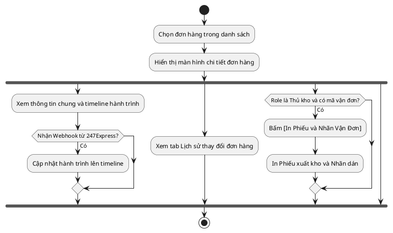

# Đặc Tả Use Case: UC-order-06 - Xem chi tiết đơn hàng và theo dõi hành trình

## 1. Thông tin chung (General Information)

| Thuộc tính | Mô tả chi tiết |
| :--- | :--- |
| **Mã Use Case (UC ID):** | UC-order-06 |
| **Tên Use Case:** | Xem chi tiết đơn hàng và theo dõi hành trình |
| **Người tạo:** | @nlchis |
| **Cập nhật lần cuối bởi:** | @nlchis |
| **Ngày tạo:** | 2026-07-02 |
| **Ngày cập nhật:** | 2026-07-24 |
| **Tác nhân (Actor):** | Tất cả vai trò (Tác nhân chính: Sales, Checker, Thủ kho; Tác nhân phụ: Hệ thống, 247Express) |
| **Độ ưu tiên:** | Cao (P0) |
| **Tần suất sử dụng:** | Diễn ra liên tục hàng ngày để kiểm tra vận đơn và xử lý hàng hóa. |
| **Bao gồm (Includes):** | Không có. |
| **Giả định:** | Không có. |

---

## 2. Mô tả & Điều kiện

### Mô tả nghiệp vụ
Cho phép tất cả các vai trò truy cập xem thông tin chi tiết của một đơn hàng, lịch trình vận chuyển (timeline) thời gian thực và lịch sử thay đổi của đơn hàng đó. Đồng thời, Thủ kho có thể thực hiện in Phiếu xuất kho / Nhãn vận đơn và Hệ thống tự động đồng bộ hành trình thực tế qua Webhook từ đối tác.

### Điều kiện tiên quyết (Preconditions)
1. Người dùng đăng nhập thành công vào Portal nội bộ và được phân quyền truy cập danh sách đơn hàng.

### Điều kiện sau khi hoàn thành (Postconditions)
1. Thông tin chi tiết đơn hàng, timeline hành trình, và lịch sử thay đổi được hiển thị chính xác.
2. Với Thủ kho: In thành công chứng từ xuất kho và nhãn vận đơn 247Express để đóng gói.
3. Với Hệ thống: Nhận webhook từ đối tác 247Express và cập nhật tức thời hành trình lên giao diện.

---

## 3. Sơ đồ Flowchart luồng xử lý

---

## 4. Luồng sự kiện (Course of Events)

### Luồng sự kiện thông thường (Normal Course)
1. Người dùng chọn một đơn hàng từ trang Danh sách Đơn hàng.
2. Hệ thống hiển thị giao diện Chi tiết Đơn hàng gồm các khu vực chính:
   * **Thông tin chung:** Họ tên khách, SĐT, Địa chỉ, Sản phẩm, Khối lượng, Tiền COD, Trạng thái hiện tại.
   * **Timeline hành trình:** Nhật ký bưu tá lấy hàng, đang trung chuyển, giao hàng...
   * **Tab Lịch sử thay đổi:** Ghi nhận nhật ký chỉnh sửa của Sales đối với đơn.
3. Người dùng chuyển đổi giữa các tab để xem thông tin chi tiết tương ứng.

### Luồng phụ 1: Thủ kho in phiếu & dán nhãn vận đơn
1. Thủ kho xem chi tiết đơn hàng có trạng thái **Đã tiếp nhận Hàng** (đơn đã có mã vận đơn 247Express).
2. Thủ kho nhấn nút **[In Phiếu & Nhãn Vận Đơn]**.
3. Hệ thống sinh file in chứa Phiếu xuất kho (ghi rõ sản phẩm) và Nhãn dán vận đơn của 247Express.
4. Thủ kho thực hiện in ấn ra máy in nhiệt chuyên dụng, nhặt hàng từ kệ và đóng gói kiện hàng vật lý.

### Luồng phụ 2: Hệ thống đồng bộ Webhook hành trình
1. Khi bưu tá 247Express quét nhận hàng hoặc cập nhật trạng thái trên đường đi, hệ thống của 247Express gửi Webhook chứa mã vận đơn và mô tả trạng thái về cổng tiếp nhận của VietMec.
2. Hệ thống kiểm tra tính hợp lệ của Webhook, cập nhật trạng thái đơn hàng tương ứng (ví dụ: sang **Đang đi phát Hàng**, **Giao Thành Công**, hoặc **Giao Chờ xử lý**) và ghi thêm dòng trạng thái mới vào Timeline hành trình chi tiết của đơn.

---

## 5. Mô tả trường dữ liệu màn hình

| STT | Trường thông tin | Loại dữ liệu | Thao tác | Mô tả chi tiết ràng buộc |
| :--- | :--- | :--- | :--- | :--- |
| 1 | Mã đơn hàng | String | Chỉ đọc | Mã đơn hàng nội bộ VietMec (ví dụ: `247-00123`). |
| 2 | Mã vận đơn | String | Chỉ đọc | Mã vận đơn do 247Express cấp (ví dụ: `247XYZ123`). |
| 3 | Họ tên & SĐT | String | Chỉ đọc | Thông tin khách nhận hàng. |
| 4 | Địa chỉ nhận | String | Chỉ đọc | Địa chỉ chi tiết nhận hàng của khách. |
| 5 | Sản phẩm & Khối lượng | String | Chỉ đọc | Chi tiết tên sản phẩm, số lượng và cân nặng. |
| 6 | Số tiền thu hộ COD | Number | Chỉ đọc | Tiền thu hộ, định dạng VNĐ. |
| 7 | Nút In Phiếu & Nhãn | Button | Click | Chỉ khả dụng cho Thủ kho khi đơn ở trạng thái **Đã tiếp nhận Hàng**. |
| 8 | Timeline hành trình | List | Chỉ đọc | Nhật ký chi tiết gồm: Thời gian / Trạng thái / Mô tả thực tế từ bưu tá. |

---

## 6. Giao diện Phác thảo (Wireframe)

Xem chi tiết tại: [order-management-dashboard.md](../wireframes/order-management-dashboard.md)
