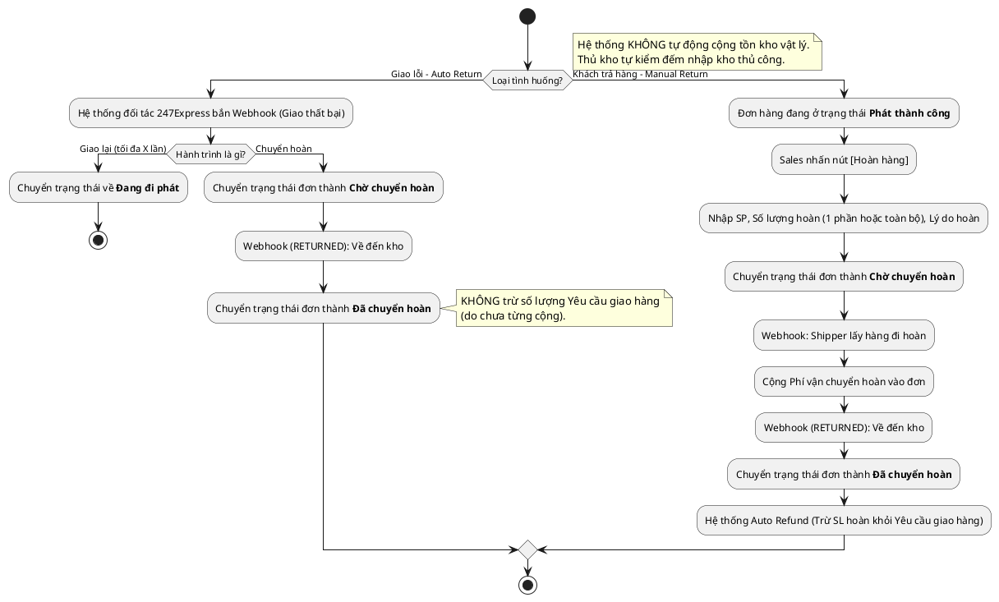

# Đặc Tả Use Case: UC-order-08 - Xử lý Hoàn hàng (Tự động & Chủ động)

## 1. Thông tin chung (General Information)

| Thuộc tính | Mô tả chi tiết |
| :--- | :--- |
| **Mã Use Case (UC ID):** | UC-order-08 |
| **Tên Use Case:** | Xử lý Hoàn hàng (Tự động & Chủ động) |
| **Người tạo:** | System |
| **Cập nhật lần cuối bởi:** | AI BA |
| **Ngày tạo:** | 2026-07-02 |
| **Ngày cập nhật:** | 2026-07-23 |
| **Tác nhân (Actor):** | Hệ thống 247Express (API/Webhook), Sales phụ trách |
| **Độ ưu tiên:** | Cao (P0) |
| **Tần suất sử dụng:** | Khi giao hàng thất bại hoặc khi Khách hàng yêu cầu trả hàng sau khi nhận. |
| **Bao gồm (Includes):** | Không có. |

---

## 2. Mô tả & Điều kiện

### Mô tả nghiệp vụ
Use Case này xử lý 2 tình huống hoàn hàng của hệ thống:
1. **Hoàn hàng tự động do giao thất bại (System):** Khi đơn hàng bị bưu tá giao thất bại và quá hạn lưu kho / vượt quá số lần giao lại quy định của 247Express (tối đa X lần), 247Express tự động chuyển hoàn. Hệ thống nhận Webhook và chuyển trạng thái về **Chờ chuyển hoàn** -> **Đã chuyển hoàn**. (Đơn này CHƯA từng cộng số lượng vào Yêu cầu giao hàng nên KHÔNG thực hiện Auto Refund trừ số lượng Yêu cầu).
2. **Hoàn hàng chủ động do Khách yêu cầu (Sales):** Đơn hàng đã giao thành công (Trạng thái **Phát thành công**). Khách hàng yêu cầu hoàn 1 phần hoặc toàn bộ đơn hàng. Sales thao tác nhấn [Hoàn hàng], chọn số lượng và lý do. Hệ thống không tạo đơn mới mà ghi đè trạng thái lên đơn cũ, cộng thêm Phí vận chuyển hoàn, và thực hiện Auto Refund trừ số lượng hoàn khỏi Yêu cầu giao hàng khi đơn về trạng thái **Đã chuyển hoàn**.

### Điều kiện tiên quyết (Preconditions)
1. **Luồng tự động:** Đơn hàng đang ở trạng thái **Chờ xử lý** (Giao thất bại).
2. **Luồng chủ động:** Đơn hàng phải đang ở trạng thái **Phát thành công**.

### Điều kiện sau khi hoàn thành (Postconditions)
1. Cả 2 luồng đều dẫn đơn hàng về trạng thái cuối cùng là **Đã chuyển hoàn**.
2. **Auto Refund:** Chỉ kích hoạt trừ số lượng của Yêu cầu giao hàng với luồng Khách hàng trả hàng sau khi đã **Phát thành công**. Luồng giao thất bại tự động hoàn KHÔNG trừ số lượng Yêu cầu giao hàng (do chưa từng cộng).
3. Không tự động cộng tồn kho vật lý (Thủ kho tự kiểm đếm để nhập kho thủ công).
4. Lưu vết toàn bộ lịch sử hành trình Tracking History (bao gồm cả chiều đi và chiều về).

---

## 3. Sơ đồ Flowchart luồng xử lý

---

## 4. Luồng sự kiện (Course of Events)

### Luồng 1: Shipper tự động hoàn hàng do giao thất bại (System)
1. Đơn hàng giao thất bại (Chờ xử lý). 247Express bắn Webhook thông báo bắt đầu chuyển hoàn (RETURNING) do vượt quá số lần giao lại tối đa X lần theo quy định 247Express.
2. Hệ thống chuyển trạng thái đơn hàng thành **Chờ chuyển hoàn**.
3. Bưu tá hoàn hàng thành công về kho. 247Express bắn Webhook hoàn thành (RETURNED).
4. Hệ thống cập nhật trạng thái đơn thành **Đã chuyển hoàn** (Không trừ số lượng Yêu cầu giao hàng).

### Luồng 2: Khách hàng yêu cầu hoàn 1 phần hoặc toàn bộ đơn (Sales)
1. Sales truy cập chi tiết đơn hàng đang ở trạng thái **Phát thành công**.
2. Sales bấm nút **[Hoàn hàng]**.
3. Hệ thống hiển thị Popup: Sales chọn Sản phẩm, nhập số lượng hoàn lại (cho phép từ 1 đến toàn bộ số lượng đơn) và Lý do hoàn. Hệ thống validate đảm bảo SL hoàn <= SL đã giao.
4. Sales xác nhận. Hệ thống lưu lại SL hoàn, hiển thị "SL thực tế đã giao" = SL ban đầu - SL hoàn.
5. Hệ thống đổi trạng thái đơn thành **Chờ chuyển hoàn**.
6. 247Express cử Shipper đi lấy hàng. Bắn Webhook đang hoàn. Hệ thống đổi trạng thái thành **Chờ chuyển hoàn** và cộng **Phí vận chuyển hoàn** vào đơn.
7. Khi hàng về kho, Webhook bắn trạng thái RETURNED. Hệ thống đổi trạng thái thành **Đã chuyển hoàn** và kích hoạt Auto Refund trừ số lượng hoàn khỏi Yêu cầu giao hàng.

---

## 5. Yêu cầu đặc biệt & Giao diện

### Yêu cầu đặc biệt
- Nút [Hoàn hàng] chỉ hiển thị khi đơn ở trạng thái **Phát thành công**.
- Hỗ trợ nhập số lượng hoàn trả từ 1 sản phẩm đến toàn bộ 100% đơn hàng.

---

## 6. Giao diện Phác thảo (Wireframe)
Xem chi tiết tại: [order-management-dashboard.md](../wireframes/order-management-dashboard.md)
