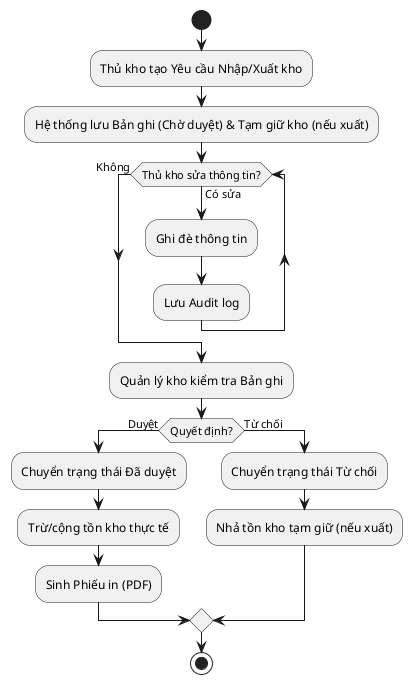

# Đặc Tả Ca Sử Dụng: UC-order-09 - Quản lý Nhập/Xuất Kho Thủ Công (Maker/Checker)

Tài liệu này đặc tả chi tiết ca sử dụng cho phép Thủ kho tạo các bản ghi Nhập kho hoặc Xuất kho thủ công, được theo dõi qua vòng đời duyệt Maker/Checker bởi Quản lý kho.

---

## 1. Tóm tắt Ca sử dụng (Use Case Summary)
* **Mã ca sử dụng:** UC-order-09
* **Tên ca sử dụng:** Quản lý Nhập/Xuất kho thủ công (Maker/Checker)
* **Tác nhân chính:** Thủ kho (Maker), Quản lý kho (Checker)
* **Độ ưu tiên:** P0 - Quan trọng bậc nhất

---

## 2. Các Ràng buộc & Điều kiện (Pre/Post Conditions)
* **Tiền điều kiện (Preconditions):** 
  * Thủ kho / Quản lý kho đăng nhập thành công vào hệ thống quản lý nội bộ với quyền tương ứng.
* **Hậu điều kiện (Postconditions):** 
  * Khi bản ghi được duyệt, số lượng tồn kho khả dụng/thực tế biến động chính xác.
  * Hệ thống tự động sinh Phiếu Nhập kho / Phiếu Xuất kho đính kèm vào bản ghi.
  * Nếu xuất kho thủ công bị từ chối, tồn kho tạm giữ được hoàn trả.
  * Mọi thay đổi trong trạng thái Chờ duyệt đều được lưu Audit log.

---

## 3. Sơ đồ Luồng xử lý (Flowchart)

---

## 4. Luồng sự kiện (Course of Events)

### 4.1 Luồng khởi tạo và chỉnh sửa (Maker)
1. Thủ kho truy cập phân hệ **Quản lý Kho**, chọn **Tạo Phiếu Nhập** hoặc **Tạo Phiếu Xuất**.
2. Thủ kho nhập các thông tin: Sản phẩm, Số lượng, Lý do, và Tải tệp đính kèm (nếu có).
3. Hệ thống tạo Bản ghi Nhập/Xuất với trạng thái **Chờ duyệt**. (Lưu ý: Nếu là phiếu xuất, hệ thống trừ số lượng khả dụng để tạm giữ kho).
4. (Tùy chọn) Trong khi phiếu vẫn ở trạng thái **Chờ duyệt**, Thủ kho có thể mở lại phiếu để **Sửa ghi đè** thông tin (như thay đổi số lượng, file đính kèm). Mỗi lần lưu hệ thống sẽ ghi lại lịch sử thao tác (Audit log).

### 4.2 Luồng phê duyệt (Checker)
1. Quản lý kho truy cập danh sách Phiếu Nhập/Xuất kho đang **Chờ duyệt**.
2. Quản lý kho mở chi tiết phiếu và đối chiếu với chứng từ/hàng hóa thực tế.
3. Quản lý kho bấm chọn [Phê Duyệt] hoặc [Từ Chối].
   * **Nếu Phê duyệt:** Hệ thống đổi trạng thái phiếu thành **Đã duyệt**, chính thức cập nhật tồn kho (Cộng tồn kho nếu Nhập, trừ tồn kho thực tế nếu Xuất). Hệ thống tự động sinh tệp **Phiếu in (PDF)** đính kèm trong chi tiết lô để Thủ kho in.
   * **Nếu Từ chối:** Hệ thống đổi trạng thái thành **Từ chối**. Nếu là phiếu xuất kho, hệ thống hoàn trả lại số lượng tạm giữ.

---

## 5. Màn hình Chi tiết Lô xuất (Đính kèm luồng Tự động từ Đơn hàng)
Bên cạnh luồng thủ công trên, các **Bản ghi Xuất kho tự động** (do Admin duyệt đơn sinh ra) ban đầu sẽ nằm ở trạng thái **Chờ duyệt** (và tự động in Phiếu xuất kho). Bản ghi này không cho phép duyệt/từ chối thủ công mà sẽ tự động chuyển sang **Đã duyệt** (tiến hành trừ tồn kho thực tế) khi bưu tá đến lấy hàng. 
* Tại màn hình chi tiết Bản ghi Xuất kho, người dùng có thể tải/in **Phiếu Xuất Kho**.
* Hệ thống sẽ hiển thị rõ tham chiếu **Mã vận đơn (Tracking ID)** liên kết với lần xuất kho này.

---

## 6. Giao diện Phác thảo (Wireframe)
Xem chi tiết tại: [order-management-dashboard.md](../wireframes/order-management-dashboard.md)
