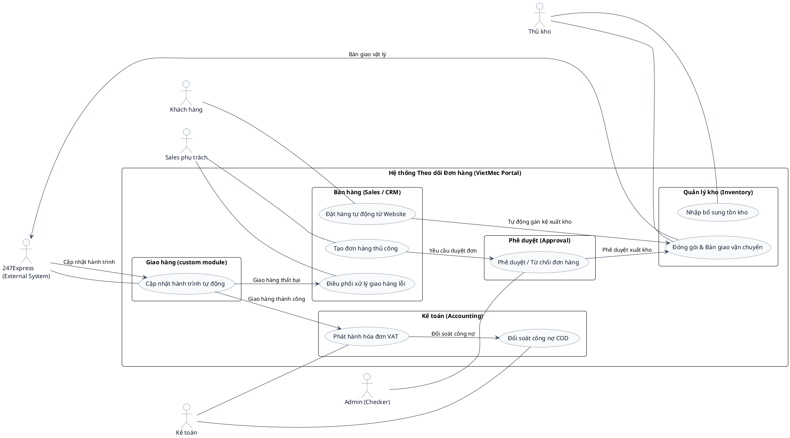

# Sơ đồ Use Case - Phân hệ Theo dõi Đơn hàng

Sơ đồ Use Case mô tả mối quan hệ tương tác giữa các tác nhân (Actors) và các ca sử dụng (Use Cases) của hệ thống.

## Ghi chú các quan hệ
* **Khách hàng:** Tác nhân chính thực hiện mua sắm trên VietMec (UC-01).
* **Sales phụ trách:** Maker tạo đơn tay (UC-02) và điều phối xử lý khi giao hàng thất bại (UC-06).
* **Admin:** Checker phê duyệt hoặc từ chối các đơn hàng thủ công (UC-03).
* **Thủ kho:** Thực hiện lấy hàng, đóng gói và bàn giao cho bưu tá (UC-04).
* **Kế toán:** Phát hành hóa đơn VAT (UC-07) và đối soát COD cuối kỳ (UC-08).
* **247Express:** Đối tác vận chuyển (External System) nhận lệnh giao hàng và đẩy Webhook cập nhật (UC-05).
