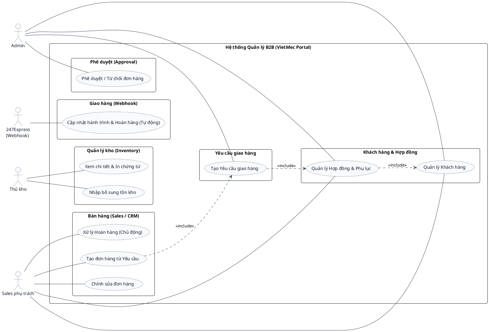

# Sơ đồ Use Case - Phân hệ B2B (Hợp đồng & Đơn hàng)

Sơ đồ Use Case mô tả mối quan hệ tương tác giữa các tác nhân (Actors) và các ca sử dụng (Use Cases) của hệ thống.

## Ghi chú các quan hệ
* **Sales phụ trách:** Quản lý khách hàng, khởi tạo hợp đồng, tự tạo đơn hàng dựa trên hạn mức Yêu cầu giao hàng, và thao tác yêu cầu hoàn hàng cho khách.
* **Admin:** Quản lý khách hàng, khởi tạo hợp đồng, tạo Yêu cầu giao hàng từ Hợp đồng để Sales chạy đơn, và có quyền duyệt/từ chối đơn hàng.
* **Thủ kho:** Thực hiện lấy hàng, in nhãn dán, đóng gói và tự kiểm đếm nhập kho thủ công khi có đơn hoàn.
* **247Express:** Đối tác vận chuyển gửi Webhook cập nhật hành trình tự động (Đang giao, Thành công, Thất bại, Chờ Hoàn, Đã hoàn).
